```mermaid
graph TD;
root((root)) --#0,1--> 0_((2.000));
0_ --#1,2--> 0_1_((5.828));
0_1_ --#2,9--> 0_1_2_((21.314));
0_1_2_ --#3,5--> 0_1_2_3_((30.730));
0_1_ --#4,5--> 0_1_3_((15.153));
0_1_3_ --#5,9--> 0_1_3_2_((32.569));
0_1_3_ --#6,9--> 0_1_3_2_((32.569));
style 0_1_3_2_ fill: lightgray
0_ --#7,9--> 0_2_((18.000));
0_2_ --#8,2--> 0_2_1_((19.485));
0_2_1_ --#9,5--> 0_2_1_3_((28.810));
0_2_ --#10,5--> 0_2_3_((27.416));
0_2_3_ --#11,2--> 0_2_3_1_((30.741));
0_ --#12,5--> 0_3_((10.472));
0_3_ --#13,2--> 0_3_1_((13.797));
0_3_1_ --#14,9--> 0_3_1_2_((29.282));
0_3_1_ --#15,9--> 0_3_1_2_((29.282));
style 0_3_1_2_ fill: lightgray
0_3_ --#16,9--> 0_3_2_((27.889));
0_3_2_ --#17,2--> 0_3_2_1_((29.374));
0_3_2_ --#18,2--> 0_3_2_1_((29.374));
style 0_3_2_1_ fill: lightgray
root((root)) --#19,2--> 1_((4.000));
1_ --#20,1--> 1_0_((5.828));
1_0_ --#21,9--> 1_0_2_((19.828));
1_0_2_ --#22,5--> 1_0_2_3_((29.245));
1_0_2_ --#23,5--> 1_0_2_3_((29.245));
style 1_0_2_3_ fill: lightgray
1_0_ --#24,5--> 1_0_3_((14.301));
1_0_3_ --#25,9--> 1_0_3_2_((31.717));
1_0_3_ --#26,9--> 1_0_3_2_((31.717));
style 1_0_3_2_ fill: lightgray
1_ --#27,9--> 1_2_((19.485));
1_2_ --#28,1--> 1_2_0_((19.485));
1_2_0_ --#29,5--> 1_2_0_3_((28.902));
1_2_0_ --#30,5--> 1_2_0_3_((28.902));
style 1_2_0_3_ fill: lightgray
1_2_ --#31,5--> 1_2_3_((28.902));
1_2_ --#32,5--> 1_2_3_((28.902));
style 1_2_3_ fill: lightgray
1_ --#33,5--> 1_3_((13.325));
1_3_ --#34,1--> 1_3_0_((13.797));
1_3_0_ --#35,9--> 1_3_0_2_((30.741));
1_3_0_ --#36,9--> 1_3_0_2_((30.741));
style 1_3_0_2_ fill: lightgray
1_3_ --#37,9--> 1_3_2_((30.741));
1_3_ --#38,9--> 1_3_2_((30.741));
style 1_3_2_ fill: lightgray
root((root)) --#39,9--> 2_((18.000));
2_ --#40,1--> 2_0_((18.000));
2_0_ --#41,2--> 2_0_1_((19.828));
2_0_1_ --#42,5--> 2_0_1_3_((29.153));
2_0_1_ --#43,5--> 2_0_1_3_((29.153));
style 2_0_1_3_ fill: lightgray
2_0_ --#44,5--> 2_0_3_((27.416));
2_0_3_ --#45,2--> 2_0_3_1_((30.741));
2_0_3_ --#46,2--> 2_0_3_1_((30.741));
style 2_0_3_1_ fill: lightgray
2_ --#47,2--> 2_1_((19.485));
2_1_ --#48,1--> 2_1_0_((21.314));
2_1_0_ --#49,5--> 2_1_0_3_((29.786));
2_1_0_ --#50,5--> 2_1_0_3_((29.786));
style 2_1_0_3_ fill: lightgray
2_1_ --#51,5--> 2_1_3_((28.810));
2_1_ --#52,5--> 2_1_3_((28.810));
style 2_1_3_ fill: lightgray
2_ --#53,5--> 2_3_((27.416));
2_3_ --#54,1--> 2_3_0_((27.889));
2_3_0_ --#55,2--> 2_3_0_1_((31.717));
2_3_0_ --#56,2--> 2_3_0_1_((31.717));
style 2_3_0_1_ fill: lightgray
2_3_ --#57,2--> 2_3_1_((30.741));
2_3_ --#58,2--> 2_3_1_((30.741));
style 2_3_1_ fill: lightgray
root((root)) --#59,5--> 3_((10.000));
3_ --#60,1--> 3_0_((10.472));
3_0_ --#61,2--> 3_0_1_((14.301));
3_0_1_ --#62,9--> 3_0_1_2_((29.786));
3_0_1_ --#63,9--> 3_0_1_2_((29.786));
style 3_0_1_2_ fill: lightgray
3_0_ --#64,9--> 3_0_2_((27.416));
3_0_2_ --#65,2--> 3_0_2_1_((28.902));
3_0_2_ --#66,2--> 3_0_2_1_((28.902));
style 3_0_2_1_ fill: lightgray
3_ --#67,2--> 3_1_((13.325));
3_1_ --#68,1--> 3_1_0_((15.153));
3_1_0_ --#69,9--> 3_1_0_2_((29.153));
3_1_0_ --#70,9--> 3_1_0_2_((29.153));
style 3_1_0_2_ fill: lightgray
3_1_ --#71,9--> 3_1_2_((28.810));
3_1_ --#72,9--> 3_1_2_((28.810));
style 3_1_2_ fill: lightgray
3_ --#73,9--> 3_2_((27.416));
3_2_ --#74,1--> 3_2_0_((27.416));
3_2_0_ --#75,2--> 3_2_0_1_((29.245));
3_2_0_ --#76,2--> 3_2_0_1_((29.245));
style 3_2_0_1_ fill: lightgray
3_2_ --#77,2--> 3_2_1_((28.902));
3_2_ --#78,2--> 3_2_1_((28.902));
style 3_2_1_ fill: lightgray

```

```mermaid
graph TD;
root((root)) --#0,1--> 0_((2.000));
root((root)) --#1,1--> 1_((4.000));
root((root)) --#2,1--> 2_((18.000));
root((root)) --#3,1--> 3_((10.000));
3_ --#4,2--> 3_0_((10.472));
3_ --#5,2--> 3_1_((13.325));
3_ --#6,2--> 3_2_((27.416));
3_2_ --#7,9--> 3_2_0_((27.416));
3_2_ --#8,9--> 3_2_1_((28.902));
3_2_1_ --#9,5--> 3_2_1_0_((30.730));
3_2_0_ --#10,5--> 3_2_0_1_((29.245));
3_1_ --#11,9--> 3_1_0_((15.153));
3_1_ --#12,9--> 3_1_2_((28.810));
3_1_2_ --#13,5--> 3_1_2_0_((28.810));
3_1_0_ --#14,5--> 3_1_0_2_((29.153));
style 3_1_0_2_ fill: lightgray
3_0_ --#15,9--> 3_0_1_((14.301));
3_0_ --#16,9--> 3_0_2_((27.416));
3_0_2_ --#17,5--> 3_0_2_1_((28.902));
style 3_0_2_1_ fill: lightgray
3_0_1_ --#18,5--> 3_0_1_2_((29.786));
style 3_0_1_2_ fill: lightgray
2_ --#19,2--> 2_0_((18.000));
2_ --#20,2--> 2_1_((19.485));
2_ --#21,2--> 2_3_((27.416));
2_3_ --#22,9--> 2_3_0_((27.889));
2_3_ --#23,9--> 2_3_1_((30.741));
style 2_3_1_ fill: lightgray
2_3_0_ --#24,5--> 2_3_0_1_((31.717));
style 2_3_0_1_ fill: lightgray
2_1_ --#25,9--> 2_1_0_((21.314));
2_1_ --#26,9--> 2_1_3_((28.810));
style 2_1_3_ fill: lightgray
2_1_0_ --#27,5--> 2_1_0_3_((29.786));
style 2_1_0_3_ fill: lightgray
2_0_ --#28,9--> 2_0_1_((19.828));
2_0_ --#29,9--> 2_0_3_((27.416));
2_0_3_ --#30,5--> 2_0_3_1_((30.741));
style 2_0_3_1_ fill: lightgray
2_0_1_ --#31,5--> 2_0_1_3_((29.153));
style 2_0_1_3_ fill: lightgray
1_ --#32,2--> 1_0_((5.828));
1_ --#33,2--> 1_2_((19.485));
1_ --#34,2--> 1_3_((13.325));
1_3_ --#35,9--> 1_3_0_((13.797));
1_3_ --#36,9--> 1_3_2_((30.741));
style 1_3_2_ fill: lightgray
1_3_0_ --#37,5--> 1_3_0_2_((30.741));
style 1_3_0_2_ fill: lightgray
1_2_ --#38,9--> 1_2_0_((19.485));
1_2_ --#39,9--> 1_2_3_((28.902));
style 1_2_3_ fill: lightgray
1_2_0_ --#40,5--> 1_2_0_3_((28.902));
style 1_2_0_3_ fill: lightgray
1_0_ --#41,9--> 1_0_2_((19.828));
1_0_ --#42,9--> 1_0_3_((14.301));
1_0_3_ --#43,5--> 1_0_3_2_((31.717));
style 1_0_3_2_ fill: lightgray
1_0_2_ --#44,5--> 1_0_2_3_((29.245));
style 1_0_2_3_ fill: lightgray
0_ --#45,2--> 0_1_((5.828));
0_ --#46,2--> 0_2_((18.000));
0_ --#47,2--> 0_3_((10.472));
0_3_ --#48,9--> 0_3_1_((13.797));
0_3_ --#49,9--> 0_3_2_((27.889));
0_3_2_ --#50,5--> 0_3_2_1_((29.374));
style 0_3_2_1_ fill: lightgray
0_3_1_ --#51,5--> 0_3_1_2_((29.282));
style 0_3_1_2_ fill: lightgray
0_2_ --#52,9--> 0_2_1_((19.485));
0_2_ --#53,9--> 0_2_3_((27.416));
0_2_3_ --#54,5--> 0_2_3_1_((30.741));
style 0_2_3_1_ fill: lightgray
0_2_1_ --#55,5--> 0_2_1_3_((28.810));
style 0_2_1_3_ fill: lightgray
0_1_ --#56,9--> 0_1_2_((21.314));
0_1_ --#57,9--> 0_1_3_((15.153));
0_1_3_ --#58,5--> 0_1_3_2_((32.569));
style 0_1_3_2_ fill: lightgray
0_1_2_ --#59,5--> 0_1_2_3_((30.730));
style 0_1_2_3_ fill: lightgray


```

```mermaid
graph TD;
root((root)) --#0,1--> 0_((2.000</br>8.000));
root((root)) --#1,2--> 1_((4.000</br>9.000));
root((root)) --#2,5--> 2_((10.000</br>12.000));
root((root)) --#3,9--> 3_((18.000</br>16.000));
0_ --#4,2--> 0_1_((5.828</br>13.828));
0_ --#5,5--> 0_2_((10.472</br>15.472));
0_ --#6,9--> 0_3_((18.000</br>17.000));
1_ --#7,1--> 1_0_((5.828</br>9.828));
1_ --#8,5--> 1_2_((13.325</br>13.325));
1_ --#9,9--> 1_3_((19.485</br>15.485));
1_0_ --#10,5--> 1_0_2_((14.301</br>24.301));
1_0_ --#11,9--> 1_0_3_((19.828</br>25.828));
0_1_ --#12,5--> 0_1_2_((15.153</br>INF));
style 0_1_2_ fill: lightgray
0_1_ --#13,9--> 0_1_3_((21.314</br>INF));
style 0_1_3_ fill: lightgray
2_ --#14,2--> 2_1_((13.325</br>16.325));
2_ --#15,1--> 2_0_((10.472</br>14.472));
2_ --#16,9--> 2_3_((27.416</br>23.416));
1_2_ --#17,1--> 1_2_0_((13.797</br>15.797));
1_2_ --#18,9--> 1_2_3_((30.741</br>INF));
style 1_2_3_ fill: lightgray
2_0_ --#19,2--> 2_0_1_((14.301</br>18.301));
2_0_ --#20,9--> 2_0_3_((27.416</br>24.416));
0_2_ --#21,2--> 0_2_1_((13.797</br>17.797));
0_2_ --#22,9--> 0_2_3_((27.889</br>INF));
style 0_2_3_ fill: lightgray
1_2_0_ --#23,9--> 1_2_0_3_((30.741</br>30.741));
0_2_1_ --#24,9--> 0_2_1_3_((29.282</br>29.282));
2_0_1_ --#25,9--> 2_0_1_3_((29.786</br>INF));
style 2_0_1_3_ fill: lightgray
2_1_ --#26,1--> 2_1_0_((15.153</br>INF));
style 2_1_0_ fill: lightgray
2_1_ --#27,9--> 2_1_3_((28.810</br>22.810));
1_3_ --#28,5--> 1_3_2_((28.902</br>26.902));
1_3_ --#29,1--> 1_3_0_((19.485</br>19.485));
0_3_ --#30,5--> 0_3_2_((27.416</br>26.416));
0_3_ --#31,2--> 0_3_1_((19.485</br>21.485));
3_ --#32,2--> 3_1_((19.485</br>22.485));
3_ --#33,5--> 3_2_((27.416</br>27.416));
3_ --#34,1--> 3_0_((18.000</br>20.000));
1_3_0_ --#35,5--> 1_3_0_2_((28.902</br>28.902));
0_3_1_ --#36,5--> 0_3_1_2_((28.810</br>26.810));
3_0_ --#37,5--> 3_0_2_((27.416</br>28.416));
3_0_ --#38,2--> 3_0_1_((19.828</br>23.828));
3_1_ --#39,5--> 3_1_2_((28.810</br>26.810));
style 3_1_2_ fill: lightgray
3_1_ --#40,1--> 3_1_0_((21.314</br>INF));
style 3_1_0_ fill: lightgray
2_1_3_ --#41,1--> 2_1_3_0_((28.810</br>26.810));
3_0_1_ --#42,5--> 3_0_1_2_((29.153</br>INF));
style 3_0_1_2_ fill: lightgray
1_0_2_ --#43,9--> 1_0_2_3_((31.717</br>INF));
style 1_0_2_3_ fill: lightgray
2_3_ --#44,1--> 2_3_0_((27.416</br>27.416));
2_3_ --#45,2--> 2_3_1_((28.902</br>29.902));
style 2_3_1_ fill: lightgray
2_0_3_ --#46,2--> 2_0_3_1_((28.902</br>28.902));
style 2_0_3_1_ fill: lightgray
1_0_3_ --#47,5--> 1_0_3_2_((29.245</br>29.245));
style 1_0_3_2_ fill: lightgray
1_3_2_ --#48,1--> 1_3_2_0_((29.374</br>INF));
style 1_3_2_0_ fill: lightgray
0_3_2_ --#49,2--> 0_3_2_1_((30.741</br>INF));
style 0_3_2_1_ fill: lightgray
2_3_0_ --#50,2--> 2_3_0_1_((29.245</br>29.245));
style 2_3_0_1_ fill: lightgray
3_0_2_ --#51,2--> 3_0_2_1_((30.741</br>30.741));
style 3_0_2_1_ fill: lightgray
3_2_ --#52,2--> 3_2_1_((30.741</br>INF));
style 3_2_1_ fill: lightgray
3_2_ --#53,1--> 3_2_0_((27.889</br>INF));
style 3_2_0_ fill: lightgray

```

# Circle Permutation

## Description


## Input

对于给定的 n 个圆，设计一个优先队列式分支限界法，计算 n 个圆的最佳排列方案，使 其长度达到最小。

## Output

由文件 input.txt 给出输入数据。第一行有 1 个正整数 n (1≤n≤20)。接下来的 1 行有 n 个数，表示 n 个圆的半径。

## Sample

将计算出的最小圆排列的长度输出到文件 output.txt。

**输入文件示例**

input.txt

3 1 1 2

**输出文件示例**

output.txt

7.65685

## Analysis

### Brute-Force Method (DFS/BFS)

对于输入，题目给定 `n个圆`，要求给出 `长度最小的圆的排列`。

则不妨考虑一个 `Brute-Force Method`思路：

*   生成 `n个圆的排列`方案
*   计算 `所有排列方案`中的 `长度`，得到 `最小长度`

* * *

> 推导： `两圆相切时圆心的水平距公式`

对于 `生成n个圆的所有排列`来说，这是容易的。

现在我们考虑，如果确实给定了 `某个特定的圆排列方案`，我们应如何 `计算出该方案的长度`。

我们设 `两个圆`的 `半径` 分别为 r\_1 和 r\_2，设 `两个圆的圆心水平距离`为 d

*   考虑 `只有2个圆`的情况
    
    *   r\_1 = r\_2
        
        
        
        该情况下，d = r\_1 + r\_2
        
    *   r\_1 \\ne r\_2
        
        *   可以 `部分遮盖` 另一个圆
        
        
        
        *   可以 `完全遮盖` 另一个圆
        
        
        
        则我们得出 `公式`
        

实际上，我们发现，该 `公式`对于 `上述的所有情况`都是适用的。

* * *

> 计算 `各个圆`的 `圆心水平坐标`

我们已知知道 `所有圆的排列顺序`，但是由于 `两个圆之间可能存在遮盖`，所以 `排列长度`并 `无法`从 `所有的圆的半径`之中直接得到。

即

所以，我们需要一些额外信息：`各个圆的圆心水平坐标` \\t{centers\[0..n-1\]}

对于计算 \\t{centers\[\]} 数组，我们知道 `某个圆的圆心水平坐标`肯定与 `该圆左侧的圆的圆心水平坐标` `存在关系`

> n.b. 我们这里说的是 `该圆左侧的圆`，而不是 `该圆左边的那1个圆`。
> 
> 实际上，我们如果要计算 `某个圆的圆心水平坐标`，需要把 `该圆左侧的所有圆`都做考虑。

设我们有 `圆的排列` r\_0r\_1\\cdots r\_{n-1}

对 `圆的数量` 运用 `归纳法`：

*   n = 1，我们假设 `第一个圆`位于 (0,0) \\implies \\t{centers\[0\] = 0}
*   n=2，我们可以使用 `两圆相切时的圆心的水平距公式` \\implies \\t{centers\[1\] = centers\[0\] } + 2\\sqrt{r\_0r\_1}
*   ，\\r{n =3，\\t{centers\[2\]} \\overset{?}{=} \\t{centers\[1\] + } 2\\sqrt{r\_1r\_2}}

当我们考虑 n=3时，存在一些问题。

不妨假设，`第2个圆`是 `无穷小`的，以至于 `我们可以忽略掉` `第2个圆`，在这个假设下，我们可以得到 \\t{centers\[2\] = \\b{centers\[0\]}} + 2\\sqrt{r\_0r\_2}

同理，我们可以假设 `某个圆左侧的所有圆 (除第一个圆外)`是 `无穷小`的，这样我们就可以 `忽略掉这些圆`。

进而得到 \\t{centers\[k\] = \\b{centers\[0\]}} + 2\\sqrt{r\_{k-1} r\_{k}}

> 这里并不是说 `某圆` 必须要和 `第一个圆` 发生 `相切`，只是拿 `第一个圆`进行举例。
> 
> 实际上，我们可以假设 `任何圆`是 `无穷小的`，从而使得 `我们想要的两个圆` 发生 `相切`

换句话说：`某个圆`有可能与 `该圆左侧的所有圆`发生 `相切`。

> 而不仅仅是与 `该圆左边的那一个圆`发生 `相切`

则可得


> n.b. 由于我们的公式是 `假设两圆之间相切`而计算出的 `两圆的圆心距`。
> 
> 实际上，我们得到的 `centers[k]` 是 `两个圆恰好发生相切`时的 `阈值`。
> 
> 如果 `圆A`和 `圆B` 之间存在 `某个足够大的圆C`，使得： 当 `圆B`和 `圆A` 发生 `相切时`， `圆B`和 `圆C`必定早已 `重叠` （而题目不允许圆发生重叠）
> 
> 我们通过 max 函数可以非常巧妙地避开这个情形。
> 
> 若 `在圆A和圆B之间`确实存在 `足够大的圆C`，则有：
> 
> 此时，max函数将会 `选择让 圆B和圆C发生相切`，而 `放弃让 圆B和圆A相切`
> 
> > 由于我们的 `centers[k]`计算的是 `两圆相切时的阈值`：所以如果 `圆B` 与 `圆A` 和 `圆C` 能 `同时相切`，
> > 
> > 则说明 `圆A`和 `圆B`的 `大小相同的圆`
> > 
> > 

* * *

> 计算 `圆的排列长度`

在已知 `各个圆的半径` r\_0\\cdots r\_{n-1} 和 `各个圆的圆心的水平坐标` c\_0 \\cdots c\_{n-1} 后

易得

该方法通过求 `最右边的区间端点`和 `最左边的区间端点`来求得 `圆的排列长度`

> n.b. `最右边的区间端点`并不一定是 `最后一个圆`所给出的。
> 
> 原因很简单，我们可以简单地假设 `最后一个圆`是 `无穷小`的，
> 
> 那么此时 `最右边的区间端点`就与 `最后一个圆`没有关系了。
> 
> 

### BFS with Priority (Branch-Bound)

#### Introduction to branch-bound

我们回顾一下，前面所讲的 `DFS` 和 `BFS` 本质上均属于 `Brute-Force Method`。

`DFS` 按照 `深度优先` 方式在 `一条路径`上进行 `不断深入进行搜索`。

`BFS` 按照 `广度优先` 方式在 `当前节点` 上进行 `拓展` 生成所有的 `子节点`，然后 `按顺序地逐个`搜索 `子节点`

这两种 `搜索方式` 是 `盲目的 (Blind)` 进行 `搜索 (Search)`，对他们而言，并不考虑 `某个节点` 所具有的 `性质`，而是将 `所有的节点` 都认为是 `对等的 (Symmetric)`。

比如说，`DFS`会首先沿着 `整颗搜索空间树` 的 `最左侧路径 (The Leftmost Path)`进行 `搜索`。但是，有可能在 `这条路径` 上根本就不存在 `任何的合法解`。

> 当然，如果 `非常幸运的话`，`DFS` 可以很快地在 `最左侧路径`上找到一个 `最优解`，然后利用 `剪枝 (Prune)` 来 `大量地裁剪`掉 `整颗搜索空间树` 的 `其余部分`。
> 
> 此时，`DFS` 将表现地非常良好。
> 
> > 如果可以为 `DFS` `尽可能早地` 找到一个 `较优的合法解`，则可以利用 `剪枝`来 `大幅度地` 加快搜索。
> > 
> > 但是，在很多情况下，我们可能 `甚至` 连一个 `合法解` 都无法找到，这时 `DFS`只能 `陷入更加盲目的搜索当中` 。

同样地，`BFS`也有类似的 `困境`。

* * *

现在，我们基于 `BFS` 的 `特性`：每次从 `当前节点`生成 `下一个子节点`进行搜索。

如果我们使用 `优先队列 (Priority Queue)` 将 `BFS` 在 `搜索过程`中的 `节点 (Node)` 按照 `某种估价策略 (Cost Function)` 进行 `优先级排序`，且每次只取出 `当前的优先队列`中 `价值最小的节点 (Minimum-Cost Node)` 作为 `下一个进行搜索的节点`。

> 根据 `问题`的 `优化目标`，如果问题是 `最大化问题`，则取的是 `价值最大的节点` 。

则，我们实际上已经实现了一种 `基于节点的价值的BFS搜索方式`：

与普通的 `BFS`的区别在于，我们通过 `价值函数 (Cost Function)` 为 `每个节点 (Node)` 进行 `估价`，给该节点设置 `价值 (Cost)`，然后将该节点加入到 `优先队列`，且每次只从 `优先队列` 中取出 `当前优先队列中的价值最小的节点`。

> 根据 `Branch-Bound`的概念，`节点类型`被分为下面3种：
> 
> *   `活节点 (Live-Node)`：已经被 `产生`但仍未被 `访问`的节点。
> *   `正被探索节点 (E-Node)`：当前 `正在被访问的节点`，也就是 `正在被拓展的节点`。
> *   `死节点 (Dead-Node)`：`已经被生成但将来不可能访问或拓展的节点`

* * *

#### How to define the cost-function

由于题目的目的是 `最小化目标值`，所以我们定义 `价值函数`为 `目标值的下界`。

> `下界`并不一定是 `严格下界`，可以是 `比较宽松的下界`。
> 
> 但我们期望的是：`界限` 尽可能地 `逼近最优解的目标值`

假定对于 `n个圆`的 `排列方案` r\_0r\_1\\cdots r\_{n-1}，

已经确定了 `前k个圆`的 `排列`：\\b{r\_0r\_1\\cdots r\_{k-1}}\\r{r\_k\\cdots r\_{n-1}}

则我们可以计算 `前k个圆的总长度` L\_{r\_0\\cdots r\_{k-1}} = r\_0 + \\t{centers\[k-1\]} + \\g{r\_{k-1}}

则对于 `剩下的圆` r\_k\\cdots r\_{n-1}，设 r = \\min{\\b{r\_{k-1}}, \\r{r\_k, \\cdots, r\_{n-1}}})

则可以给出一个 `下界`：L\_{r\_k \\cdots r\_{n-1}} \\ge (n-1-k+1) \* 2r

因此，`整合`两个式子得到：


> n.b. `不等式` 需要扣除 r\_{k-1}
> 
> 因为对于 r\_{k}\\cdots r\_{n-1}来说，`每个圆的长度 = 该圆半径的两倍`
> 
> 即 L\_{r\_i} = 2r\_i \\quad(i = k\\cdots n-1)
> 
> 但对于处于 `接壤处` 的 `圆` r\_{k-1} 和 `圆` r\_k，
> 
> 我们 `实际上` 拥有的是`左半个圆` r\_{k-1} 和 `右半个圆` r\_k
> 
> > 也就是说，我们并没有拥有 `整个圆` r\_{k-1}
> 
> 即 r\_{k-1} \\le r\_k \\implies r\_{k-1} + r\_{k} \\le r\_k + r\_k = 2r\_k
> 
> > n.b. 准确地说，我们实际上是用 `图中的红色半圆` 来 `替代 (Substitute)` `图中的绿色半圆`

综上，我们得出了 `评估任何给定节点的下界`的 `价值函数`

> 通常说，可以将 `当前节点的情况`进行 `极端化假设` 来获得 `界限`：比如说使用 min 和 max 函数来使得 `某些值`属于 `最好的情况` 或者 `最坏的情况`

> 另外，还有一种策略是通过为 `当前节点` 运行一个 `贪心算法 (Greedy Method)` 来获取 `界限`。
> 
> 比如，通过为 `0/1 Knapsack` 的 `节点` 运行一个 `Fraction Knapsack`的 `Greedy Method` 可以获得一个 `非常接近当前节点的最优解的合法解`。
> 
> 使用 `Greedy Method`来获得 `Bound` 需要满足：
> 
> *   `贪心选择策略`足够简单，使得 `贪心算法`不至于过慢
> *   所获得的 `贪心解`大部分情况下 `比较接近` `当前节点的最优解`
> 
> 但对于 `圆排列问题`，我们不容易找到一种 `贪心选择策略足够简单，且贪心解比较接近当前节点的最优解` 的 `贪心选择算法`。
> 
> > 比如说，下面2种 `贪心选择策略`：
> > 
> > *   按照 `降序/升序` 排列 `剩下的圆`
> > *   按照 `大圆` 和 `小圆` 交替的方式排列 `剩下的圆`
> > 
> > 这是我们直观想得到的策略，但它们给出的 `贪心解` 可能会 `非常偏离` `当前节点的最优解` 。
> > 
> > > 第一个策略：我们其实已经知道，它将包含很多非 `最优的子结构`。实际上，这是一个 `非常糟糕` 的 `贪心选择策略`
> > > 
> > > 第二个策略：这个 `贪心选择策略` 可能会稍微好一些，但仍然有可能 `非常偏离` `当前节点的最优解`。
> > > 
> > > 而且，我们可能会想对该策略进行 `改进`，使之变得更加 `贪婪 (More Greedy)`，比如说 `尽可能多地包含更多小圆`。
> > > 
> > > 但是，如果 `引入更复杂的贪心选择策略` 同时也增加了 `价值函数` 的 `复杂度`，在整个 `BFS搜索过程` 上有可能 `得不偿失`

* * *

#### Accelerate the search by pruning

对于某些 `我们已知不可能从中获得最优解的节点`，可以直接将 `该节点` 进行 `丢弃`。

##### Not better than current solution

```pseudocode
// define the ans as the infinity for min-imization problem
ans = infinity
```

```pseudocode
// when we reach a leaf-node, try to update the ans
ans = min(ans, node.cost)
```

```pseudocode
// when we are in a non-leaf node, check the cost before expanding it
if (node.cost < ans) {
expand the node
}
```

##### Out of bound

```pseudocode
// before we expand a node, check the bound (cost-function)
if (bound(node) < ans) {
expand the node
}
```

##### Contains substructures that are not optimal

根据 `题目性质`，通过 `观察`可以发现，`最优解`不应当包含的 `子结构`。 如对于本题：

1.  `最优解`必定不包含 `连续的3个半径升序的圆`
2.  `最优解`必定不包含 `连续的3个半径降序的圆`

```java
        // the radius of circles are sorted in ascending order: Arrays.sort(circles);
        // prune: we ensure that the best solution won't contain 3 successive ascending circles or 3 successive descending circles.
        if (node.level >= 2) {
            if (node.plan[node.level] > node.plan[node.level - 1] && node.plan[node.level - 1] > node.plan[node.level - 2]) {
                return Double.MAX_VALUE;
            }
            if (node.plan[node.level] < node.plan[node.level - 1] && node.plan[node.level - 1] < node.plan[node.level - 2]) {
                return Double.MAX_VALUE;
            }
        }
```

> 通过 `剪枝` 掉 `拥有非最优子结构的节点`，我们实际上可以非常好地利用 `解的局部特征`，并且更有可能 `尽早地进行剪枝`。

#### Accelerate the search by priority

相比于 `BFS` 和 `DFS` 的 `盲目的搜索` 而言，`分支界限法`使用了 `价值函数`来计算出 `某个节点的界限`，而且 `搜索性能` 极大程度地取决于 `价值函数` 是否 `足够聪明 (Intellectual)`。

如果 `价值函数` 是 `绝对聪明的 (Absolutely Intellectual)`，那么它就好像可以 `预知未来`一样，直接从 `成千上万条可能的路径`之中，挑选出 `1条最优解的路径`。

而如果 `价值函数` 不够聪明，那么它可能会被 `某些节点` 所 `误导`，为 `这些节点`给出 `错误的估价`，从而导致 `额外的没有必要的搜索`，但 `后续仍然有机会重回正轨 (Bring us closer to the optimal solution)` （如果 `最优解`所在的路径上的节点没有被 `错误地剪枝`掉的话）。

但对于 `DFS`而言，它从 `最左侧路径`开始 `深入` 进行搜索 ，如果 `最优解`处于 `最右侧路径`上的话，则会做 `大量无用的搜索`。

下面例子给出了当 `指数爆炸` 时，`毫无目标地进行盲目搜索的DFS/BFS` 和 `拥有价值函数的分支界限` 的不同 `性能表现`。

```java
Branch and Bound
-----------------------------------------------------
Current Case: CIRCLE15.in & CIRCLE15.out
Expected  Input: [12, 48, 31, 18, 25, 33, 35, 73, 75, 65, 78, 94, 48]
Expected Output: [1121.467]
Your     Output: [1121.467]
Time Cost: 22052.981400 ms (22052981400 ns)
Accepted.
-----------------------------------------------------
```

```java
DFS
-----------------------------------------------------
Current Case: CIRCLE15.in & CIRCLE15.out
Expected  Input: [12, 48, 31, 18, 25, 33, 35, 73, 75, 65, 78, 94, 48]
Expected Output: [1121.467]
Your     Output: [1121.467]
Time Cost: 66771.506100 ms (66771506100 ns)
Accepted.
-----------------------------------------------------
```

```java
BFS
-----------------------------------------------------
Current Case: CIRCLE15.in & CIRCLE15.out
Expected  Input: [12, 48, 31, 18, 25, 33, 35, 73, 75, 65, 78, 94, 48]
Expected Output: [1121.467]
Your     Output: [1121.467]
Time Cost: 179924.051700 ms (179924051700 ns)
Accepted.
-----------------------------------------------------
```

## Solution

### DFS

#### Diagram



#### Source

```java
public class CirclePermutationSolver_DFS {

    static Judger judger = new Judger("/Cases/Lab7/CIRCLE PERMUTATION").redirectErrorToErrorFile().disablePrettyFormat();

    /*
    all the circles should TOUCH THE GROUND, therefore we can't put one circle over another

    if we have an infinite big circle, we can put ALL the other circles under the big circle !

    for total n circles: the FIRST circle and the LAST circle is special.
    THE OTHER circles should considerate both of them.

    we can divide a circle into 2 PARTs

    we assume that: the first circle is in (0, 0)
     */

    public static double calc_center(int[] circles, int[] plan, int plan_index) {
        // if we only have 1 circle, we assume that the first circle is in (0, 0)
        double center = 0;

        /* compare circles[plan[plan_index]] with ALL the previous circles */
        for (int i = 0; i < plan_index; i++) {
            double r1 = circles[plan[i]];
            double r2 = circles[plan[plan_index]];
            center = Math.max(center, centers[i] + 2 * Math.sqrt(r1 * r2));
        }
        return center;
    }

    public static double calc_length(int[] circles, int[] plan) {
        /* all circles */
        // the first circle
        double interval_left = 0;
        double interval_right = 0;
        // it's ok if we only have 1 circle. calcCenter() will return 0 if we only have 1 circle
        for (int i = 0; i < plan.length; i++) {
            double r = circles[plan[i]];
            // current circle & left circle
            double c = calc_center(circles, plan, i);
            interval_left = Math.min(interval_left, c - r);
            interval_right = Math.max(interval_right, c + r);
        }
        return interval_right - interval_left;
    }

    /* Global Variables */
    static int n;
    static int[] circles;
    static boolean[] used;
    static double[] centers;
    static int[] plan;
    static double ans;

    public static void search(int depth) {

        /* Base Case */
        if (depth >= n) {
            ans = Math.min(ans, calc_length(circles, plan));
            return;
        }

        /* Recursion Case */
        for (int i = 0; i < circles.length; i++) {
            /* lock */
            if (used[i]) continue;
            else used[i] = true;

            /* update */
            plan[depth] = i;
            centers[depth] = calc_center(circles, plan, depth);

            // pruning increases speed by about 2 to 10 times !
            // n.b. the LHS is not the new length ! it's JUST a condition for pruning
            // if you want to get the new length, you ought to call calcLength()
            if (centers[depth] + circles[plan[0]] + circles[plan[depth]] < ans) {
                search(depth + 1);
            }

            /* unlock */
            used[i] = false;
        }
    }

    public static void solve(Scanner scanner) {

        /* Initialize */
        n = scanner.nextInt();
        circles = new int[n];
        centers = new double[n];
        for (int i = 0; i < n; i++) {
            circles[i] = scanner.nextInt();
        }
        used = new boolean[n];
        plan = new int[n];
        ans = Double.MAX_VALUE;

        /* Algo */
        search(0);
        System.out.printf("%.3f", ans);
    }

    public static void main(String[] args) {
        for (Scanner scanner : judger) {
            solve(scanner);
        }
    }
}
```

#### Benchmark

```yaml
-----------------------------------------------------
Current Case: CIRCLE0.in & CIRCLE0.out
Expected  Input: [3, 1 1 2]
Expected Output: [7.657]
Your     Output: [7.657]
Time Cost: 2.953300 ms (2953300 ns)
Accepted.
-----------------------------------------------------
Current Case: CIRCLE1.in & CIRCLE1.out
Expected  Input: [5, 59 23 41 70 47 ]
Expected Output: [454.388]
Your     Output: [454.388]
Time Cost: 1.378200 ms (1378200 ns)
Accepted.
-----------------------------------------------------
Current Case: CIRCLE10.in & CIRCLE10.out
Expected  Input: [10, 9 2 117 45 9 3 142 14 9 98 ]
Expected Output: [755.928]
Your     Output: [755.928]
Time Cost: 866.089000 ms (866089000 ns)
Accepted.
-----------------------------------------------------
Current Case: CIRCLE11.in & CIRCLE11.out
Expected  Input: [2, 10000 1]
Expected Output: [20000.000]
Your     Output: [20000.000]
Time Cost: 0.695200 ms (695200 ns)
Accepted.
-----------------------------------------------------
Current Case: CIRCLE12.in & CIRCLE12.out
Expected  Input: [2, 10000 10000]
Expected Output: [40000.000]
Your     Output: [40000.000]
Time Cost: 0.688300 ms (688300 ns)
Accepted.
-----------------------------------------------------
Current Case: CIRCLE13.in & CIRCLE13.out
Expected  Input: [1, 10000]
Expected Output: [20000.000]
Your     Output: [20000.000]
Time Cost: 0.700300 ms (700300 ns)
Accepted.
-----------------------------------------------------
Current Case: CIRCLE2.in & CIRCLE2.out
Expected  Input: [7, 94 35 20 88 55 28 57 ]
Expected Output: [666.874]
Your     Output: [666.874]
Time Cost: 1.431800 ms (1431800 ns)
Accepted.
-----------------------------------------------------
Current Case: CIRCLE3.in & CIRCLE3.out
Expected  Input: [7, 25 1 5 74 47 77 8 ]
Expected Output: [415.089]
Your     Output: [415.089]
Time Cost: 1.630000 ms (1630000 ns)
Accepted.
-----------------------------------------------------
Current Case: CIRCLE4.in & CIRCLE4.out
Expected  Input: [9, 17 49 77 84 86 64 75 88 65 ]
Expected Output: [1159.668]
Your     Output: [1159.668]
Time Cost: 44.285300 ms (44285300 ns)
Accepted.
-----------------------------------------------------
Current Case: CIRCLE5.in & CIRCLE5.out
Expected  Input: [10, 99 22 17 45 91 73 42 14 9 98 ]
Expected Output: [858.474]
Your     Output: [858.474]
Time Cost: 447.405000 ms (447405000 ns)
Accepted.
-----------------------------------------------------
Current Case: CIRCLE6.in & CIRCLE6.out
Expected  Input: [10, 51 100 66 37 30 83 87 98 31 43 ]
Expected Output: [1140.471]
Your     Output: [1140.471]
Time Cost: 409.175500 ms (409175500 ns)
Accepted.
-----------------------------------------------------
Current Case: CIRCLE7.in & CIRCLE7.out
Expected  Input: [10, 51 100 66 37 30 1 87 98 31 3 ]
Expected Output: [902.696]
Your     Output: [902.696]
Time Cost: 550.624100 ms (550624100 ns)
Accepted.
-----------------------------------------------------
Current Case: CIRCLE8.in & CIRCLE8.out
Expected  Input: [9, 1 49 77 8 86 6 75 88 3 ]
Expected Output: [738.394]
Your     Output: [738.394]
Time Cost: 83.854200 ms (83854200 ns)
Accepted.
-----------------------------------------------------
Current Case: CIRCLE9.in & CIRCLE9.out
Expected  Input: [10, 9 22 17 45 9 3 42 14 9 98 ]
Expected Output: [400.389]
Your     Output: [400.389]
Time Cost: 343.135900 ms (343135900 ns)
Accepted.
-----------------------------------------------------
Result Statistics: √ √ √ √ √ √ √ √ √ √ √ √ √ √ 
```

### BFS

#### Diagram



#### Source

```java
public class CirclePermutationSolver_BFS {

    static Judger judger = new Judger("/Cases/Lab7/CIRCLE PERMUTATION").redirectErrorToErrorFile().disablePrettyFormat();

    /*
    all the circles should TOUCH THE GROUND, therefore we can't put one circle over another
    if we have an infinite big circle, we can put ALL the other circles under the big circle !

    for total n circles: the FIRST circle and the LAST circle is special.
    THE OTHER circles should considerate both of them.

    we can divide a circle into 2 PARTs

    ---
    take 2 circles into considerations:
    Case1: luckily, we have a big enough circle to cover another circle
    Case2: we can't cover the other circle, but we can cover the big circle
     */
    static class Node {

        /* State */
        public int level;
        public int[] plan;
        public double[] centers;
        // n.b. if we use swap() to generate circle permutation, we don't need the used field !
        public boolean[] used;

        public Node(int level, int[] plan, double[] centers, boolean[] used) {
            this.level = level;
            this.plan = plan;
            this.centers = centers;
            this.used = used;
        }
    }

    public static double calc_center(int[] circles, int[] plan, double[] centers, int level) {
        // if we only have 1 circle, we assume that the first circle is in (0, 0)
        double center = 0;

        /* compare circles[plan[plan_index]] with ALL the previous circles */
        for (int i = 0; i < level; i++) {
            double r1 = circles[plan[i]];
            double r2 = circles[plan[level]];
            center = Math.max(center, centers[i] + 2 * Math.sqrt(r1 * r2));
        }
        return center;
    }

    public static double calc_length(int[] circles, int[] plan, double[] centers, int level) {
        /* all circles */
        // the first circle
        double interval_left = 0;
        double interval_right = 0;
        // it's ok if we only have 1 circle. calcCenter() will return 0 if we only have 1 circle
        for (int i = 0; i <= level; i++) {
            double r = circles[plan[i]];
            // current circle & left circle
            double c = centers[i];
            interval_left = Math.min(interval_left, c - r);
            interval_right = Math.max(interval_right, c + r);
        }

        return interval_right - interval_left;
    }

    public static double ans;

    public static double solve(int n, int[] circles) {

        /* Initialize */
        ans = Double.MAX_VALUE;

        /* Construct the queue and init */
        LinkedList<Node> nodes = new LinkedList<>();
        nodes.add(new Node(-1, new int[n], new double[n], new boolean[n]));

        // BFS
        while (!nodes.isEmpty()) {

            // Get one node
            Node currentNode = nodes.poll();
            int $level = currentNode.level + 1;

            /* Generate all the next nodes */
            for (int k = 0; k < n; k++) {
                // Skip the used circles
                if (currentNode.used[k]) continue;

                // Generate the next node
                int[] $plan = currentNode.plan.clone();
                $plan[$level] = k;

                double[] $centers = currentNode.centers.clone();
                $centers[$level] = calc_center(circles, $plan, $centers, $level);

                boolean[] $used = currentNode.used.clone();
                $used[k] = true;

                /* Update the next node */
                double length = calc_length(circles, $plan, $centers, $level);

                // ADD of DROP the next node ?
                // prune: if the next-node is NOT BETTER THAN current solution
                if (length < ans) {
                    /* Try to update ans */
                    Node node = new Node($level, $plan, $centers, $used);
                    /* Finish permutation ! */
                    if ($level == n - 1) {
                        ans = Math.min(ans, length);
                    } else nodes.push(node);
                }
            }
        }

        return ans;
    }

    public static void main(String[] args) {
        for (Scanner scanner : judger) {
            int n = scanner.nextInt();
            int[] a = new int[n];
            for (int i = 0; i < n; i++) {
                a[i] = scanner.nextInt();
            }
            System.out.printf("%.3f", solve(n, a));
        }
    }
}
```

#### Benchmark

```yaml
-----------------------------------------------------
Current Case: CIRCLE0.in & CIRCLE0.out
Expected  Input: [3, 1 1 2]
Expected Output: [7.657]
Your     Output: [7.657]
Time Cost: 3.026100 ms (3026100 ns)
Accepted.
-----------------------------------------------------
Current Case: CIRCLE1.in & CIRCLE1.out
Expected  Input: [5, 59 23 41 70 47 ]
Expected Output: [454.388]
Your     Output: [454.388]
Time Cost: 1.600400 ms (1600400 ns)
Accepted.
-----------------------------------------------------
Current Case: CIRCLE10.in & CIRCLE10.out
Expected  Input: [10, 9 2 117 45 9 3 142 14 9 98 ]
Expected Output: [755.928]
Your     Output: [755.928]
Time Cost: 2300.654100 ms (2300654100 ns)
Accepted.
-----------------------------------------------------
Current Case: CIRCLE11.in & CIRCLE11.out
Expected  Input: [2, 10000 1]
Expected Output: [20000.000]
Your     Output: [20000.000]
Time Cost: 0.799000 ms (799000 ns)
Accepted.
-----------------------------------------------------
Current Case: CIRCLE12.in & CIRCLE12.out
Expected  Input: [2, 10000 10000]
Expected Output: [40000.000]
Your     Output: [40000.000]
Time Cost: 0.685500 ms (685500 ns)
Accepted.
-----------------------------------------------------
Current Case: CIRCLE13.in & CIRCLE13.out
Expected  Input: [1, 10000]
Expected Output: [20000.000]
Your     Output: [20000.000]
Time Cost: 0.686900 ms (686900 ns)
Accepted.
-----------------------------------------------------
Current Case: CIRCLE2.in & CIRCLE2.out
Expected  Input: [7, 94 35 20 88 55 28 57 ]
Expected Output: [666.874]
Your     Output: [666.874]
Time Cost: 6.327000 ms (6327000 ns)
Accepted.
-----------------------------------------------------
Current Case: CIRCLE3.in & CIRCLE3.out
Expected  Input: [7, 25 1 5 74 47 77 8 ]
Expected Output: [415.089]
Your     Output: [415.089]
Time Cost: 5.280500 ms (5280500 ns)
Accepted.
-----------------------------------------------------
Current Case: CIRCLE4.in & CIRCLE4.out
Expected  Input: [9, 17 49 77 84 86 64 75 88 65 ]
Expected Output: [1159.668]
Your     Output: [1159.668]
Time Cost: 316.421300 ms (316421300 ns)
Accepted.
-----------------------------------------------------
Current Case: CIRCLE5.in & CIRCLE5.out
Expected  Input: [10, 99 22 17 45 91 73 42 14 9 98 ]
Expected Output: [858.474]
Your     Output: [858.474]
Time Cost: 3063.122800 ms (3063122800 ns)
Accepted.
-----------------------------------------------------
Current Case: CIRCLE6.in & CIRCLE6.out
Expected  Input: [10, 51 100 66 37 30 83 87 98 31 43 ]
Expected Output: [1140.471]
Your     Output: [1140.471]
Time Cost: 3877.059500 ms (3877059500 ns)
Accepted.
-----------------------------------------------------
Current Case: CIRCLE7.in & CIRCLE7.out
Expected  Input: [10, 51 100 66 37 30 1 87 98 31 3 ]
Expected Output: [902.696]
Your     Output: [902.696]
Time Cost: 3195.105900 ms (3195105900 ns)
Accepted.
-----------------------------------------------------
Current Case: CIRCLE8.in & CIRCLE8.out
Expected  Input: [9, 1 49 77 8 86 6 75 88 3 ]
Expected Output: [738.394]
Your     Output: [738.394]
Time Cost: 216.487600 ms (216487600 ns)
Accepted.
-----------------------------------------------------
Current Case: CIRCLE9.in & CIRCLE9.out
Expected  Input: [10, 9 22 17 45 9 3 42 14 9 98 ]
Expected Output: [400.389]
Your     Output: [400.389]
Time Cost: 2362.946400 ms (2362946400 ns)
Accepted.
-----------------------------------------------------
Result Statistics: √ √ √ √ √ √ √ √ √ √ √ √ √ √ 
```

### Branch-Bound

#### Diagram



#### Source

```java
public class CirclePermutationSolver_BranchBoundMethod {

    static Judger judger = new Judger("/Cases/Lab7/CIRCLE PERMUTATION").redirectErrorToErrorFile().disablePrettyFormat();

    static class Node {

        /* State */
        public int level;
        // n.b. we use swap() to generate permutation, so used[] is useless.
        public int[] plan;
        public double[] centers;

        /* Model */
        public double cost = 0;
        public static int n;
        public static int[] circles;
        public static double ans;

        public Node(int level, int[] plan, double[] centers) {
            this.level = level;
            this.plan = plan;
            this.centers = centers;
        }

        public String radius_string() {
            int[] radius = new int[this.level + 1];
            for (int i = 0; i <= this.level; i++) {
                radius[i] = Node.circles[this.plan[i]];
            }
            return Arrays.toString(radius);
        }

        @Override
        public String toString() {
            return "Node{" +
                    "level=" + level +
                    ", radius=" + radius_string() +
                    ", centers=" + Arrays.toString(centers) +
                    ", cost=" + cost +
                    '}';
        }
    }

    /*
    n.b. This function use centers[0..level - 1] to calculate centers[level].
    Therefore, centers[0..level - 1] should be initialized and computed before calling this function
     */
    public static double calc_center(int[] circles, int[] plan, double[] centers, int level) {
        // if we only have 1 circle, we assume that the first circle is in (0, 0)
        double center = 0;

        /* compare circles[plan[plan_index]] with ALL the previous circles */
        for (int k = 0; k < level; k++) {
            double r1 = circles[plan[k]];
            double r2 = circles[plan[level]];
            center = Math.max(center, centers[k] + 2 * Math.sqrt(r1 * r2));
        }
        return center;
    }

    /* This function only does some easy things: for all the circles, use its center and radius to calc (c+r) and (c-r).
     *  and then use min(c-r) and max(c+r) to calculate the interval length.
     *  n.b. centers[0..level] should be initialized and computed before calling this function
     * */
    public static double calc_length(int[] circles, int[] plan, double[] centers, int level) {
        /* all circles */
        // the first circle
        double interval_left = 0;
        double interval_right = 0;
        // it's ok if we only have 1 circle. calcCenter() will return 0 if we only have 1 circle
        for (int i = 0; i <= level; i++) {
            double r = circles[plan[i]];
            double c = centers[i];
            interval_left = Math.min(interval_left, c - r);
            interval_right = Math.max(interval_right, c + r);
        }

        return interval_right - interval_left;
    }

    public static double calc_cost(Node node) {
        // the radius of circles are sorted in ascending order: Arrays.sort(circles);
        // prune: we ensure that the best solution won't contain 3 successive ascending circles or 3 successive descending circles.
        if (node.level >= 2) {
            if (node.plan[node.level] > node.plan[node.level - 1] && node.plan[node.level - 1] > node.plan[node.level - 2]) {
                return Double.MAX_VALUE;
            }
            if (node.plan[node.level] < node.plan[node.level - 1] && node.plan[node.level - 1] < node.plan[node.level - 2]) {
                return Double.MAX_VALUE;
            }
        }

        double cost = 0;
        double x_k = node.centers[node.level];
        // n.b. r_1 ... r_k totally k circles
        double r_1 = Node.circles[node.plan[0]];
        cost += x_k;
        cost += r_1;
        // n.b. we drop the r_k: cost += r_k;
        // since the radius of r is the min-imum radius of the circles[k+1..n], we can know r <= r_k ,
        // it's safe for us to assume lower-bound of the length of circles[k+1..n] is (left_circles_amount * (2 * r))
        double r_k = Node.circles[node.plan[node.level]];
        double r = r_k;
        for (int i = node.level + 1; i < Node.n; i++) {
            r = Math.min(r, Node.circles[node.plan[i]]);
        }
        cost += (2 * (Node.n - node.level - 1) + 1) * r;
        return cost;
    }

    public static void swap(int[] arr, int i, int j) {
        int temp = arr[i];
        arr[i] = arr[j];
        arr[j] = temp;
    }

    public static double solve(int n, int[] circles) {

        /* Initialize */
        // n.b. in ascending order of circle radius
        Arrays.sort(circles);
        Node.n = n;
        Node.circles = circles;
        Node.ans = Double.MAX_VALUE;

        /* Construct the queue and init */
        PriorityQueue<Node> PQ = new PriorityQueue<>((o1, o2) -> {
            // n.b. if o1.cost == o2.cost, we need to compare o1.level and o2.level
            // it's also ok if you considerate the LEVEL inside your COST function.
            // we have tried and found that: more complex comparator won't benefit us more.
            return (int) ((o1.cost - o1.level) - (o2.cost - o2.level));
        });

        // add dummy node
        int[] root_node = new int[n];
        for (int i = 0; i < n; i++) root_node[i] = i;
        PQ.add(new Node(-1, root_node, new double[n]));

        // BFS with Priority
        while (!PQ.isEmpty()) {

            /* Get one node */
            Node current_node = PQ.poll();
            int $level = current_node.level + 1;

            /* Generate all the next nodes */
            for (int k = $level; k < n; k++) {

                /* Generate the next-node */
                int[] $plan = current_node.plan.clone();
                swap($plan, $level, k);

                double[] $centers = current_node.centers.clone();
                $centers[$level] = calc_center(circles, $plan, $centers, $level);

                /* Check the node ! */
                // n.b. centers[level] + circles[plan[0]] + circles[plan[level]] is NOT ALWAYS the LENGTH of the plan !
                // prune: if the next-node is NOT BETTER THAN current solution, skip it
                if ($centers[$level] + circles[$plan[0]] + circles[$plan[$level]] < Node.ans) {

                    Node $ = new Node($level, $plan, $centers);
                    $.cost = calc_cost($);

                    // prune:  if the next-node is out of BOUND
                    if ($.cost < Node.ans) {
                        if ($level == n - 1) {
                            Node.ans = Math.min(Node.ans, calc_length(circles, $plan, $centers, $level));
                        } else PQ.add($);
                    }
                }
            }
        }
        return Node.ans;
    }

    public static void main(String[] args) {
        for (Scanner scanner : judger) {
            int n = scanner.nextInt();
            int[] a = new int[n];
            for (int i = 0; i < n; i++) {
                a[i] = scanner.nextInt();
            }
            System.out.printf("%.3f", solve(n, a));
        }
    }
}

```

#### Benchmark

```java
-----------------------------------------------------
Current Case: CIRCLE0.in & CIRCLE0.out
Expected  Input: [3, 1 1 2]
Expected Output: [7.657]
Your     Output: [7.657]
Time Cost: 4.585800 ms (4585800 ns)
Accepted
-----------------------------------------------------
Current Case: CIRCLE1.in & CIRCLE1.out
Expected  Input: [5, 59 23 41 70 47 ]
Expected Output: [454.388]
Your     Output: [454.388]
Time Cost: 1.767200 ms (1767200 ns)
Accepted
-----------------------------------------------------
Current Case: CIRCLE10.in & CIRCLE10.out
Expected  Input: [10, 9 2 117 45 9 3 142 14 9 98 ]
Expected Output: [755.928]
Your     Output: [755.928]
Time Cost: 235.701100 ms (235701100 ns)
Accepted
-----------------------------------------------------
Current Case: CIRCLE11.in & CIRCLE11.out
Expected  Input: [2, 10000 1]
Expected Output: [20000.000]
Your     Output: [20000.000]
Time Cost: 1.475400 ms (1475400 ns)
Accepted
-----------------------------------------------------
Current Case: CIRCLE12.in & CIRCLE12.out
Expected  Input: [2, 10000 10000]
Expected Output: [40000.000]
Your     Output: [40000.000]
Time Cost: 1.274300 ms (1274300 ns)
Accepted
-----------------------------------------------------
Current Case: CIRCLE13.in & CIRCLE13.out
Expected  Input: [6, 1 1 2 2 3 5]
Expected Output: [24.136]
Your     Output: [24.136]
Time Cost: 1.613500 ms (1613500 ns)
Accepted
-----------------------------------------------------
Current Case: CIRCLE14.in & CIRCLE14.out
Expected  Input: [3, 1 2 9]
Expected Output: [19.485]
Your     Output: [19.485]
Time Cost: 1.742700 ms (1742700 ns)
Accepted
-----------------------------------------------------
Current Case: CIRCLE2.in & CIRCLE2.out
Expected  Input: [7, 94 35 20 88 55 28 57 ]
Expected Output: [666.874]
Your     Output: [666.874]
Time Cost: 2.466700 ms (2466700 ns)
Accepted
-----------------------------------------------------
Current Case: CIRCLE3.in & CIRCLE3.out
Expected  Input: [7, 25 1 5 74 47 77 8 ]
Expected Output: [415.089]
Your     Output: [415.089]
Time Cost: 3.496700 ms (3496700 ns)
Accepted
-----------------------------------------------------
Current Case: CIRCLE4.in & CIRCLE4.out
Expected  Input: [9, 17 49 77 84 86 64 75 88 65 ]
Expected Output: [1159.668]
Your     Output: [1159.668]
Time Cost: 49.480700 ms (49480700 ns)
Accepted
-----------------------------------------------------
Current Case: CIRCLE5.in & CIRCLE5.out
Expected  Input: [10, 99 22 17 45 91 73 42 14 9 98 ]
Expected Output: [858.474]
Your     Output: [858.474]
Time Cost: 176.674800 ms (176674800 ns)
Accepted
-----------------------------------------------------
Current Case: CIRCLE6.in & CIRCLE6.out
Expected  Input: [10, 51 100 66 37 30 83 87 98 31 43 ]
Expected Output: [1140.471]
Your     Output: [1140.471]
Time Cost: 193.609000 ms (193609000 ns)
Accepted
-----------------------------------------------------
Current Case: CIRCLE7.in & CIRCLE7.out
Expected  Input: [10, 51 100 66 37 30 1 87 98 31 3 ]
Expected Output: [902.696]
Your     Output: [902.696]
Time Cost: 179.229300 ms (179229300 ns)
Accepted
-----------------------------------------------------
Current Case: CIRCLE8.in & CIRCLE8.out
Expected  Input: [9, 1 49 77 8 86 6 75 88 3 ]
Expected Output: [738.394]
Your     Output: [738.394]
Time Cost: 21.907700 ms (21907700 ns)
Accepted
-----------------------------------------------------
Current Case: CIRCLE9.in & CIRCLE9.out
Expected  Input: [10, 9 22 17 45 9 3 42 14 9 98 ]
Expected Output: [400.389]
Your     Output: [400.389]
Time Cost: 120.563100 ms (120563100 ns)
Accepted
-----------------------------------------------------
Result Statistics: √ √ √ √ √ √ √ √ √ √ √ √ √ √ √ 
```

## Reference

1.  [Coursera, Design and Analysis of Algorithms - Circle Permutation](https://zh.coursera.org/lecture/algorithms/074yuan-pai-lie-wen-ti-CasbS)
2.  [CSDN, myy\_cjw, 圆排列问题](https://blog.csdn.net/qq_43470416/article/details/106364345)
3.  [CSDN, Lrish Coffee, 圆排列问题](https://blog.csdn.net/weixin_43939564/article/details/106724719)