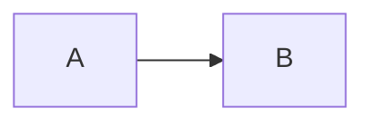
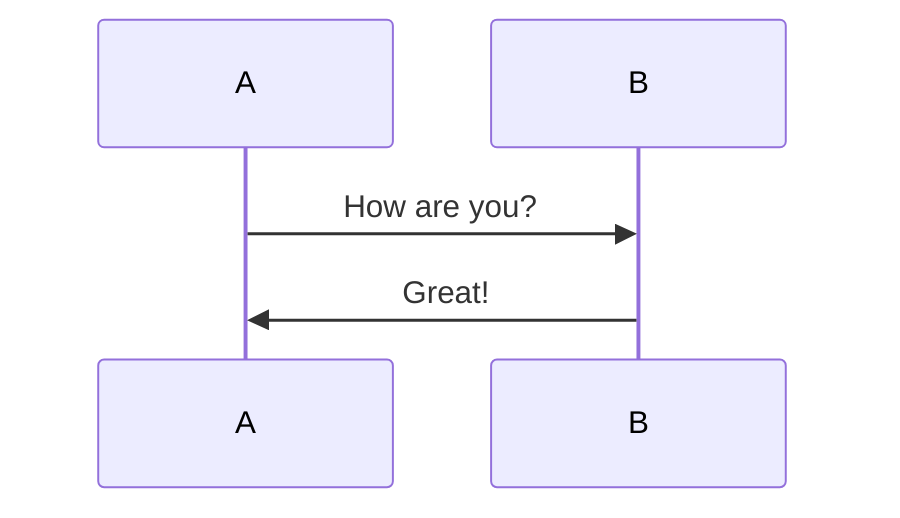

重新复习一下Markdown语法吧。

# 一级标题

## 二级标题

### 三级标题

#### 四级标题

##### 五级标题

###### 六级标题

####### 最多六级标题，没有第七级标题了

常用的无序列表 - Apple - Orange - Melon - 二级无序列表 - 三级无序列表

GTD可能用到的小组件

*   \[x\] 打上勾
*   \[ \] 不打勾，中间空着

有序列表直接用数字表示即可。可以连续使用数字1来表示，会自动排序。

1.  第一个
2.  第二个
3.  第三个

> 单行引用 也可以支持多行
> 
> > 引用之内嵌套引用

3个及以上的减号表示分隔线

* * *

_单个星星是斜体_ **两个星星加粗** \***三个星星斜体又加粗\***

两个等于是高亮

~~ 不稳定的两个波浪线删除 ~~

```
行内引用
```

[中括号后跟小括号，是超链接](https://www.baidu.com)

链接提取出来，方便多次使用

Google[1](http://www.google.com) 注脚功能。类似引用 使用 Markdown[1](#fn-688-1)可以效率的书写文档, 直接转换成 HTML[1](#dfref-footnote-1)。

用感叹号开头，然后同样中括号+小括号，快速插入图片。 

非常强大的Latex支持

单美元号表示行内公式

f(x) = x^2

双美元号表示整行公式

x \\in A

代码块后加math关键字，表示多行的latex代码

E = mc^2

一个可能的流程图模板





\[TOC\] 字符，显示段落目录。

转义字符直接使用反斜杠即可。

也可以直接内嵌HTML代码。 AB

* * *

1.  Markdown是一种纯文本标记语言
    

1 HyperText Markup Language 超文本标记语言 [↩︎](#fnref-688-1) [↩](#ref-footnote-1 "back to document")