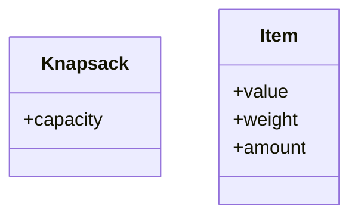
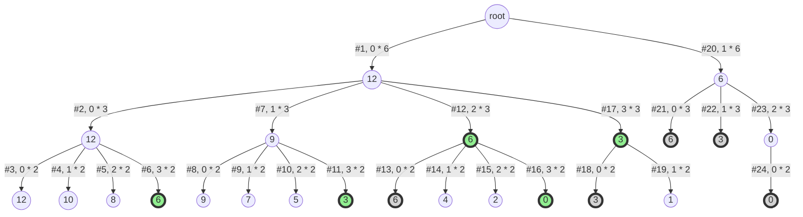
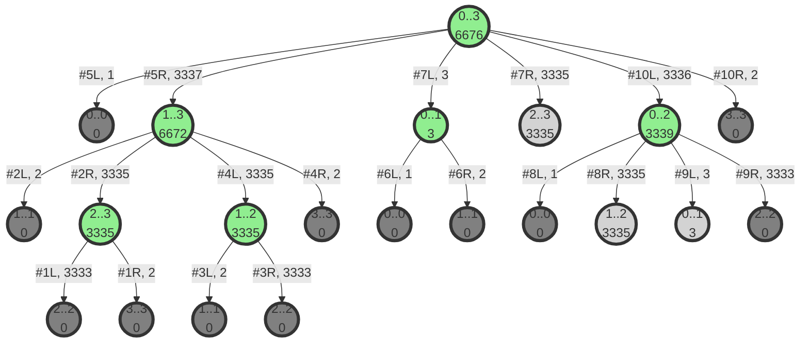
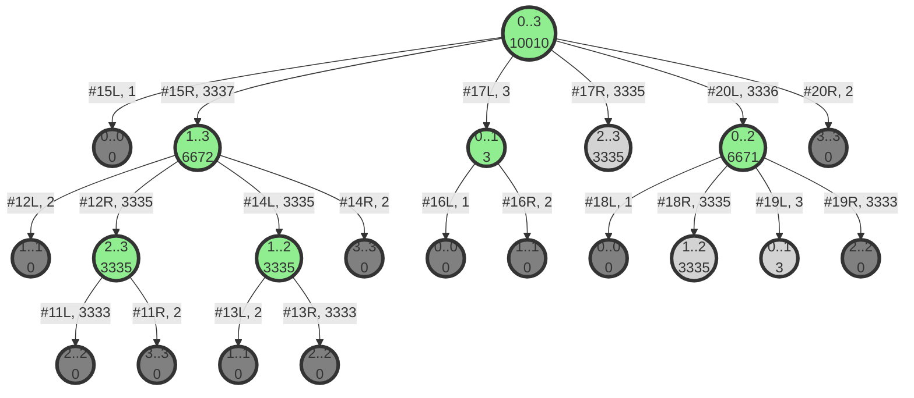

```mermaid
graph TD;
root((root)) --#36, 0 * 6--> a7411865((12))
a7411865 --#37, 0 * 3--> 45b1eb92((12))
45b1eb92 --#38, 0 * 2--> 23c84bd8((12))
style 23c84bd8 fill: lightgray,stroke: #333,stroke-width: 4px
45b1eb92 --#39, 1 * 2--> 3a989a55((10))
style 3a989a55 fill: lightgray,stroke: #333,stroke-width: 4px
45b1eb92 --#40, 2 * 2--> 01f72111((8))
style 01f72111 fill: lightgray,stroke: #333,stroke-width: 4px
45b1eb92 --#41, 3 * 2--> bf018faf((6))
style bf018faf fill: lightgray,stroke: #333,stroke-width: 4px
a7411865 --#42, 1 * 3--> e48ee7e2((9))
e48ee7e2 --#43, 0 * 2--> 4edc439b((9))
style 4edc439b fill: lightgray,stroke: #333,stroke-width: 4px
e48ee7e2 --#44, 1 * 2--> f92a6278((7))
style f92a6278 fill: lightgray,stroke: #333,stroke-width: 4px
e48ee7e2 --#45, 2 * 2--> 1b25d26a((5))
style 1b25d26a fill: lightgray,stroke: #333,stroke-width: 4px
e48ee7e2 --#46, 3 * 2--> 39611a30((3))
style 39611a30 fill: lightgray,stroke: #333,stroke-width: 4px
a7411865 --#47, 2 * 3--> 0abad9d3((6))
0abad9d3 --#48, 0 * 2--> ba8ca012((6))
style ba8ca012 fill: lightgray,stroke: #333,stroke-width: 4px
0abad9d3 --#49, 1 * 2--> 0475bb15((4))
style 0475bb15 fill: lightgray,stroke: #333,stroke-width: 4px
0abad9d3 --#50, 2 * 2--> ea8374c3((2))
style ea8374c3 fill: lightgray,stroke: #333,stroke-width: 4px
0abad9d3 --#51, 3 * 2--> eeff9ef2((0))
style eeff9ef2 fill: lightgray,stroke: #333,stroke-width: 4px
a7411865 --#52, 3 * 3--> fbb80b24((3))
fbb80b24 --#53, 0 * 2--> a96a30bc((3))
style a96a30bc fill: lightgray,stroke: #333,stroke-width: 4px
fbb80b24 --#54, 1 * 2--> fc4ee4be((1))
style fc4ee4be fill: lightgray,stroke: #333,stroke-width: 4px
root((root)) --#55, 1 * 6--> 8c399954((6))
8c399954 --#56, 0 * 3--> 59fdd542((6))
59fdd542 --#57, 0 * 2--> 49d33747((6))
style 49d33747 fill: lightgray,stroke: #333,stroke-width: 4px
59fdd542 --#58, 1 * 2--> 8d975ef6((4))
style 8d975ef6 fill: lightgray,stroke: #333,stroke-width: 4px
59fdd542 --#59, 2 * 2--> 89d23054((2))
style 89d23054 fill: lightgray,stroke: #333,stroke-width: 4px
59fdd542 --#60, 3 * 2--> 1ec22271((0))
style 1ec22271 fill: lightgray,stroke: #333,stroke-width: 4px
8c399954 --#61, 1 * 3--> 4de3015f((3))
4de3015f --#62, 0 * 2--> 010c58d1((3))
style 010c58d1 fill: lightgray,stroke: #333,stroke-width: 4px
4de3015f --#63, 1 * 2--> 951f5029((1))
style 951f5029 fill: lightgray,stroke: #333,stroke-width: 4px
8c399954 --#64, 2 * 3--> ce3992c9((0))
style ce3992c9 fill: lightgray,stroke: #333,stroke-width: 4px

```

# Dynamic Programming Problems


$$
\boxed{@}
% Color %
\newcommand\c[2]{\textcolor{#1}{#2}}
\newcommand\r[1]{\textcolor{red}{#1}}
\newcommand\g[1]{\textcolor{green}{#1}}
\newcommand\b[1]{\textcolor{blue}{#1}}
\newcommand\red[1]{\textcolor{red}{#1}}
\newcommand\blue[1]{\textcolor{blue}{#1}}
\newcommand\green[1]{\textcolor{green}{#1}}
\newcommand\black[1]{\textcolor{black}{#1}}
\newcommand\white[1]{\textcolor{white}{#1}}
\newcommand\cyan[1]{\textcolor{cyan}{#1}}
\newcommand\magenta[1]{\textcolor{magenta}{#1}}
\newcommand\yellow[1]{\textcolor{yellow}{#1}}
\newcommand\orange[1]{\textcolor{orange}{#1}}
\newcommand\lime[1]{\textcolor{lime}{#1}}
\newcommand\pink[1]{\textcolor{pink}{#1}}
\newcommand\darkgray[1]{\textcolor{darkgray}{#1}}
\newcommand\gray[1]{\textcolor{gray}{#1}}
\newcommand\lightgray[1]{\textcolor{lightgray}{#1}}
\newcommand\brown[1]{\textcolor{brown}{#1}}
\newcommand\olive[1]{\textcolor{olive}{#1}}
\newcommand\purple[1]{\textcolor{purple}{#1}}
\newcommand\teal[1]{\textcolor{teal}{#1}}
\newcommand\violet[1]{\textcolor{violet}{#1}}
\newcommand\hotpink[1]{\textcolor{hotpink}{#1}}
\newcommand\blueviolet[1]{\textcolor{blueviolet}{#1}}
\newcommand\navyblue[1]{\textcolor{navyblue}{#1}}
\newcommand\peach[1]{\textcolor{Peach}{#1}}
\newcommand\orangeRed[1]{\textcolor{OrangeRed}{#1}}
\newcommand\salmon[1]{\textcolor{Salmon}{#1}}
\newcommand\skyblue[1]{\textcolor{SkyBlue}{#1}}
\newcommand\springreen[1]{\textcolor{SpringGreen}{#1}}
\newcommand\aqua[1]{\textcolor{aqua}{#1}}
\newcommand\navy[1]{\textcolor{navy}{#1}}
\newcommand\silver[1]{\textcolor{silver}{#1}}
\newcommand\fuchsia[1]{\textcolor{fuchsia}{#1}}
\newcommand\maroon[1]{\textcolor{maroon}{#1}}
\definecolor{luo}{RGB}{102,204,255}
\definecolor{miku}{RGB}{57,197,187} 
\newcommand\luo[1]{\textcolor{luo}{#1}}
\newcommand\miku[1]{\textcolor{miku}{#1}}

% Typography %
\newcommand\a[1]{\begin{aligned}#1\end{aligned}}
\newcommand\t[1]{\text{#1}}
\newcommand\lb[1]{\left\{\begin{aligned} #1 \end{aligned}\right.}
\newcommand\rb[1]{\left.\begin{aligned} #1 \end{aligned}\right\}}
\newcommand\env[2]{\begin{#1}#2\end{#1}}

% Misc %
\newcommand\s[1]{\{#1\}}
\newcommand\qed{\quad\square}
\newcommand\define{\dot{=}}
\newcommand\then{\implies}
\newcommand\rounddown[1]{\lfloor{#1}\rfloor}
\newcommand\roundup[1]{\lceil{#1}\rceil}
\newcommand\graph[4]{#1 = (#2, #3) \quad |#2| = #4}
\newcommand\G{G = (V, E) \quad |V| = n}
\newcommand\so{\therefore}
\newcommand\comment[1]{\quad\text{(#1)}}
\newcommand\note[1]{\quad\text{(#1)}}
\newcommand\bt[1]{\boxed{\text{#1}}}
\newcommand\max[1]{\textbf{ max } \{#1\} }
\newcommand\min[1]{\textbf{ min } \{#1\} }
\newcommand\IF{\textbf{ IF }}
\newcommand\if{\textbf{ if }}
\newcommand\IS{\textbf{ IS }}
\newcommand\is{\textbf{ is }}
\newcommand\but{\textbf{ but }}
\newcommand\however{\textbf{ however }}
\newcommand\AND{\textbf{ AND }}
\newcommand\OR{\textbf{ OR }}
\newcommand\NOT{\textbf{ NOT }}
\newcommand\THEN{\textbf{ THEN }}
\newcommand\IN{\textbf{ IN }}
\newcommand\NOTIN{\textbf{ NOT-IN }}
\newcommand\assume{\textbf{ Assuming that: }}
\newcommand\contradictory{\textbf{ Thus lead to contradiction }}
\newcommand\proof{\textbf{Proof: }}
\newcommand\st{\text{ such that }}
\newcommand\hold{\text{ holds }}
\newcommand\lhs{\text{ LHS }}
\newcommand\rhs{\text{ RHS }}
\newcommand\wlg{\text{ Without loss of generality }}
\newcommand\nb{\text{ nota bene }}
\newcommand\analogously{\text{ analogously }}
\newcommand\viceversa{\textbf{ viceversa }}
\newcommand\let{\textbf{ let }}
\newcommand\as{\textbf{ as }}
\newcommand\for{\textbf{ As for }}
\newcommand\select{\textbf{ SELECT }}
\newcommand\m[1]{\mathit{#1}}
\newcommand\+[1]{\mathcal{#1}}
\newcommand\warnning[1]{\colorbox{Blue}{\textcolor{Yellow}{#1}}}
\newcommand\error[1]{\colorbox{Black}{\textcolor{White}{#1}}}
$$



## Multiple-Knapsack Problem

### Description

设有 n 种不同面值的硬币，各硬币的面值存于数组 T［1:n］中。现要用这些面值的硬
币来找钱。可以使用的各种面值的硬币个数存于数组 Coins［1:n］中。
对任意钱数 0≤m≤20001，设计一个用最少硬币找钱 m 的方法。

### Input

由文件 input.txt 提供输入数据，文件的第一行中只有 1 个整数给出n 的值,第 2 行起每
行 2 个数，分别是 T[j]和 Coins[j]。最后 1 行是要找的钱数 m。

### Output

程序运行结束时，将计算出的最少硬币数输出到文件 output.txt 中。问题无解时输出-1。

### Sample

**输入文件示例**

input.txt

3
1 3
2 3
5 3
18

**输出文件示例**

output.txt

5

### Analysis

#### Analyse the Dimensions & Establish the Recursive Equation



首先，分析出题目中的 `对象 (Object)` 所涉及到的 `属性 (Attribute)`  有哪些。

我们可以得到：

- 与`物品 (硬币)`有关的属性有`面值 (value)`和`数量 (amount)`。

  > 实际上，`物品`还有一个属性为 `重量 (weight)`。
  >
  > 由于 `优化目标`为 `所需的最少硬币的数量`，所以可以将 `所有物品的重量`均视为 `单位重量`，
  >
  > 然后 `忽略` 掉这个属性。

- 与`背包 (需要凑的零钱)`有关的属性有`容量 (capacity)`

所以，我们可以得到3个 `数据维度 (Dimension)`：`硬币的面值`，`硬币的数量`，`需要凑的零钱`，

> `硬币的数量` 应该算 `2个维度`，加起来总共 `4个维度`

并且，我们可以定义`递推关系的值`为`所需的最少硬币数`。

> 这是因为 `所需的最少硬币数`是 `题目所需求的解`。
>
> > 一般直接将 `递推关系的值` 定义为 `题目所需要求解的值`，然后进行 `划分子问题`，
> >
> > 这样等到 `递推方程的值`计算完成，我们就可以 `直接`得到 `问题的解`。

---

现在，我们不妨考虑一下，在`最终凑齐零钱`之前发生了什么？

在`最后一步 (The Final Step)`  ，我们会将`某种面值的硬币`放入`k枚`，然后满足`目标容量`。

> n.b. 这里如果认为：`最后一步` 会将 `某种面值的硬币` 放入`1枚` 也可以。
>
> 但实际上，`某种面值的硬币` 可以 `一次性` 地放入 `多枚`，并且效果 `等价于`
>
> `分多次在不同步` 放入 `该种硬币1枚`

因此，我们可以立即得出下面的`递推方程`。
$$
\boxed{\t{Just take the final step into consideration}} \\
dp[capacity][type][amount] = 
\lb{
& dp[capacity \r{- (k * values[type])}][type-1][amount \r{+ k}] + \g{k},&(\t{use coins}) \\
& dp[capacity][type-1][amount],&(\t{don't use coins})
}
$$

---

#### Compress the Recursive Equation

到此，我们已经得到了`递推方程`，但该方程是`4维`的，`时间复杂度` 可能会较大。

> 后面我们会对比 `4维解法` 和 `2维解法` 的 `性能差异`。
>
> 当 `问题规模` 变得 `稍微大一些` 的时候， `4维解法` 的 `时间复杂度` 将无法在 `可接受的时间` 内完成求解。

接下来我们可以考虑，能否`压缩 (Compress)` `某些维度`来达到`降维优化`的效果。

> 实际上，该 `递推方程`的 `数量 (amount)`维度存有 `冗余的信息`。

---

关于`每种硬币的数量限制`，不妨考虑：

如果`每种硬币`都是`无限的`，那么我们很确信，`capacity较大的问题的最优解`由`capacity较小的问题的最优解`来`组成`。

>  因为`每种硬币 `是 `无限的`，我们只需要简单地把`capacity较小的问题的找零方案`进行`组合`即可。

但是，如果`每种硬币都是有限的`，如何知道`capacity较大的问题的最优解`是否可以 `直接` 由`capacity较小的问题的最优解`组合得到，而且 `不违反每种硬币的数量限制`？

换句话说：如果我们需要`凑齐500元`，而`凑齐500元的最优解`由`凑齐200元的最优解`和`凑齐300元的最优解`来`组合`得到。假设，`凑齐200元的最优解`和`凑齐500元的最优解`都用到了`5元硬币`，则我们如何`确保所使用的5元硬币的总量符合数量限制`？

这个问题其实依赖于我们的`计算顺序`，`凑齐200元的最优解`和`凑齐300元的最优解`并不是`独立地被计算出来的`。

我们会在`凑齐200元的最优解`的 `基础上` 进行计算`凑齐300元的最优解`，也就是从`capacity较小的问题`开始计算。

同时，`保证任何时候的凑零钱方式`都符合 `每种硬币的数量限制`。

也就是说，我们是通过`在capacity较小的问题`的 `基础 (Base)`之上，`动态地` 计算 `capacity较大的问题的最优解`，

> 换句话说，如果我们在 `capacity较小的问题` 的 `基础` 之上，求解 `capacity较大的问题`的 `最优解`。
>
> 那么违反 `数量限制的解` 本质上就是 `非法解`，并不是 `合法解`，更谈不上 `最优解`！
>
> 这使得处理 `数量限制`的约束非常容易，我们需要做的仅仅是 `在子问题的基础之上求解原问题`。
>
> > 即要求我们满足 `最优子结构 (Optimal Substructure)` 性质

---

关于`每种硬币的数量限制`，还有一个重要的性质，那就是`凑硬币的顺序是可交换的`。

比如说：

$$
\a{
50 &= 30 + 10 + 10 \\
&= 10 + 30 + 10 \\
&= 10 + 10 + 30
}
$$
也就是`同样面值的固定数量的硬币`，按 `任意顺序` 放入，最终的 `效果` 是等价的。

> 即 `整数的加法`是 `可交换的`

那么，也就是说：如果我们要求`凑齐50元硬币的最优解`，而我们 `拥有一些10元硬币`，

则我们无需考虑`到底要按照什么顺序放入这些10元硬币`，而仅仅需要考虑，`到底一次性要放多少枚10元硬币`才可以得到`凑齐50元硬币的最优解`。

因此，我们实际上利用 `可交换性`可以`压缩` 掉 `amount维度`：

由于对于 `某种硬币`来说， `分多步放入共k枚`和 `在1步就一次性放入k枚`的 `效果`是 `等价的`，

那么我们不妨就可以 `依次考虑每种类型的硬币`，并 `确定一次性要放多少枚该种硬币`。

在已知`正在考虑的硬币类型`和 `当前需要凑齐的金额`时，我们可以很容易地得出 `当前类型的硬币的数量`的 `上下界`，

然后依次考虑 `k的所有可能取值`，找出 `原问题的最优解`。

> 如果没有这样压缩，则我们要为`amount维度`的每种可能的来源方式做考虑：
>
> 如果没有 `可交换性`的话，我们就需要为 `硬币数量的所有可能来源`做考虑。
>
> 如 5枚 = 0+5 = 1 + 4 = 2 + 3 = 3 + 2 = 4 + 1 = 5 + 0

---

因而，我们可以得到 `压缩后的递推方程`。
$$
\boxed{\t{Just take the final step into consideration}} \\
dp[capacity][type] = \lb{
&dp[capacity \r{- (k * values[type])}][type-1]\g{+ k},&(\t{use coins of the current type}) \\
&dp[capacity][type-1],&(\t{don't use coins of the current type})
}
$$
> n.b. 当我们`集中起来一次性考虑每种面额要放多少枚硬币`时，我们将`非常容易地`实现`对每种面值的硬币的数量的限制`（只需要通过简单地取定`当前面值的硬币`的`循环下限`和`循环上限`即可）
>
> > 同时这也意味着，`每种硬币的数量是特定的`和`每种硬币的数量是无限的`这两种问题本质上是相同的。

### Solution

#### Iterative Method

##### Diagram

```yaml
Expected  Input: [3, 2 3, 3 3, 6 1, 12]
Expected Output: [3]
```

| item\capacity |  0   |     1      |     2      |     3      |     4      |                              5                               |     6      |     7      |     8      |     9      |     10     |     11     |     12     |
| :-----------: | :--: | :--------: | :--------: | :--------: | :--------: | :----------------------------------------------------------: | :--------: | :--------: | :--------: | :--------: | :--------: | :--------: | :--------: |
|       0       |  0   | 1061109567 | 1061109567 | 1061109567 | 1061109567 |                          1061109567                          | 1061109567 | 1061109567 | 1061109567 | 1061109567 | 1061109567 | 1061109567 | 1061109567 |
|       1       |  0   | 1061109567 |     1      | 1061109567 |     2      |                          1061109567                          |     3      | 1061109567 | 1061109567 | 1061109567 | 1061109567 | 1061109567 | 1061109567 |
|       2       |  0   | 1061109567 |     1      |     1      |     2      |                              2                               |     2      | 1061109567 |     3      |     3      | 1061109567 |     4      | 1061109567 |
|       3       |  0   | 1061109567 |     1      |     1      |     2      | xxxxxxxxxx -----------------------------------------------------Current Case: MODE1.in & MODE1.outExpected  Input: [10, Omit the remaining 10 line(s)...]Expected Output: [1, 5]Your     Output: [1, 5]Time Cost: 0.045200 ms (45200 ns)Accepted-----------------------------------------------------Current Case: MODE10.in & MODE10.outExpected  Input: [1234567, Omit the remaining 1234567 line(s)...]Expected Output: [47527, 38]Your     Output: [47527, 38]Time Cost: 104.330000 ms (104330000 ns)Accepted-----------------------------------------------------Current Case: MODE11.in & MODE11.outExpected  Input: [10, Omit the remaining 10 line(s)...]Expected Output: [1, 6]Your     Output: [1, 6]Time Cost: 0.001100 ms (1100 ns)Accepted-----------------------------------------------------Current Case: MODE12.in & MODE12.outExpected  Input: [10, Omit the remaining 10 line(s)...]Expected Output: [2, 5]Your     Output: [2, 5]Time Cost: 0.001000 ms (1000 ns)Accepted-----------------------------------------------------Current Case: MODE13.in & MODE13.outExpected  Input: [10, Omit the remaining 10 line(s)...]Expected Output: [2, 4]Your     Output: [2, 4]Time Cost: 0.000901 ms (901 ns)Accepted-----------------------------------------------------Current Case: MODE14.in & MODE14.outExpected  Input: [10, Omit the remaining 10 line(s)...]Expected Output: [2, 4]Your     Output: [2, 4]Time Cost: 0.001200 ms (1200 ns)Accepted-----------------------------------------------------Current Case: MODE15.in & MODE15.outExpected  Input: [10, Omit the remaining 9 line(s)...]Expected Output: [3, 4]Your     Output: [3, 4]Time Cost: 0.001101 ms (1101 ns)Accepted-----------------------------------------------------Current Case: MODE2.in & MODE2.outExpected  Input: [50, Omit the remaining 50 line(s)...]Expected Output: [3, 8]Your     Output: [3, 8]Time Cost: 0.002099 ms (2099 ns)Accepted-----------------------------------------------------Current Case: MODE3.in & MODE3.outExpected  Input: [100, Omit the remaining 100 line(s)...]Expected Output: [28, 9]Your     Output: [28, 9]Time Cost: 0.004400 ms (4400 ns)Accepted-----------------------------------------------------Current Case: MODE4.in & MODE4.outExpected  Input: [500, Omit the remaining 500 line(s)...]Expected Output: [17, 8]Your     Output: [29, 8]Time Cost: 0.029600 ms (29600 ns)Wrong Answer.-----------------------------------------------------Current Case: MODE5.in & MODE5.outExpected  Input: [10000, Omit the remaining 10000 line(s)...]Expected Output: [152, 11]Your     Output: [152, 11]Time Cost: 0.564300 ms (564300 ns)Accepted-----------------------------------------------------Current Case: MODE6.in & MODE6.outExpected  Input: [50000, Omit the remaining 50000 line(s)...]Expected Output: [1507, 11]Your     Output: [1507, 11]Time Cost: 3.741200 ms (3741200 ns)Accepted-----------------------------------------------------Current Case: MODE7.in & MODE7.outExpected  Input: [500000, Omit the remaining 500000 line(s)...]Expected Output: [62872, 23]Your     Output: [62872, 23]Time Cost: 37.026301 ms (37026301 ns)Accepted-----------------------------------------------------Current Case: MODE8.in & MODE8.outExpected  Input: [1000000, Omit the remaining 1000000 line(s)...]Expected Output: [15875, 34]Your     Output: [15875, 34]Time Cost: 71.459100 ms (71459100 ns)Accepted-----------------------------------------------------Current Case: MODE9.in & MODE9.outExpected  Input: [1234567, Omit the remaining 1234567 line(s)...]Expected Output: [44678, 42]Your     Output: [44678, 42]Time Cost: 83.852201 ms (83852201 ns)Accepted-----------------------------------------------------Result Statistics: √ √ √ √ √ √ √ √ √ × √ √ √ √ √ yaml |     1      | 1061109567 |     2      |     2      |     3      |     3      |     3      |

##### Source

```java
    public static int solve(int[] values, int[] amounts, int capacity) {
        // define dp array
        int[][] dp = new int[values.length + 1][capacity + 1];

        // init
        for (int i = 0; i <= values.length; i++) {
            dp[i][0] = 0;
        }
        for (int j = 1; j <= capacity; j++) {
            dp[0][j] = 0x3f3f3f3f;
        }

        // only use the first i coins
        for (int i = 1; i <= values.length; i++) {
            int value = values[i - 1];
            // to satisfy j capacity
            for (int j = 1; j <= capacity; j++) {
                // how many coins of this type should be used ?
                for (int k = 0; k <= j / value && k <= amounts[i - 1]; k++) {
                    dp[i][j] = Math.min(dp[i - 1][j], dp[i - 1][j - k * value] + k);
                }
            }
        }

        int ans = dp[values.length][capacity];
        return ans == 0x3f3f3f3f ? -1 : ans;
    }
```

##### Benchmark

```yaml
-----------------------------------------------------
Current Case: COINS0.in & COINS0.out
Expected  Input: [10, 1 0, 2 12, 5 180, 10 0, 20 109, 50 126, 100 192, 200 107, 500 47, 1000 20, 14758]
Expected Output: [21]
Your     Output: [21]
Time Cost: 25.284600 ms (25284600 ns)
Accepted.
-----------------------------------------------------
Current Case: COINS1.in & COINS1.out
Expected  Input: [10, 1 0, 2 12, 5 180, 10 0, 20 109, 50 126, 100 192, 200 107, 500 47, 1000 20, 14758]
Expected Output: [21]
Your     Output: [21]
Time Cost: 16.951400 ms (16951400 ns)
Accepted.
-----------------------------------------------------
Current Case: COINS2.in & COINS2.out
Expected  Input: [10, 1 0, 2 45, 5 0, 10 148, 20 145, 50 136, 100 181, 200 17, 500 172, 1000 152, 16834]
Expected Output: [23]
Your     Output: [23]
Time Cost: 13.734800 ms (13734800 ns)
Accepted.
-----------------------------------------------------
Current Case: COINS3.in & COINS3.out
Expected  Input: [10, 1 0, 2 22, 5 0, 10 27, 20 52, 50 192, 100 164, 200 110, 500 62, 1000 98, 17397]
Expected Output: [-1]
Your     Output: [-1]
Time Cost: 10.814700 ms (10814700 ns)
Accepted.
-----------------------------------------------------
Current Case: COINS4.in & COINS4.out
Expected  Input: [10, 1 0, 2 99, 5 173, 10 11, 20 54, 50 101, 100 6, 200 44, 500 15, 1000 126, 12810]
Expected Output: [16]
Your     Output: [16]
Time Cost: 8.838500 ms (8838500 ns)
Accepted.
-----------------------------------------------------
Current Case: COINS5.in & COINS5.out
Expected  Input: [10, 1 0, 2 133, 5 6, 10 137, 20 196, 50 198, 100 176, 200 0, 500 168, 1000 94, 2253]
Expected Output: [-1]
Your     Output: [-1]
Time Cost: 1.159000 ms (1159000 ns)
Accepted.
-----------------------------------------------------
Current Case: COINS6.in & COINS6.out
Expected  Input: [10, 1 0, 2 0, 5 3, 10 131, 20 24, 50 78, 100 66, 200 84, 500 147, 1000 152, 16423]
Expected Output: [-1]
Your     Output: [-1]
Time Cost: 8.171400 ms (8171400 ns)
Accepted.
-----------------------------------------------------
Result Statistics: √ √ √ √ √ √ √ 
```

#### Recursive Method (2-Dimension)

##### Diagram

```yaml
Expected  Input: [3, 2 3, 3 3, 6 1, 12]
Expected Output: [3]
```



##### Source

```java
    static int n;
    static int[] values;
    static int[] amounts;
    static int capacity;
    static int[][] dp;
    static boolean[][] visited;
    static int INF = 0x3f3f3f3f;

    public static int f(int firstCoins, int capacity) {

        /* Base Case */
        if (visited[firstCoins][capacity] || firstCoins == 0) return dp[firstCoins][capacity];
        else visited[firstCoins][capacity] = true;

        /* Recursive Case */
        int value = values[firstCoins - 1];
        for (int k = 0; (k <= capacity / value) && (k <= amounts[firstCoins - 1]); k++) {
            // the following are the same
            // dp[firstCoins][capacity] = Math.min(f(firstCoins - 1, capacity), f(firstCoins - 1, capacity - (k * value)) + k);
            dp[firstCoins][capacity] = Math.min(dp[firstCoins - 1][capacity], f(firstCoins - 1, capacity - (k * value)) + k);
        }

        return dp[firstCoins][capacity];
    }

    public static int solve() {

        // define dp array
        dp = new int[values.length + 1][capacity + 1];
        visited = new boolean[values.length + 1][capacity + 1];

        // init
        for (int i = 0; i <= values.length; i++) {
            for (int j = 0; j <= capacity; j++) {
                dp[i][j] = INF;
            }
        }

        for (int i = 0; i <= values.length; i++) {
            dp[i][0] = 0;
        }
        for (int j = 1; j <= capacity; j++) {
            dp[0][j] = INF;
        }

        // dp
        int ans = f(values.length, capacity);
        return ans == INF ? -1 : ans;
    }

    public static void main(String[] args) {
        for (Scanner scanner : judger) {
            n = scanner.nextInt();
            values = new int[n];
            amounts = new int[n];
            for (int i = 0; i < n; i++) {
                int value = scanner.nextInt();
                int amount = scanner.nextInt();
                values[i] = value;
                amounts[i] = amount;
            }
            capacity = scanner.nextInt();
            judger.manuallyStartTimer();
            System.out.println(solve());
            judger.manuallyStopTimer();
        }
    }
```

##### Benchmark

```yaml
-----------------------------------------------------
Current Case: COINS0.in & COINS0.out
Expected  Input: [10, 1 0, 2 12, 5 180, 10 0, 20 109, 50 126, 100 192, 200 107, 500 47, 1000 20, 14758]
Expected Output: [21]
Your     Output: [21]
Time Cost: 8.383200 ms (8383200 ns)
Accepted.
-----------------------------------------------------
Current Case: COINS1.in & COINS1.out
Expected  Input: [10, 1 0, 2 12, 5 180, 10 0, 20 109, 50 126, 100 192, 200 107, 500 47, 1000 20, 14758]
Expected Output: [21]
Your     Output: [21]
Time Cost: 5.690600 ms (5690600 ns)
Accepted.
-----------------------------------------------------
Current Case: COINS2.in & COINS2.out
Expected  Input: [10, 1 0, 2 45, 5 0, 10 148, 20 145, 50 136, 100 181, 200 17, 500 172, 1000 152, 16834]
Expected Output: [23]
Your     Output: [23]
Time Cost: 6.921800 ms (6921800 ns)
Accepted.
-----------------------------------------------------
Current Case: COINS3.in & COINS3.out
Expected  Input: [10, 1 0, 2 22, 5 0, 10 27, 20 52, 50 192, 100 164, 200 110, 500 62, 1000 98, 17397]
Expected Output: [-1]
Your     Output: [-1]
Time Cost: 1.721700 ms (1721700 ns)
Accepted.
-----------------------------------------------------
Current Case: COINS4.in & COINS4.out
Expected  Input: [10, 1 0, 2 99, 5 173, 10 11, 20 54, 50 101, 100 6, 200 44, 500 15, 1000 126, 12810]
Expected Output: [16]
Your     Output: [16]
Time Cost: 4.294700 ms (4294700 ns)
Accepted.
-----------------------------------------------------
Current Case: COINS5.in & COINS5.out
Expected  Input: [10, 1 0, 2 133, 5 6, 10 137, 20 196, 50 198, 100 176, 200 0, 500 168, 1000 94, 2253]
Expected Output: [-1]
Your     Output: [-1]
Time Cost: 1.258100 ms (1258100 ns)
Accepted.
-----------------------------------------------------
Current Case: COINS6.in & COINS6.out
Expected  Input: [10, 1 0, 2 0, 5 3, 10 131, 20 24, 50 78, 100 66, 200 84, 500 147, 1000 152, 16423]
Expected Output: [-1]
Your     Output: [-1]
Time Cost: 2.296300 ms (2296300 ns)
Accepted.
-----------------------------------------------------
Current Case: COINS7.in & COINS7.out
Expected  Input: [3, 1 1, 2 2, 3 3, 11]
Expected Output: [4]
Your     Output: [4]
Time Cost: 0.092600 ms (92600 ns)
Accepted.
-----------------------------------------------------
Result Statistics: √ √ √ √ √ √ √ √ 
```

#### Recursive Method (4-Dimension)

##### Diagram

```yaml
Expected  Input: [3, 2 3, 3 3, 6 1, 12]
Expected Output: [3]
```



##### Source

```java
    static int n;
    static int[] values;
    static int[] amounts;
    static int capacity;
    static int INF = 0x3f3f3f3f;

    public static class Memo {
        private static final ArrayList<Memo> memo = new ArrayList<>();
        public int firstCoins;
        public int capacity;
        public int[] amounts;
        public int value;
        public boolean visited;

        public Memo(int firstCoins, int capacity, int[] amounts, int value, boolean visited) {
            this.firstCoins = firstCoins;
            this.capacity = capacity;
            this.amounts = amounts;
            this.value = value;
            this.visited = visited;
        }

        @Override
        public boolean equals(Object o) {
            if (this == o) return true;
            if (o == null || getClass() != o.getClass()) return false;

            Memo memo = (Memo) o;
            if (firstCoins != memo.firstCoins) return false;
            if (capacity != memo.capacity) return false;
            return Arrays.equals(amounts, memo.amounts);
        }

        public static void resetMemo() {
            memo.clear();
        }

        public static void set(int firstCoins, int capacity, int[] amounts, int value, boolean visited) {
            int index = memo.indexOf(new Memo(firstCoins, capacity, amounts, value, visited));
            if (index == -1) {
                memo.add(new Memo(firstCoins, capacity, amounts, value, visited));
            } else {
                memo.set(index, new Memo(firstCoins, capacity, amounts, value, visited));
            }
        }

        public static Memo MEMO_ZERO = new Memo(0, 0, null, 0, true);
        public static Memo MEMO_INF = new Memo(0, 0, null, INF, true);

        public static Memo get(int firstCoins, int capacity, int[] amounts) {

            /* Special cases */
            if (capacity == 0) return MEMO_ZERO;
            else if (firstCoins == 0) return MEMO_INF;

            /* Normal cases */
            int index = memo.indexOf(new Memo(firstCoins, capacity, amounts, -1, false));
            if (index == -1) {
                Memo temp = new Memo(firstCoins, capacity, amounts, INF, false);
                memo.add(temp);
                return temp;
            } else return memo.get(index);
        }

    }

    public static int f(int firstCoins, int capacity, int[] amounts) {

        /* Base Case */
        if (Memo.get(firstCoins, capacity, amounts).visited) {
            return Memo.get(firstCoins, capacity, amounts).value;
        }

        /* Recursive Case */
        int value = values[firstCoins - 1];
        for (int k = 0; (k <= capacity / value) && (k <= amounts[firstCoins - 1]); k++) {
            // choice 1
            int do_not_use_current_type_of_coin = Memo.get(firstCoins - 1, capacity, amounts).value;

            // choice 2
            int[] amounts_clone = amounts.clone();
            amounts_clone[firstCoins - 1] -= k;
            int use_current_type_of_coin = f(firstCoins - 1, capacity - (k * value), amounts_clone) + k;

            // optimal choice
            Memo.set(firstCoins, capacity, amounts, Math.min(do_not_use_current_type_of_coin, use_current_type_of_coin), true);
        }

        return Memo.get(firstCoins, capacity, amounts).value;
    }

    public static int solve() {

        // define dp array
        Memo.resetMemo();

        // dp
        int ans = f(values.length, capacity, amounts);
        return ans == INF ? -1 : ans;
    }

    public static void main(String[] args) {
        for (Scanner scanner : judger) {
            n = scanner.nextInt();
            values = new int[n];
            amounts = new int[n];
            for (int i = 0; i < n; i++) {
                int value = scanner.nextInt();
                int amount = scanner.nextInt();
                values[i] = value;
                amounts[i] = amount;
            }
            capacity = scanner.nextInt();
            judger.manuallyStartTimer();
            System.out.println(solve());
            judger.manuallyStopTimer();
        }
    }
```

##### Benchmark

###### Recursive Method with 4-Dimension

```yaml
-----------------------------------------------------
Current Case: COINS7.in & COINS7.out
Expected  Input: [3, 1 1, 2 2, 3 3, 11]
Expected Output: [4]
Your     Output: [4]
Time Cost: 1.000600 ms (1000600 ns)
Accepted
-----------------------------------------------------
Current Case: COINS8.in & COINS8.out
Expected  Input: [3, 2 3, 3 3, 6 1, 12]
Expected Output: [3]
Your     Output: [3]
Time Cost: 0.242400 ms (242400 ns)
Accepted
-----------------------------------------------------
Current Case: COINS9.in & COINS9.out
Expected  Input: [9, 1 1, 2 2, 3 3, 4 4, 5 5, 6 6, 7 7, 8 8, 9 9, 60]
Expected Output: [7]
Your     Output: [7]
Time Cost: 17775.069700 ms (17775069700 ns)
Accepted
-----------------------------------------------------
Result Statistics: √ √ √ 
```

###### Recursive Method with 2-Dimention

```yaml
-----------------------------------------------------
Current Case: COINS7.in & COINS7.out
Expected  Input: [3, 1 1, 2 2, 3 3, 11]
Expected Output: [4]
Your     Output: [4]
Time Cost: 8.181900 ms (8181900 ns)
Accepted
-----------------------------------------------------
Current Case: COINS8.in & COINS8.out
Expected  Input: [3, 2 3, 3 3, 6 1, 12]
Expected Output: [3]
Your     Output: [3]
Time Cost: 3.047300 ms (3047300 ns)
Accepted
-----------------------------------------------------
Current Case: COINS9.in & COINS9.out
Expected  Input: [9, 1 1, 2 2, 3 3, 4 4, 5 5, 6 6, 7 7, 8 8, 9 9, 60]
Expected Output: [7]
Your     Output: [7]
Time Cost: 69.721200 ms (69721200 ns)
Accepted
-----------------------------------------------------
Result Statistics: √ √ √ 
```


## Pebble Merging Problem

### Description

在一个圆形操场的四周摆放着 n 堆石子。现要将石子有次序地合并成一堆。规定每次只
能选相邻的 2 堆石子合并成新的一堆，并将新的一堆石子数记为该次合并的得分。试设计一
个算法，计算出将 n 堆石子合并成一堆的最小得分和最大得分。

### Input

由文件 input.txt 提供输入数据。文件的第 1 行是正整数 n，1≤n≤100，表示有 n 堆石子。
第二行有 n 个数，分别表示每堆石子的个数。

### Output

程序运行结束时，将计算结果输出到文件 output.txt 中。文件的第 1 行中的数是最小得
分；第 2 行中的数是最大得分；。

### Sample

**输入文件示例**

input.txt

4

4 4 5 9

**输出文件示例**

output.txt

43

54

### Analysis

我们只考虑`最小得分`，因为 `最小得分` 和 `最大得分` 是`对称的`。

然后，由于`每次只能合并相邻的两堆石子`，所以我们不妨`将所有石子从左到右排成线性的一堆石子`

---

#### Establish the Recursive Equation

我们不妨考虑 `最终 (End)  ` 会发生什么： `所有的n堆石子` 被合并为 `1堆石子`。

而`最后一步 (The Final Step)`时，我们会将`2堆石子`合并为`1堆石子`。

显然，我们需要`为此次合并操作`付出的代价为`左边那一堆石子的重量 + 右边那一堆石子的重量`

此外，我们还要加上`为了获得左边那堆石子的所付出的代价`和`为了获得右边那堆石子所付出的代价`

> 注意，这里面已经隐含了`递归`，这相当于，我们在`线性排列的一堆石子里`：在`第i堆石子`和`第j堆石子`之中，插入了`分隔板`，使之形成`左边那堆石子（第i堆石子~第k堆石子)` 和`右边那堆石子 (第k+1堆石子~第j堆石子)`。

因而，我们可以写出`递推方程`
$$
\bt{Just take the final step into considetaion} \\
dp[i][j] = \lb {
& \r{dp[i][k]+dp[k+1][j]} \g{+ (sum[j] - sum[i])},&(\t{we find a better plan !}) \\
& dp[i][j],&(\t{not better than current plan})
}
$$

> 其中$sum$表示 `前缀和`

---

#### Determine the order of computation (Iterative Method)

为了 `保证`在  `求解原问题`时，`该原问题所需的所有子问题` 均 `已经求解完毕`，则我们需要 `确定合适的运算顺序`。

首先，我们考虑下`合并过程刚开始的时候`：i=1,j=n 即表示考虑 从`第1堆石子`到`第n堆石子`的最少合并代价，

假设`最终这个最优解在第k堆石子处分隔开`：

即可得到`2个子问题`，`从第1堆石子到第k堆石子的最少合并代价`和`从第k+1堆石子到第n堆石子的最少合并代价`。

不妨继续考虑`从第1堆石子到第k堆石子的最少合并代价`，我们会发现这里仍然需要 `递归` ，直到`基本情况`。

而`基本情况`就是`只有1堆石子的情况`。

所以，通过`分析递归过程`得出的`基本情况`，我们`反过来`从`基本情况`逐步建立`迭代形式的运算顺序`：即我们从`只有1堆石子的最少合并代价`开始计算，然后计算`只有2堆石子的最少合并代价`，...，计算`只有n堆石子的最少合并代价`。

于是，我们确定了`第一个运算顺序：考虑只有[1, n]堆石子的最少合并代价`

接下来，我们需要` 枚举` `只有len堆石子`到底是 `哪len堆石子` ，由于已经确定了`石子的堆数（即区间长度 len，因为所有石子堆是线性排列的）`。

则我们只需要确定`起始点`即可，于是，我们确定了`第二个运算顺序：只有指定堆的石子的起始点为[0,n - len]`

而接下来，我们仅需要对`指定长度的石子堆`进行`确定分割点k`即可。

> 而且由于我们前面的运算顺序中，`第一个运算顺序`为计算`石子堆的长度`从1~n
>
> 因而，我们在`第三个运算顺序`时`确立分割点`时，可以`保证 更小区间长度的石子堆的最小合并代价`是`已经计算好的`

---

综上，我们确立好了运算顺序：

1. 第一个运算顺序：区间长度（连续的len个石子堆）
2. 第二个运算顺序：区间的起始点（从第i个石子堆开始的连续len个石子堆）
3. 第三个运算顺序：分割点（在这个选定的 `石子堆序列` 中，选定 `分割点`，将这个 `石子堆序列` 分为 `左右两个部分`）

#### Simply use memo (Recursive Method)

在已经得出了 `递推方程`的情况下，如果不希望 `确定运算顺序`，则可以直接使用 `递归方法`。

`递归方法`可以非常自然地 `描述`  `递推关系`。

在已知 `最优子结构`的情况下，`动态规划 (Dynamic Programming)`   和 `暴力法 (Brute-Force)`最大的区别是：

`动态规划`利用了 `重叠子问题 (Overlapping Subproblem)`性质。

即 `递归形式的动态规划 = 递归形式的暴力法 + 备忘录机制`

> 如果一开始就打算使用`递归形式`，那么`运算顺序`就没有那么重要了，因为我们总可以`在需要的时候临时计算`，然后`利用备忘录机制（这很重要，否则会导致重复地求解相同的子问题）`来保存`某个子问题的计算结果`即可。

> 但相比于 `迭代形式的动态规划`会 `产生整颗子问题空间树 (无论某些子问题是否真的被用到)`， `递归形式的动态规划`则只会 `生成那些确实需要用到的子问题`。
>
> 但是，一般来说，`迭代形式的动态规划`却会更加快速。
>
> > `编译器`对于 `迭代算法`可以有更多的信息来进行 `指令级优化`。
> >
> > 同时，`迭代形式`也可以避免过多的 `过程调用的帧栈创建和销毁的代价`，以及获得 `更优的高速缓存命中率`
>
> 但通过 `递归形式`产生的 `子问题空间树`是 `“残缺的”`，在只有 `少量子问题`重复出现的情况下，用 `递归形式的动态规划`会更加高效。

### Solution

#### Iterative Method

##### Diagram

```yaml
Expected  Input: [4, 1 2 3333 2]
Expected Output: [6676, 10010]
```

| i\j  |     0      |     1      |     2      |  3   |
| :--: | :--------: | :--------: | :--------: | :--: |
|  0   |     0      |     3      |    3339    | 6676 |
|  1   | 1061109567 |     0      |    3335    | 6672 |
|  2   | 1061109567 | 1061109567 |     0      | 3335 |
|  3   | 1061109567 | 1061109567 | 1061109567 |  0   |

| i\j  |  0   |  1   |  2   |   3   |
| :--: | :--: | :--: | :--: | :---: |
|  0   |  0   |  3   | 6671 | 10010 |
|  1   |  0   |  0   | 3335 | 6672  |
|  2   |  0   |  0   |  0   | 3335  |
|  3   |  0   |  0   |  0   |   0   |

##### Source

```java
     public static Judger.Pair<Integer, Integer> solve(int n, int[] sum) {

        int[][] dp = new int[n][n];
        int min, max;

        // Min cost
        for (int i = 0; i < n; i++) {
            for (int j = 0; j < n; j++) {
                if (i == j) dp[i][j] = 0;
                else dp[i][j] = 0x3f3f3f3f;
            }
        }

        for (int len = 1; len < n; len++) {
            for (int i = 0; i < (n - len); i++) {
                int j = i + len;
                for (int k = i; k < j; k++) {
                    dp[i][j] = Math.min(dp[i][j], dp[i][k] + dp[k + 1][j] + (sum[j + 1] - sum[i]));
                }

            }
        }
        min = dp[0][n - 1];

        // Max Cost
        for (int i = 0; i < n; i++) {
            for (int j = 0; j < n; j++) {
                if (i == j) dp[i][j] = 0;
                else dp[i][j] = 0;
            }
        }

        for (int len = 1; len < n; len++) {
            for (int i = 0; i < (n - len); i++) {
                int j = i + len;
                for (int k = i; k < j; k++) {
                    dp[i][j] = Math.max(dp[i][j], dp[i][k] + (dp[k + 1][j] + sum[j + 1] - sum[i]));
                }

            }
        }
        max = dp[0][n - 1];

        return new Judger.Pair<>(min, max);
    }

    public static void main(String[] args) {

        for (Scanner scanner : judger) {
            int n = scanner.nextInt();
            int[] a = new int[n];
            for (int i = 0; i < n; i++) {
                a[i] = scanner.nextInt();
            }

            // Pre-solve: partial sum
            int[] sum = new int[n + 1];
            sum[0] = 0;
            for (int i = 1; i < sum.length; i++) {
                sum[i] = sum[i - 1] + a[i - 1];
            }

            Judger.Pair<Integer, Integer> answer = solve(n, sum);
            System.out.printf("%d\n%d", answer.getKey(), answer.getValue());
        }
    }
```

##### Benchmark

```yaml
-----------------------------------------------------
Current Case: MERGE0.in & MERGE0.out
Expected  Input: [37, 53 49 2 9 9 30 2 35 1 46 39 46 42 33 13 41 35 57 38 59 15 40 18 6 46 30 53 31 34 57 41 20 1 42 59 46 45 ]
Expected Output: [6186, 25130]
Your     Output: [6186, 25130]
Time Cost: 4.828800 ms (4828800 ns)
Accepted.
-----------------------------------------------------
Current Case: MERGE1.in & MERGE1.out
Expected  Input: [4, 1 2 3333 2]
Expected Output: [6676, 10010]
Your     Output: [6676, 10010]
Time Cost: 0.929800 ms (929800 ns)
Accepted.
-----------------------------------------------------
Current Case: MERGE2.in & MERGE2.out
Expected  Input: [7, 30 35 15 5 10 20 25]
Expected Output: [370, 580]
Your     Output: [370, 580]
Time Cost: 1.354100 ms (1354100 ns)
Accepted.
-----------------------------------------------------
Current Case: MERGE3.in & MERGE3.out
Expected  Input: [7, 3 4 5 6 7 8 9]
Expected Output: [116, 187]
Your     Output: [116, 187]
Time Cost: 1.063500 ms (1063500 ns)
Accepted.
-----------------------------------------------------
Current Case: MERGE4.in & MERGE4.out
Expected  Input: [30, 3 4 7 11 13 15 18 21 17 14 7 5 8 10 19 16 13 10 7 5 4 3 4 5 6 3 15 3 10 8 ]
Expected Output: [1342, 5318]
Your     Output: [1342, 5318]
Time Cost: 1.857000 ms (1857000 ns)
Accepted.
-----------------------------------------------------
Current Case: MERGE5.in & MERGE5.out
Expected  Input: [4, 1 3 15 2 ]
Expected Output: [42, 59]
Your     Output: [42, 59]
Time Cost: 0.901300 ms (901300 ns)
Accepted.
-----------------------------------------------------
Current Case: MERGE6.in & MERGE6.out
Expected  Input: [7, 1 7 6 12 3 15 2 ]
Expected Output: [129, 218]
Your     Output: [129, 218]
Time Cost: 1.066700 ms (1066700 ns)
Accepted.
-----------------------------------------------------
Current Case: MERGE7.in & MERGE7.out
Expected  Input: [5, 1 1 2 3333 2]
Expected Output: [6680, 13349]
Your     Output: [6680, 13349]
Time Cost: 0.969700 ms (969700 ns)
Accepted.
-----------------------------------------------------
Current Case: MERGE8.in & MERGE8.out
Expected  Input: [87, 14 27 48 9 8 14 9 29 25 14 8 30 37 37 4 4 3 6 39 40 19 30 22 37 25 17 41 41 7 5 4 3 10 33 12 28 13 18 42 16 16 33 34 45 16 24 15 38 37 28 36 21 27 30 44 33 6 24 20 6 3 27 33 4 46 42 34 46 14 35 36 25 33 8 12 47 18 7 49 16 3 5 43 28 35 5 33 ]
Expected Output: [12799, 96955]
Your     Output: [12799, 96955]
Time Cost: 6.057900 ms (6057900 ns)
Accepted.
-----------------------------------------------------
Current Case: MERGE9.in & MERGE9.out
Expected  Input: [20, 1 2 3 4 5 6 7 8 9 10 20 19 18 17 16 15 14 13 12 11 ]
Expected Output: [864, 2850]
Your     Output: [864, 2850]
Time Cost: 1.526400 ms (1526400 ns)
Accepted.
-----------------------------------------------------
Result Statistics: √ √ √ √ √ √ √ √ √ √ 
```

#### Recursive Method

##### Diagram

```yaml\
Expected  Input: [4, 1 2 3333 2]
Expected Output: [6676, 10010]
```






##### Source

```cpp
    static int n;
    static int[] sum;
    static int[][] dp;
    static int INF = 0x3f3f3f3f;

    public static int m(int i, int j) {

        /* Base Case */
        if (dp[i][j] != INF) {
            return dp[i][j];
        }

        /* Recursive Case */
        for (int k = i; k < j; k++) {
            // it's also correct: dp[i][j] = Math.min(m(i, j), m(i, k) + m(k + 1, j) + (sum[j + 1] - sum[i]));
            dp[i][j] = Math.min(dp[i][j], m(i, k) + m(k + 1, j) + (sum[j + 1] - sum[i]));
        }
        return dp[i][j];
    }

    public static int M(int i, int j) {

        /* Base Case */
        if (dp[i][j] != -INF) {
            return dp[i][j];
        }

        /* Recursive Case */
        for (int k = i; k < j; k++) {
            dp[i][j] = Math.max(dp[i][j], M(i, k) + M(k + 1, j) + (sum[j + 1] - sum[i]));
        }
        return dp[i][j];
    }

    public static Judger.Pair<Integer, Integer> solve() {

        dp = new int[n][n];
        int min, max;

        /* Min */
        for (int i = 0; i < n; i++) {
            for (int j = 0; j < n; j++) {
                dp[i][j] = INF;
            }
        }
        for (int i = 0; i < n; i++) {
            dp[i][i] = 0;
        }
        min = m(0, n - 1);

        /* Max */
        for (int i = 0; i < n; i++) {
            for (int j = 0; j < n; j++) {
                dp[i][j] = -INF;
            }
        }
        for (int i = 0; i < n; i++) {
            dp[i][i] = 0;
        }
        max = M(0, n - 1);

        return new Judger.Pair<>(min, max);
    }

    public static void main(String[] args) {

        for (Scanner scanner : judger) {
            n = scanner.nextInt();
            int[] a = new int[n];
            for (int i = 0; i < n; i++) {
                a[i] = scanner.nextInt();
            }

            // Pre-solve: partial sum
            sum = new int[n + 1];
            sum[0] = 0;
            for (int i = 1; i < sum.length; i++) {
                sum[i] = sum[i - 1] + a[i - 1];
            }

            Judger.Pair<Integer, Integer> answer = solve();
            System.out.printf("%d\n%d", answer.getKey(), answer.getValue());
        }
    }
```

##### Benchmark

```yaml
-----------------------------------------------------
Current Case: MERGE0.in & MERGE0.out
Expected  Input: [37, 53 49 2 9 9 30 2 35 1 46 39 46 42 33 13 41 35 57 38 59 15 40 18 6 46 30 53 31 34 57 41 20 1 42 59 46 45 ]
Expected Output: [6186, 25130]
Your     Output: [6186, 25130]
Time Cost: 4.601200 ms (4601200 ns)
Accepted.
-----------------------------------------------------
Current Case: MERGE1.in & MERGE1.out
Expected  Input: [4, 1 2 3333 2]
Expected Output: [6676, 10010]
Your     Output: [6676, 10010]
Time Cost: 0.888000 ms (888000 ns)
Accepted.
-----------------------------------------------------
Current Case: MERGE2.in & MERGE2.out
Expected  Input: [7, 30 35 15 5 10 20 25]
Expected Output: [370, 580]
Your     Output: [370, 580]
Time Cost: 1.097400 ms (1097400 ns)
Accepted.
-----------------------------------------------------
Current Case: MERGE3.in & MERGE3.out
Expected  Input: [7, 3 4 5 6 7 8 9]
Expected Output: [116, 187]
Your     Output: [116, 187]
Time Cost: 1.463500 ms (1463500 ns)
Accepted.
-----------------------------------------------------
Current Case: MERGE4.in & MERGE4.out
Expected  Input: [30, 3 4 7 11 13 15 18 21 17 14 7 5 8 10 19 16 13 10 7 5 4 3 4 5 6 3 15 3 10 8 ]
Expected Output: [1342, 5318]
Your     Output: [1342, 5318]
Time Cost: 1.491700 ms (1491700 ns)
Accepted.
-----------------------------------------------------
Current Case: MERGE5.in & MERGE5.out
Expected  Input: [4, 1 3 15 2 ]
Expected Output: [42, 59]
Your     Output: [42, 59]
Time Cost: 0.847000 ms (847000 ns)
Accepted.
-----------------------------------------------------
Current Case: MERGE6.in & MERGE6.out
Expected  Input: [7, 1 7 6 12 3 15 2 ]
Expected Output: [129, 218]
Your     Output: [129, 218]
Time Cost: 0.783500 ms (783500 ns)
Accepted.
-----------------------------------------------------
Current Case: MERGE7.in & MERGE7.out
Expected  Input: [5, 1 1 2 3333 2]
Expected Output: [6680, 13349]
Your     Output: [6680, 13349]
Time Cost: 0.795700 ms (795700 ns)
Accepted.
-----------------------------------------------------
Current Case: MERGE8.in & MERGE8.out
Expected  Input: [87, 14 27 48 9 8 14 9 29 25 14 8 30 37 37 4 4 3 6 39 40 19 30 22 37 25 17 41 41 7 5 4 3 10 33 12 28 13 18 42 16 16 33 34 45 16 24 15 38 37 28 36 21 27 30 44 33 6 24 20 6 3 27 33 4 46 42 34 46 14 35 36 25 33 8 12 47 18 7 49 16 3 5 43 28 35 5 33 ]
Expected Output: [12799, 96955]
Your     Output: [12799, 96955]
Time Cost: 3.839300 ms (3839300 ns)
Accepted.
-----------------------------------------------------
Current Case: MERGE9.in & MERGE9.out
Expected  Input: [20, 1 2 3 4 5 6 7 8 9 10 20 19 18 17 16 15 14 13 12 11 ]
Expected Output: [864, 2850]
Your     Output: [864, 2850]
Time Cost: 1.105300 ms (1105300 ns)
Accepted.
-----------------------------------------------------
Result Statistics: √ √ √ √ √ √ √ √ √ √ 
```
