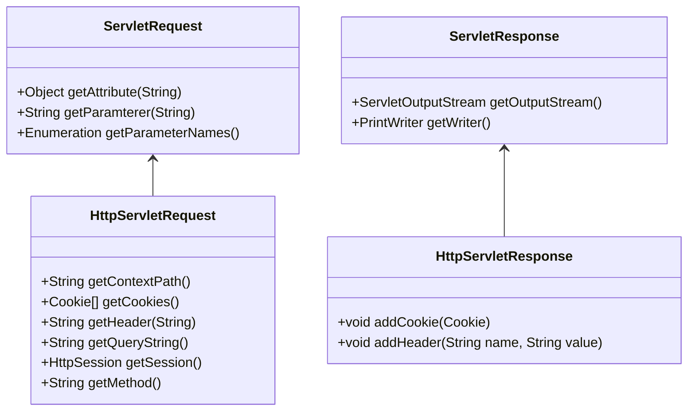

# 

```mermaid
classDiagram

class ServletRequest{
+Object getAttribute(String)
+String getParamterer(String)
+Enumeration getParameterNames()

}
class ServletResponse{
+ServletOutputStream getOutputStream()
+PrintWriter getWriter()
}
ServletRequest <-- HttpServletRequest
class HttpServletRequest {
+String getContextPath()
+Cookie[] getCookies()
+String getHeader(String)
+String getQueryString()
+HttpSession getSession()
+String getMethod()
}

ServletResponse <-- HttpServletResponse
class HttpServletResponse {
+void addCookie(Cookie)
+void addHeader(String name, String value)
}
```

```mermaid
  graph TD;
      A-->B;
      A-->C;
      B-->D;
      C-->D;
```


pie
    title Key elements in Product X
    "Calcium" : 42.96
    "Potassium" : 50.05
    "Magnesium" : 10.01
    "Iron" :  5


