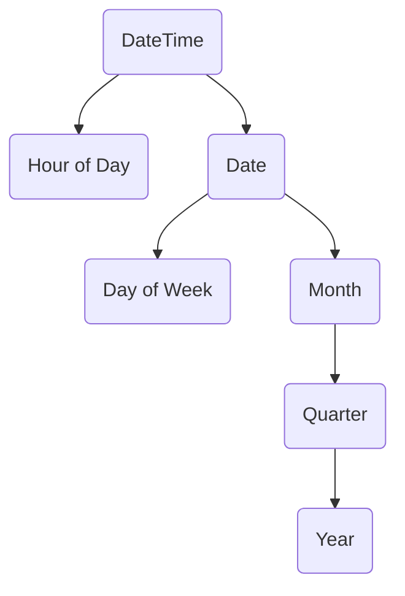

# Advanced SQL


$$
\boxed{@}
% Color %
\newcommand\c[2]{\textcolor{#1}{#2}}
\newcommand\r[1]{\textcolor{red}{#1}}
\newcommand\g[1]{\textcolor{green}{#1}}
\newcommand\b[1]{\textcolor{blue}{#1}}
\newcommand\red[1]{\textcolor{red}{#1}}
\newcommand\blue[1]{\textcolor{blue}{#1}}
\newcommand\green[1]{\textcolor{green}{#1}}
\newcommand\black[1]{\textcolor{black}{#1}}
\newcommand\white[1]{\textcolor{white}{#1}}
\newcommand\cyan[1]{\textcolor{cyan}{#1}}
\newcommand\magenta[1]{\textcolor{magenta}{#1}}
\newcommand\yellow[1]{\textcolor{yellow}{#1}}
\newcommand\orange[1]{\textcolor{orange}{#1}}
\newcommand\lime[1]{\textcolor{lime}{#1}}
\newcommand\pink[1]{\textcolor{pink}{#1}}
\newcommand\darkgray[1]{\textcolor{darkgray}{#1}}
\newcommand\gray[1]{\textcolor{gray}{#1}}
\newcommand\lightgray[1]{\textcolor{lightgray}{#1}}
\newcommand\brown[1]{\textcolor{brown}{#1}}
\newcommand\olive[1]{\textcolor{olive}{#1}}
\newcommand\purple[1]{\textcolor{purple}{#1}}
\newcommand\teal[1]{\textcolor{teal}{#1}}
\newcommand\violet[1]{\textcolor{violet}{#1}}
\newcommand\hotpink[1]{\textcolor{hotpink}{#1}}
\newcommand\blueviolet[1]{\textcolor{blueviolet}{#1}}
\newcommand\navyblue[1]{\textcolor{navyblue}{#1}}
\newcommand\peach[1]{\textcolor{Peach}{#1}}
\newcommand\orangeRed[1]{\textcolor{OrangeRed}{#1}}
\newcommand\salmon[1]{\textcolor{Salmon}{#1}}
\newcommand\skyblue[1]{\textcolor{SkyBlue}{#1}}
\newcommand\springreen[1]{\textcolor{SpringGreen}{#1}}
\newcommand\aqua[1]{\textcolor{aqua}{#1}}
\newcommand\navy[1]{\textcolor{navy}{#1}}
\newcommand\silver[1]{\textcolor{silver}{#1}}
\newcommand\fuchsia[1]{\textcolor{fuchsia}{#1}}
\newcommand\maroon[1]{\textcolor{maroon}{#1}}
\definecolor{luo}{RGB}{102,204,255}
\definecolor{miku}{RGB}{57,197,187} 
\newcommand\luo[1]{\textcolor{luo}{#1}}
\newcommand\miku[1]{\textcolor{miku}{#1}}

% Typography %
\newcommand\a[1]{\begin{aligned}#1\end{aligned}}
\newcommand\t[1]{\text{#1}}
\newcommand\tb[1]{\text{\textcolor{blue}{#1}}}
\newcommand\lb[1]{\left\{\begin{aligned} #1 \end{aligned}\right.}
\newcommand\lrb[1]{\lb{\rb{#1}}}
\newcommand\rb[1]{\left.\begin{aligned} #1 \end{aligned}\right\}}
\newcommand\env[2]{\begin{#1}#2\end{#1}}
\newcommand\step[1]{\textbf{ (#1) }}

% Misc %
\newcommand\s[1]{\{#1\}}
\newcommand\qed{\quad\square}
\newcommand\define{\dot{=}}
\newcommand\then{\implies}
\newcommand\rounddown[1]{\lfloor{#1}\rfloor}
\newcommand\roundup[1]{\lceil{#1}\rceil}
\newcommand\graph[4]{#1 = (#2, #3) \quad |#2| = #4}
\newcommand\G{G = (V, E) \quad |V| = n}
\newcommand\so{\therefore}
\newcommand\comment[1]{\quad\text{(#1)}}
\newcommand\note[1]{\quad\text{(#1)}}
\newcommand\bt[1]{\boxed{\text{#1}}}
\newcommand\max[1]{\textbf{ max } \{#1\} }
\newcommand\min[1]{\textbf{ min } \{#1\} }
\newcommand\IF{\textbf{ IF }}
\newcommand\if{\textbf{ if }}
\newcommand\IS{\textbf{ IS }}
\newcommand\is{\textbf{ is }}
\newcommand\do{\textbf{ do }}
\newcommand\dowhile{\textbf{ do while }}
\newcommand\dountil{\textbf{ do until }}
\newcommand\find{\textbf{ find }}
\newcommand\until{\textbf{ until }}
\newcommand\thereisa{\textbf{ There is a }}
\newcommand\thereisan{\textbf{ There is an }}
\newcommand\hasno{\textbf{ has no }}
\newcommand\has{\textbf{ has }}
\newcommand\but{\textbf{ but }}
\newcommand\however{\textbf{ however }}
\newcommand\AND{\textbf{ AND }}
\newcommand\OR{\textbf{ OR }}
\newcommand\NOT{\textbf{ NOT }}
\newcommand\THEN{\textbf{ THEN }}
\newcommand\IN{\textbf{ in }}
\newcommand\NOTIN{\textbf{ NOT-IN }}
\newcommand\assume{\textbf{ Assuming that: }}
\newcommand\contradictory{\textbf{ Thus lead to contradiction }}
\newcommand\proof{\textbf{Proof: }}
\newcommand\st{\textbf{ such that }}
\newcommand\hold{\text{ holds }}
\newcommand\lhs{\text{ LHS }}
\newcommand\rhs{\text{ RHS }}
\newcommand\wlg{\text{ Without loss of generality }}
\newcommand\nb{\text{ nota bene }}
\newcommand\analogously{\text{ analogously }}
\newcommand\viceversa{\textbf{ viceversa }}
\newcommand\let{\textbf{ let }}
\newcommand\as{\textbf{ as }}
\newcommand\for{\textbf{ As for }}
\newcommand\select{\textbf{ SELECT }}
\newcommand\m[1]{\mathit{#1}}
\newcommand\+[1]{\mathcal{#1}}
\newcommand\warnning[1]{\colorbox{Blue}{\textcolor{Yellow}{#1}}}
\newcommand\error[1]{\colorbox{Black}{\textcolor{White}{#1}}}
$$



## Access DB From PL

通过 `编程语言 (Programming Language)`  `访问` `数据库` 的方式：

- `动态SQL`：使用 `数据库API` 来连接 `数据库`
  - JDBC
  - ODBC
  - ADO.NET
- `嵌入式SQL`：可以将 `SQL语句` 嵌入到 `宿主语言` 中，通过 `预处理器` 对 `嵌入宿主语言的SQL` 进行 `转化`。

---

这里简单地讨论几点 `JDBC` 的内容。

- 主要涉及的对象：`Connection`，`Statement`，`ResultSet`

- `JDBC` 并不是仅仅支持 `MySQL` 的，它可以 `指定` 用于 `建立数据库连接` 的 `数据库通信的API`：如 `jdbc:mysql`，`jdbc:oracle` 等来连接 `多种类型的数据库`

  > 更准确地说，`JDBC` 仅 `指定通信所用的API`，而不是 `指定通信所用的协议`。因为一个`JDBC驱动器` 可能同时支持 `多种数据库通信协议`

- `Statement` 并不是 `SQL语句对象`本身，但可以用 `Statement` 来 `执行语句`
- 使用 `PreparedStatement` 而不是 `拼接字符串的方式` 来 `构造SQL语句`！
- `数据库` 返回的 `ResultSet` 不仅仅包含 `元组数据`，还包含许多 `元数据`。在需要时使用 `ResultSet#getMetaData` 获得 `元数据`，而不是 `硬编码` 它们！
- 对 `Updatable Result Set` 的 `修改性操作` 会 `反映到数据库`
- 如果需要将 `接下来的多条SQL语句作为事务`，而不是 `每条语句都被视为独立的事务`，则请用 `Connection#setAutoCommit(false)`


## Function and Procedure

`函数 (Function)` 和 `过程 (Procedure)` 允许 `业务逻辑` 作为 `存储过程 ` 记录在 `数据中`。

这使得 `业务逻辑代码` 是 `编程语言独立` 和 `应用独立` 的。

### Function

- 一个简单的 `函数` 的例子

```sql
CREATE FUNCTION dept_count(dept_name varchar(20)) RETURNS integer
BEGIN
    DECLARE d_count integer
    SELECT count(*) INTO d_count
    FROM instructor
    WHERE instructor.dept_name = dept_name
    RETURN d_count
END
```

- `带参数的视图 (Parameterized View)`

```sql
CREATE FUNCTION instructor_of(dept_name varchar(20)) RETURNS TABLE(ID varchar(5),
                                                                  name varchar(20),
                                                                  dept_name varchar(20),
                                                                  salary numeric(8,2))
RETURN TABLE(SELECT ID, name, dept_name, salary
             FROM instructor
             WHERE instructor.dept_name = instructor_of.dept_name
            );                                                                 
```

我们将 `这种函数` 视为 `广义上的视图`。

### Procedure

> 对于 `函数 (Function) ` 和 `过程 (Procedure)` 如果做 `详细区分`，则我们这样定义：
>
> - 函数：带有 `返回值`
> - 过程：不带有 `返回值`
>
> 从 `组成体系结构` 的角度看，`过程` 是比 `函数`  更加 `底层的概念`

```sql
CREATE PROCEDURE dept_count_proc(IN dept_name varchar(20), OUT d_count integer)
BEGIN
    SELECT count(*) INTO d_count
    FROM instructor
    WHERE instructor.dept_name = dept_count_proc.dept_name
END
```

> `IN` 表示 `输入参数`，而 `OUT 表示输出参数`。
>
> 这种形式的 `传参方式` 在某些 `底层接口调用` 中常见。其中 `OUT` 经常传递的是 `指针类型`，以便 `调用者` 可以通过 `变量` 来 `接收` 到 `过程的结果` 

### Persistent Storage Module

`持久存储模块 (Persistent Storage Module)` ：用于处理 `构造` 

这里不详细讨论 `PSM` 的 `语法`，只给出一个 `大号的例子`

```sql
DECLARE out_of_classroom_seats CONDITION
DECLARE EXIT HANDLER FOR out_of_classroom_seats
BEGIN
	sequence of statements
END

CREATE FUNCTION registerStudnet(
    IN s_id varchar(5),
    IN s_courseid varchar(8),
    IN s_secid varchar(8),
    IN s_semester varchar(6),
    IN s_year numeric(4,0),
    OUT errorMsg varchar(100)
	RETURNS integer
BEGIN
    DECLARE currEnrol int;
    SELECT count(*) INTO currEnrol
    FROM takes
    WHERE course_id = s_courseid AND sec_id = s_secid
    AND semester = s_semester AND year = s_year;
    
    DECLARE limit int;
    SELECT capacity INTO limit
    FROM capacity NATURAL JOIN section
    WHERE course_id = s_courseid AND sec_id = s_secid
    AND semester = s_semester AND year = s_year;
    
    IF (currEnrol < limit) 
    	BEGIN
    		INSERT INTO takes VALUES (s_id, s_courseid, s_secid, s_semester, s_year, null);
    		RETURN(0);
    	END
    -- capacity overflow !
    SET errorMsg = 'Enrollment limit reached for course' || s_courseid || 'section' || s_secid;
    RETURN(-1);
END    
)
```

### External Language Procedure

`数据库` 可以将 `过程` 委托给 `外部语言程序` 来执行，像这样的 `过程` 称作 `外部语言过程`

```sql
CREATE PROCEDURE dept_count_proc(IN dept_name varchar(20), OUT count integer)
LANGUAGE C
EXTERNAL NAME '/usr/avi/bin/dept_course_proc'
```

> 如果为了 `性能` 而将 `任务` 委托给 `C` 这样的语言，可能会导致 `安全问题`。
>
> 而如果委托给 `Java`，`C#` 这样的语言，通过 `进程间通信` 和 `沙盒执行` 则会导致 `效率低下`。
>
> 此外，编写能 `正确处理` `数据库数据` 的 `外部例程` 的 `编码量` 通常较多。

## Trigger

`触发器 (Trigger)`：用于在 `数据库` 发生 `指定事件` 时，`自动` 被 `执行的语句`

---

```sql
CREATE TRIGGER credits_earned AFTER UPDATE OF takes ON(grade)
	REFERENCING NEW ROW AS nrow
	REFERENCING OLD ROW AS orow
	FOR EACH ROW
	WHEN nrow.grade <> 'F' AND nrow.grade IS NOT NULL
		AND (orow.grade = 'F' OR orow.grade IS NULL)
	BEGIN ATOMIC
		UPDATE student
		SET tot_cred = tot_cred + 
            (SELECT credits
            FROM course
            WHERE course.course_id = nrow.course_id)
    	WHERE student.id = nrow.id;
    END
```

> `触发器类型`：
>
> - `语句级触发器 (FOR EACH STATEMENT)`：对于 `引起修改的整个SQL语句` `仅执行1次` `触发器`
> - `行级触发器 (FOR EACH ROW)`：对 `每个受影响的行` `都执行1次` `触发器`
>
> `过渡变量 (Transition Variable)`：
>
> - `REFERENCING OLD ROW AS symbol`：存储 `已经更新或删除的行的旧值`
> - `REFERENCING NEW ROW AS symbol`：可用于 `插入` 或 `删除` 的 `行的引用`
>
> `触发时机`：
>
> - `BEFORE`：用于 `避免非法更新`，`附加额外约束`
> - `AFTER`：用于 `为某些修改做善后处理`，`维护某些修改性操作的合法性`

如果可以使用 `存储过程`  的话，则尽量不要使用 `触发器`。

## Recursive Query

`递归查询 (Recursive Query)` 的典型例子是寻找 `传递闭包 (Transitive Closure)` ，比如 `找出某个课程的所有前置课程`。

---

寻找 `传递闭包`

###  Iteration

```sql
CREATE FUNCTION findAllPrereqs(cid varchar(8))
RETURN TABLE(course_id varchar(8))
BEGIN
	-- define variables
	CREATE TEMPORARY TABLE c_prereq(course_id varchar(8));
	CREATE TEMPORARY TABLE new_c_prereq(course_id varchar(8));
	CREATE TEMPORARY TABLE temp(course_id varchar(8));
	-- init and continue
	INSERT INTO new_c_prereq
		SELECT prereq_id
		FROM prereq
		WHERE course_id = cid;
	-- loop until not new course is added
	REPEAT
		INSERT INTO c_prereq
			SELECT INTO temp
			FROM new_c_prereq;
		INSERT INTO temp
			(SELECT prereq.course_id
            FROM new_C_prereq, prereq
            WHERE new_c_prereq.course_id = prereq.course_id)
            EXCEPT
            (SELECT course_id
            FROM c_prereq);
        DELETE FROM new_c_prereq;
        INSERT INTO new_c_prereq
        	SELECT *
			FROM temp;
		DELETE FROM temp;
	UNTIL NOT EXISTS (SELECT * FROM new_c_prereq)
	END REPEAT
	-- return the result table
    RETURN TABLE c_prereq;
END 
```

### Recursion

```sql
-- define recursive query
WITH RECURSIVE rec_prereq(course_id, prereq_id) AS (SELECT course_id, prereq_id
                                                   FROM prereq)
                                                   UNION 
                                                   (SELECT rec_prereq, course_id, prereq.prereq_id
                                                   FROM prereq, rec_prereq
                                                   WHERE prereq.course_id = rec_prereq.prereq_id)
-- call recursive query
SELECT *
FROM rec_prereq;
```

> 上述的SQL中，首先通过 `基查询` 找到 `每门课程的先修课程`，然后 `递归查询` 在 `每次迭代过程` 中 `增加一层课程`，直到到达 `课程-先修课程的最大层次`。

> 通过 `FROM子句` 对 `递归视图 prc_prereq` 进行 `递归查询`。
>
> `WITH RECURSIVE` 用于声明 `递归视图`，它会使得 `递归` 在到达 `不动点` 时 `自动被终止`

> `SQL标准` 要求 `递归过程` 返回的 `结果` 是 `单调递增的`，并且最终到达 `不动点 (Fixed Point)`
>
> > 也就是说，每次 `递归过程` 返回的 `结果` 必须是 `之前的结果的超集`
>
> > 只要 `递归过程是递增的`，就可以使用 `迭代过程来定义递归过程`。

任何的 `递归查询 (Recursive Query)` = `基查询 (Base Query)` UNION `递归查询 (Recursive Query)`

## Advanced Aggregate

### Rank

#### Sparse Rank & Dense Rank

- `rank()`

``` sql
-- SQL 1
SELECT ID, rank() OVER (ORDER BY (GPA) DESC) AS s_rank
FROM student_grades
ORDER BY 's_rank'
```

> 单纯的 `rank` 并不会对 `结果关系中的元组` `按rank进行排序`。
>
> 故添加 `ORDER BY 's_rank'`  来对 `结果关系的元组` 进行 `排序`

> 其他类型的 `排序函数`：`percent_rank()`，`cume_dist()`，`row_number()`

> 关于 `空值` 的处理，可以设置策略：`NULL FIRST` 或 `NULL LAST`
>
> ```sql
> SELECT ID, rank() OVER (ORDER BY (GPA) DESC NULL LAST) AS s_rank
> FROM student_grades
> ORDER BY 's_rank'
> ```

$SQL 1 = SQL 2$

```sql
-- SQL 2
SELECT ID, (1 + (SELECT count(*)
                FROM student_grades B
                WHERE B.GPA > A.GPA)) AS s_rank
FROM student_grades A
ORDER BY s_rank
```

- `dense_rank()`

`rank()` 产生的 `排名` 是 `间断的`：如果 `分数最高的人` 有2人，则 `这两个人的排名` 均为 `1`，但 `分数次高的人` 的 `排名` 则为 `3`

相反的，如果使用 `dense_rank()`，则产生 `不间断` 的 `排名`：`分数最高的两人` 排名均为 `1`，但 `分数次高的人` 的 `排名` 则为 `2`

```sql
-- SQL 3
SELECT ID, dense_rank() OVER (ORDER BY (GPA) DESC) AS s_rank
FROM student_grades
ORDER BY 's_rank'
```

####   Partition before Rank

```sql
-- SQL 4
SELECT ID, dept_name, rank() OVER (PARTITION BY dept_name ORDER BY GPA DESC) AS DEPT_RANK
FROM dept_grades
ORDER BY dept_name, dept_rank;
```

> 当存在 `GROUP BY` 时， `PARTION` 在 `GROUP BY` 之后执行。

> 可以认为，如果在 `聚集` 时没有 `显示地指定 PARTITION`，则认为 `将所有的集合` 分为 `唯一的一个分区`

#### Grading

 `ntile(n)` 按 `给定顺序` 取得 `每个分区 (Partion) 中的元组`，然后将 `元组` 分成 `n个具有相同元组数目的桶`

```sql
SELECT ID, ntile(4) OVER (ORDER BY (GPA DESC)) AS quartile
FROM student_grades;
```

 可用于构造 `百分比直方图`

### Window Query

`窗口查询`：可用于对 `一定范围内的元组` 进行 `聚集`

> 不同于 `分区查询` 中的 `1个元组` 只对 `1个分区 (Partion)` 有贡献，`分窗查询` 中的 `窗口 (Window)` 是可以 `重叠的`。

```sql
SELECT year, avg(num_credits) OVER(ORDER BY year ROWS 3 PRECEDING) AS avg_total_credits
FROM tot_credits;
```

> n.b. 如果 `某个年份的元组` 具有 `多个`，则 `为某个年份到底选择哪个元组` 将 `取决于具体实现`。

> `窗口` 的大小界定参数：
>
> - `ROWS n PRECEDING/FOLLOWING`
> - `ROWS UNBOUNDED PRECEDING/FOLLOWING`
> - `ROWS BETWEEN a PRECEEDING AND b FOLLOWING `
> - `RANGE BETWEEN a AND b `


## OLAP

### Introduction

`联机分析处理 (OLAP)` 是一个 `交互式系统`，允许 `分析人员` 查看 `多维数据` 的 `不同种类的汇总数据`

---

假如我们有 `模式` $sales(item\_name, color, clothes\_size, quantity)$

可以对 `关系中的某些属性`  `分组 (Group)`  为 `度量属性` 和 `维属性`：

- `度量属性 (Measure Attribute)`：对 `某个值` 进行 `度量`，并且可以对 `这个值` 进行 `聚集操作`
- `维属性 (Dimension Attribute)`：`剩余的属性` 称为 `维属性`

能够 `模式化` 为 `度量属性` 和 `维属性` 的 `数据` 统称为 `多维数据 (Multi-Dimensional Data)`

---

`数据立方体 (Data Cube)`：可以用于描述 `n维数据`。

> `交叉表 (Cross-Tabulation / Pivot Table)`：可以用于描述 `二维属性`，是 `数据立方体` 的 `2维情形`
>
> 某些 `交叉表` 可能还含有 `汇总行 (Total Row)` 和 `汇总列 (Total Column)`

`单元 (Cell)`：`n维的数据单元` 可用 `n维向量` 进行 `定位`，每个 `单元` 存储 `1个值`

>  当 `某个维度` 的 `取值` 为 `all` 时，则表示 `对该维度的数据进行聚集`，即 `对该维度进行压缩`！
>
>  如 `clothes_size`  的 `all值` 是对 ：`small`，`medium` 和 `large` 进行 `聚集` 得到的。

---

- Select `attribute_list`

`转轴 (Pivot)`：改变 `交叉表` 中 `维` 的操作

`切片 (Slice) / 切块 (Dicing)`：`固定` `某个维度`，`观察` `其余的维度`

> 一般将 `切片` 用于 `固定1个维度`时，`切块` 用于 `固定多个维度` 时。

- Change ` observation granularity`

`上卷 (RollUp)` ：即 `粒度变粗`

`下钻 (Drill Down)`：即 `粒度变细`

> `较粗粒度的数据` 可以由 `较细粒度的数据` 所产生，反之则不能。
>
> 即 `高维数据` 可以产生 `低维数据`，反之不能。

一个 `属性` 可以有不同的 `粒度`，这些 `不同粒度` 组成 `层次结构`，如 `Datetime的层次结构`：



> 当我们讨论 `属性的粒度` 时， 我们应当把 `粒度树` `倒过来看`，这样正好符合 `上卷` 和 `下钻`。
>
> > 计算机的 `树` 就是 `倒过来的自然界的树`，而 `粒度树` 是 `倒过来的树`，也就正好符合 `自然界的树`。

### OLAP in SQL

 `模式` $sales(item\_name, color, clothes\_size, quantity)$

- `pivot()`

```sql
SELECT *
FROM sales
pivot(
	sum(quantity)
    FOR color IN ('dark', 'pastel', 'white')
)
```

> `pivot中的for` 的 `语义` 是：`解包`  `指定属性的指定值` ，将 `这些值` 作为 `新属性` 插入。

| item_name | clothes_size | dark | pastel | white |
| --------- | ------------ | ---- | ------ | ----- |
| skirt     | small        | 2    | 11     | 2     |
| ...       | ...          | ...  | ...    | ...   |

- `cube()`

```sql
SELECT item_name, color, clothes_size, sum(quantity)
FROM sales
GROUP BY cube(item_name, color, clothes_size)
```

> 如果需要处理 `all值`，则可以使用 `decode()` 和 `grouping()`。

该查询返回的是一个 `关系` $ (item\_name, color, clothes\_size, quantity)$

该关系表示1个 `3维的数据立方体`

- `rollup()`

```sql
SELECT item_name, color, clothes_size, sum(quantity)
FROM sales
GROUP BY rollup(item_name, color, clothes_size)
```

从 `返回的结果关系的模式` 来看，`rollup()` 和 `cube()` 返回的 `结果关系` 具有 `相同的模式`。

实际上，`rollup()` 生成的是：1个 `0维立方体`，1个 `1维立方体`，1个 `2维立方体`， 1个 `3维立方体`

> 无论是用 `cube()` 还是 `rollup()`，我们都无法 `精准控制分组的产生`，即无法 `精准指定分组具有哪些属性`。
>
> 但我们可以通过 `HAVING子句` 来去除 `GROUP子句` 产生的 `我们不想要的分组`
