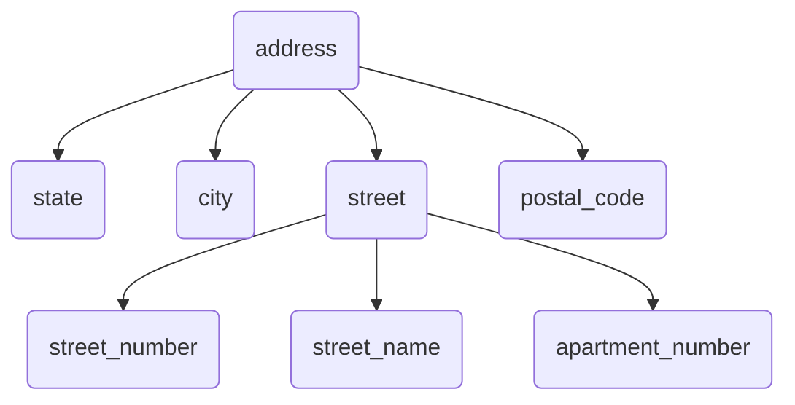
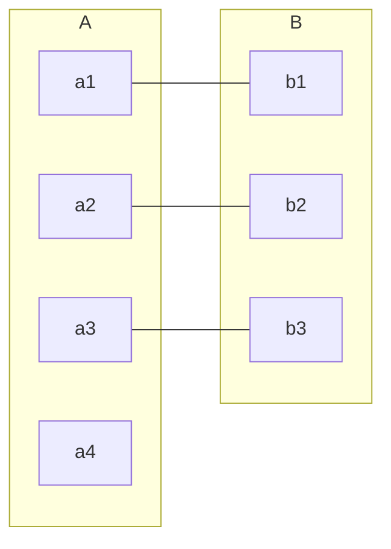
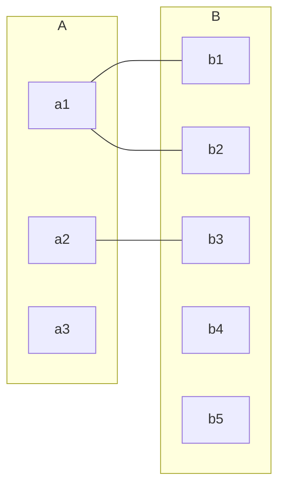
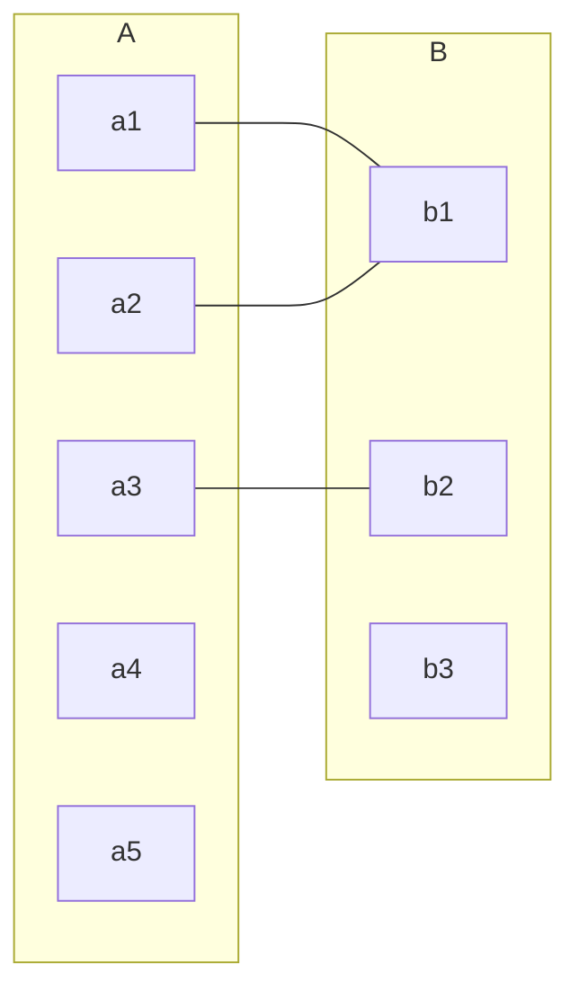
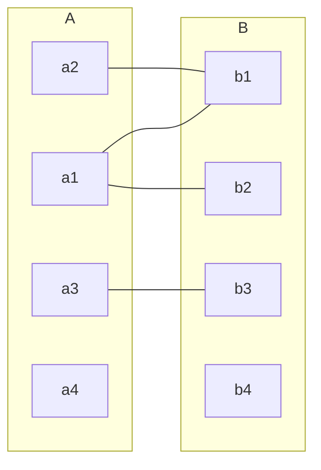

# Database Design


$$
\boxed{@}
% Color %
\newcommand\c[2]{\textcolor{#1}{#2}}
\newcommand\r[1]{\textcolor{red}{#1}}
\newcommand\g[1]{\textcolor{green}{#1}}
\newcommand\b[1]{\textcolor{blue}{#1}}
\newcommand\red[1]{\textcolor{red}{#1}}
\newcommand\blue[1]{\textcolor{blue}{#1}}
\newcommand\green[1]{\textcolor{green}{#1}}
\newcommand\black[1]{\textcolor{black}{#1}}
\newcommand\white[1]{\textcolor{white}{#1}}
\newcommand\cyan[1]{\textcolor{cyan}{#1}}
\newcommand\magenta[1]{\textcolor{magenta}{#1}}
\newcommand\yellow[1]{\textcolor{yellow}{#1}}
\newcommand\orange[1]{\textcolor{orange}{#1}}
\newcommand\lime[1]{\textcolor{lime}{#1}}
\newcommand\pink[1]{\textcolor{pink}{#1}}
\newcommand\darkgray[1]{\textcolor{darkgray}{#1}}
\newcommand\gray[1]{\textcolor{gray}{#1}}
\newcommand\lightgray[1]{\textcolor{lightgray}{#1}}
\newcommand\brown[1]{\textcolor{brown}{#1}}
\newcommand\olive[1]{\textcolor{olive}{#1}}
\newcommand\purple[1]{\textcolor{purple}{#1}}
\newcommand\teal[1]{\textcolor{teal}{#1}}
\newcommand\violet[1]{\textcolor{violet}{#1}}
\newcommand\hotpink[1]{\textcolor{hotpink}{#1}}
\newcommand\blueviolet[1]{\textcolor{blueviolet}{#1}}
\newcommand\navyblue[1]{\textcolor{navyblue}{#1}}
\newcommand\peach[1]{\textcolor{Peach}{#1}}
\newcommand\orangeRed[1]{\textcolor{OrangeRed}{#1}}
\newcommand\salmon[1]{\textcolor{Salmon}{#1}}
\newcommand\skyblue[1]{\textcolor{SkyBlue}{#1}}
\newcommand\springreen[1]{\textcolor{SpringGreen}{#1}}
\newcommand\aqua[1]{\textcolor{aqua}{#1}}
\newcommand\navy[1]{\textcolor{navy}{#1}}
\newcommand\silver[1]{\textcolor{silver}{#1}}
\newcommand\fuchsia[1]{\textcolor{fuchsia}{#1}}
\newcommand\maroon[1]{\textcolor{maroon}{#1}}
\definecolor{luo}{RGB}{102,204,255}
\definecolor{miku}{RGB}{57,197,187} 
\newcommand\luo[1]{\textcolor{luo}{#1}}
\newcommand\miku[1]{\textcolor{miku}{#1}}

% Typography %
\newcommand\a[1]{\begin{aligned}#1\end{aligned}}
\newcommand\t[1]{\text{#1}}
\newcommand\tb[1]{\text{\textcolor{blue}{#1}}}
\newcommand\lb[1]{\left\{\begin{aligned} #1 \end{aligned}\right.}
\newcommand\lrb[1]{\lb{\rb{#1}}}
\newcommand\rb[1]{\left.\begin{aligned} #1 \end{aligned}\right\}}
\newcommand\env[2]{\begin{#1}#2\end{#1}}
\newcommand\step[1]{\textbf{ (#1) }}

% Misc %
\newcommand\s[1]{\{#1\}}
\newcommand\qed{\quad\square}
\newcommand\define{\dot{=}}
\newcommand\then{\implies}
\newcommand\rounddown[1]{\lfloor{#1}\rfloor}
\newcommand\roundup[1]{\lceil{#1}\rceil}
\newcommand\graph[4]{#1 = (#2, #3) \quad |#2| = #4}
\newcommand\G{G = (V, E) \quad |V| = n}
\newcommand\so{\therefore}
\newcommand\comment[1]{\quad\text{(#1)}}
\newcommand\note[1]{\quad\text{(#1)}}
\newcommand\bt[1]{\boxed{\text{#1}}}
\newcommand\max[1]{\textbf{ max } \{#1\} }
\newcommand\min[1]{\textbf{ min } \{#1\} }
\newcommand\IF{\textbf{ IF }}
\newcommand\if{\textbf{ if }}
\newcommand\IS{\textbf{ IS }}
\newcommand\is{\textbf{ is }}
\newcommand\do{\textbf{ do }}
\newcommand\dowhile{\textbf{ do while }}
\newcommand\dountil{\textbf{ do until }}
\newcommand\find{\textbf{ find }}
\newcommand\until{\textbf{ until }}
\newcommand\thereisa{\textbf{ There is a }}
\newcommand\thereisan{\textbf{ There is an }}
\newcommand\hasno{\textbf{ has no }}
\newcommand\has{\textbf{ has }}
\newcommand\but{\textbf{ but }}
\newcommand\however{\textbf{ however }}
\newcommand\AND{\textbf{ AND }}
\newcommand\OR{\textbf{ OR }}
\newcommand\NOT{\textbf{ NOT }}
\newcommand\THEN{\textbf{ THEN }}
\newcommand\IN{\textbf{ in }}
\newcommand\NOTIN{\textbf{ NOT-IN }}
\newcommand\assume{\textbf{ Assuming that: }}
\newcommand\contradictory{\textbf{ Thus lead to contradiction }}
\newcommand\proof{\textbf{Proof: }}
\newcommand\st{\textbf{ such that }}
\newcommand\hold{\text{ holds }}
\newcommand\lhs{\text{ LHS }}
\newcommand\rhs{\text{ RHS }}
\newcommand\wlg{\text{ Without loss of generality }}
\newcommand\nb{\text{ nota bene }}
\newcommand\analogously{\text{ analogously }}
\newcommand\viceversa{\textbf{ viceversa }}
\newcommand\let{\textbf{ let }}
\newcommand\as{\textbf{ as }}
\newcommand\for{\textbf{ As for }}
\newcommand\select{\textbf{ SELECT }}
\newcommand\m[1]{\mathit{#1}}
\newcommand\+[1]{\mathcal{#1}}
\newcommand\warnning[1]{\colorbox{Blue}{\textcolor{Yellow}{#1}}}
\newcommand\error[1]{\colorbox{Black}{\textcolor{White}{#1}}}
$$



## Design Process

$$
\t{Design Process} \lb{
& \t{Design Stage} \lb{
& \t{Conceptual-Design Phase} \\
& \t{Logical-Design Phase} \\
& \t{Physical-Design Phase}
} \\

& \t{Design Choice}
}
$$

## Entity-Relationship Model

`E-R模型` 采用3个 `基本概念`：`实体集`，`联系集`，`属性`

### Entity-Set

`实体 (Entity)`：可区别于所有其他对象的一个对象，通过一组 `属性` 来表示。

`实体集 (Entity-Set)`：`相同类型` 的 `实体` 的 `集合`。

### Relationship-Set

`联系 (Relationship)`：指 `多个实体` 之间的 `相互关联`。

`联系集 (Relationship-Set)`：`相同类型` 的 `联系` 的 `集合`。

- `描述性属性 (Descriptive Attribute)`
- `度 (Degree)`：参与 `联系集` 的 `实体集` 的 `数目`

> 练习机： 的即`实体` 之间的 `关联` ，`实体集` $E_1, E_2,\cdots, E_n$ `参与` `联系集` $R$
>
> `角色 (Role)`：`实体` 在 `联系` 中扮演的 `功能`
>
> > `自环联系集 (Recursive Relationship-Set)`：即存在 `实体集` 以 `不同的身份` 参与 `联系` 

### Attribute

`域 (Domain)` / `值集 (Value Set)` ：`属性` 的 `可取值集合`

`属性` 有以下几种 `分类方式`
$$
\t{Attribute} \lb{
& \t{Classification 1} \lb{
& \t{Simple Attribute} \\
& \t{Composite Attribute}
} \\
& \t{Classification 2} \lb{
& \t{Single-Valued Attribute} \\
& \t{Multi-Valued Attribute}
} \\
& \t{Derived Attribute}

}
$$

#### Single Attribute & Composite Attribute

`复合属性 (Composite Attribute)` 由 `简单属性 (Simple Attribute)` 所组成。

> 实际上，`同样的概念` 可能是 `复合属性` 也可能是 `简单属性`，这取决于 `具体需求`。
>
> 同理，对于 `单值属性` 和 `多值属性` 也有类似的情况。

#### Single-Valued Attribute & Multi-Valued Attribute

`多值属性` 使用 `花括号` 包围 `属性名`：$\s{phone\_numer}$

| id   | name  | phone_number                                  |
| ---- | ----- | --------------------------------------------- |
| 1    | Alice | 12345678901 12345678902 12345678903 |
| 2    | Bob   | 12345678904                                   |
| ...  | ...   | ...                                           |

####  Derived Attribute

`派生属性 (Derived Attribute)`  可以通过 `其他属性` 导出。

如 `age` 可以通过 `birthday` 导出。

### Constraint

`约束 (Constraint)` 是 `数据库中的数据` 必须要满足的 `条件`

#### Mapping Cardinality

`映射基数 (Mapping Cardinality)` 用于表示 一个 `实体` 通过 一个 `联系集` 所 `能能关联的实体个数`。

常见的 `映射基数`  如下：

- `one-to-one`

- `one-to-many`

- `many-to-one`

- `many-to-many`

> n.b. `一` 只能表示 `确切地要有1个实体`，而 `多` 可以是 `零个或多个实体`。
>
> 这里所说的 `实体个数` 都是 `至多的实体个数`

#### Participation Constraint

$$
\t{Participation Constraint} \lb{
& \t{Total Participation} \\
& \t{Partial Participation}
}
$$

`全部参与 (Total Participation)`： `实体集` $E$ 的 `每个实体都参与`  到 `联系集`  $R$ 的 `至少一个联系` 中。

`部分参与 (Partial Participation)`：`实体集` $E$ 中 `只有部分实体参与 ` 到联系集` $R$ 的 `至少一个联系` 中。

#### Key

##### Identify entity

`码/关键字 (Key)` 用于在 `实体集` 中 `唯一地标识`  某个 `实体`。

> 可以用 `关系模式` 中的 `超码`，`主码`，`候选码` 等概念应用于 `实体集`

我们使用 `主码` 来区别 `实体`

##### Identify Relationship

同理，我们也用 `主码` 来在 `联系集` 中 `区分` `联系`。

设 `主码` $E_i$ 表示 `构成实体集` $E_i$ `的主码的属性集合`。

`联系集的主码` 构成依赖于 `与之相同的联系集` $R$ `所相关联的属性结合`：

- 若 `联系集` $R$ 没有 `属性` 与之相 `关联`$\implies primary-key(E_1) \cup primary-key(E_2) \cup\cdots \cup primary-key(E_n)$
- 若 `联系集` $R$ 有 `属性` $a_1, a_2,\cdots,a_m$ 与之相 `关联` $\implies primary-key(E_1) \cup primary-key(E_2) \cup \cdots \cup primary-key(E_n) \r{\cup \s{a_1,a_2,\cdots, a_m}}$

> 考虑 `student` 和 `instructor` 的 `二元联系 advisor`：
>
> - 从student到instructor是 `多对一` 的：`advisor的主码` 选用 `student的主码` 
> - 从student到instructor是 `一对多` 的：`advisor的主码` 选用 `instructor的主码`
> - 从student到instructor是 `一对一` 的：`advisor的主码` 选用 `student的主码` 或者 `instructor的主码` 都可以。
> - 从student到instructor是 `多对多` 的：`advisor的主码` 选用 `student的主码` 和 `instructor的主码` 的 `并集` 

 

## E-R Diagram

### Definition

`E-R图` 的 `主要构件 (Component)`：

- `分成两部分的矩形`：表示 `实体集`
- `菱形`：表示 `联系集`
- `未分隔的矩形`：表示 `联系集的属性`
- `线段`： `连接` `实体集` 和 `联系集`
- `虚线`： `连接` `联系集的属性` 和 `联系集`
- `双线`： 表示 `实体` 在 `联系集` 中的 `参与度`
- `双菱形`： `连接` `弱实体集` 的 `标志性联系集`

#### 

### Weak-Entity Set

`弱实体集 (Weak Entity Set)`：没有 `足够的属性` 以形成 `主码` 的 `实体集`

`强实体集 (Strong Entity Set)`：有 `主码` 的 `实体集`

---

`弱实体集` 必须 `依赖于` `标识实体集 (Identifying Entity Set) / 属主实体集 （Owner Entity Set)`，而我们将建立这种依赖的 `联系` 称为 `标识性联系 (Identifying Relationship)`

`标识性联系` 具有如下特点：

- 从 `弱实体集` 到 `标识实体集` 是 `多对一` ，且 `弱实体集`  在 `标识性联系` 中是 `全部参与的`
- 没有 `描述性属性`

---

`弱实体集的分辨码 (Discriminator) / 部分码`：用于 `区分` `依赖于特定强实体集`的 `弱实体集` 。

> `弱实体集的主码` = `强实体集的主码` + `弱实体集的分辨码`

> 如果 `弱实体集` 仅在 `单个地方` 被使用到，则可以考虑将 `弱实体集` 直接 `编码` 为 `属主实体集` 的 `一个属性`。

`弱实体集` 的 `绘图规则`：

- `弱实体集的分辨符` 使用 `虚下划线` 表示
- `关联` `弱实体集`  和 `强实体集` 的 `联系集`  应当用 `双菱形` 表示
