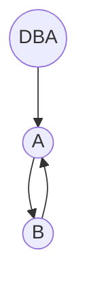
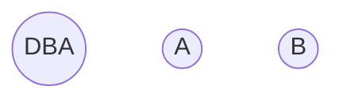
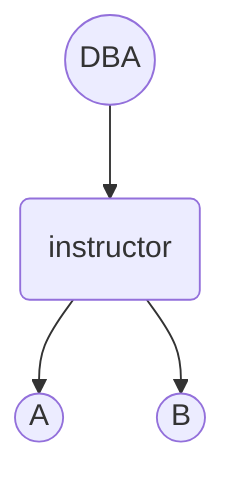
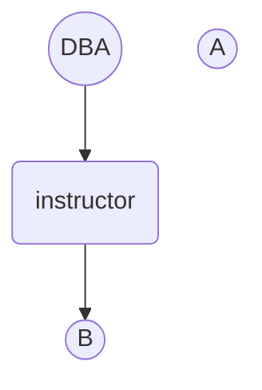

# Intermediate SQL

## Join Expression

### Join Condition

#### natural

使用 `natural` 作为 `连接条件` 的 `连接 (Join)` 称为 `自然连接 (Natural Join)`。

> 我们前面讨论过，可以将 `natura`展开为 `using attribute_list` 展开为 `on <predicate>`

#### using attribute\_list

指定对 `参与连接的关系` 进行 `连接` 时所使用的 `属性列表 (Attribute List)`

#### on <Predicate>

`on条件` 用于设置 `参与连接的关系` 的 `元组匹配` 的 `通用谓词`

> 从 `功能范围` 来讲：`on <Predicate>` > `using attribute_list` > `natural`

* * *

我们考虑下面两个连接。

```sql
-- SQL 1
SELECT *
FROM student JOIN takes ON student.ID = takes.ID
```

```sql
-- SQL 2
SELECT *
FROM student NATURAL JOIN takes
```

`SQL1` \\ne `SQL 2` ，但它们的 `结果关系` 高度 `相似`，`唯一的区别` 是：`SQL 1` 的 `结果关系` 中， `ID属性` 出现 `2次`，分别为 `student.ID` 和 `takes.ID`

> 注意 `on <predicate>` 的 `语义`：`<predicate>` `过滤出` `能参与连接的元组`。
> 
> 注意 `join` 的语义：最基本的 `连接 (Join)` 操作就是 `简单地` `将两个元组` 进行 `拼接`。
> 
> > `自动去除相同的属性名` 是 `natural join` 的 `特性`，`join` 并不会这么做！

然而，对于 `SQL 2`来说，由于 `student关系` 和 `takes关系` 的 `共有属性` 仅有 `ID`，所以 `连接条件` 也是 `student.ID = takes.ID`。

但 `Natural Join` 会 `自动地去除属性名相同的列`，所以 `ID属性` 仅在 `SQL 2的结果关系` 中 `出现1次`

更确切地

```sql
-- SQL 3 equals SQL 1
SELECT *
FROM student, takes
WHERE student.ID = takes.ID
```

```sql
-- SQL 4 equals SQL 2
SELECT student.ID as ID, name, dept_name, tot_cred, course_id, sec_id, semester, year, grade
FROM student JOIN takes ON student.ID = takes.ID
```

### Join Type

#### Inner Join

`内连接 (Inner Join)` 是 `默认的连接类型`。

> 当我们写 `JOIN` 时，实际上是省略了 `INNER` 的 `INNER JOIN`。
> 
> 同理，`NATURAL JOIN` = `NATURAL INNER JOIN`

#### Outer Join

考虑该语句

```sql
SELECT *
FROM student NATURAL JOIN takes;
```

该 `语句` 的 `期望` 是： `查询出所有学生的选课信息`

但是，如果 `某些学生没有选任何课`，那么在 `结果关系` 中，我们将无法看到 `这些学生`。

如果我们 `希望` 在 `结果关系` 中，`仍然显示出` `没有选任何课的学生` 的信息，并且 `将它们的选课信息` 显示为 `null`。

则可以使用 `外连接`

```sql
SELECT *
FROM student NATURAL LEFT OUTER JOIN takes;
```

* * *

`外连接 (Outer Join)`：在 `内连接` 的基础上，通过在 `结果关系` 中 `创建包含空值的元组` 来 `保留` `哪些本来在内连接中丢失的元组`

> 换句话说：`外连接` 会将 `那些有参与连接` 但 `不满足连接条件的元组` 的 `那些本该被内连接丢弃的元组` 重新 `捡回来`，然后 `填充空值`。
> 
> 注意一个细节，我们说 `参与连接的元组` 指的是按照所属的 `连接表达式` 作为 `边界` 来划分的。`另一个连接表达式` 和 `WHERE子句` 显然都属于 `边界之外`。
> 
> `外连接` 只会 `捡回那些参与了连接但不满足连接条件的元组，并为它们填充空值`。如果 `某些元组根本没有参与这个外连接`，那么 `显然这些元组不应该被这个外连接所捡回并填充空值`。

`外连接` 的 3种 `类型`：

*   `左外连接 (Left Outer Join)`：只 `保留` 出现在 `左外连接运算符` `左边的关系中的元组`
*   `右外连接 (Right Outer Join)`：只 `保留` 出现在 `右外连接运算符` `右边的关系中的元组`
*   `全外连接 (Full Outer Join)`：`保留` `两个关系中的元组`

> 相比来说，`内连接` 不 `保留` `两侧的关系中的任何关系中的元组`

> `外连接的计算方法`：可以先计算 `相应的内连接`，然后向 `内连接的结果关系` 中 `加入` `应当被保留的元组`

* * *

考虑该查询

```sql
-- SQL 1
SELECT *
FROM student LEFT OUTER JOIN takes ON student.ID = takes.ID;
```

`SQL 1` \\ne `SQL 2`

```sql
-- SQL 2
SELECT *
FROM student LEFT OUTER JOIN takes ON true
WHERE student.ID = takes.ID;
```

*   `SQL 1`：`结果关系` 类似于 `student LEFT NATURAL OUTER JOIN takes` ，只不过 `ID属性将出现2次`。
    
*   `SQL 2`：由于指定 `ON true` 使得 `参与连接的关系中的所有元组` 都 `满足连接条件`，所以 `外连接` 不会 `加入被内连接丢弃的元组并为它们填充空值`
    
    > 也就是说 `由于没有元组因不满足连接条件而被内连接所丢弃`，所以后续 `外连接` 也不会 `加入这些本来被内连接丢弃的元组并为它们填充空值`
    
    实际上，`a LEFT OUTER JOIN b ON true` 相当于 `产生两个关系的笛卡尔积`。
    
    > 不要将 `a LEFT OUTER JOIN b ON true` 和 `NATURAL LEFT OUTER JOIN` 弄 `混淆`，`NATURAL` 只不过是 `连接条件` 中的一种而已。
    

## View

### Definition

`视图 (View)`：是一种 `通过查询来定义的` `虚关系 (Virtual Relation)`。它在 `概念层` 包含 `查询的结果`，但 `序关系`并不 `预先计算并存储`，而是在 `查询时临时进行计算` 而得到。

> 该 `定义` 暂时不考虑 `物化视图 (Materialized View)`

### Create a view

所定义的 `视图` 的 `模式` 可以从 `查询语句` 中自动地被 `推导` 出来

```sql
CREATE VIEW faculty AS
SELECT ID, name, dept_name
FROM instructor;
```

当然，也可以指定 `视图的属性名`

```sql
CREATE VIEW departments_total_salary(dept_name, total_salary) AS
SELECT dept_name, sum(salary)
FROM instructor
GROUP BY dept_name;
```

### Materialized View

`物化视图 (Materialized View)`：和 `非物化视图` 的区别在于，`物化视图` 会 `存储查询的结果关系`，并 `保证` 当 `实际关系` 更新时，`物化视图` 也应当有 `相应的维护策略`。这个过程称为 `物化视图的维护 (Materialized View Maintenance)`

`物化视图` 的 `维护策略 (Maintenance Strategy)`：

*   立即更新
*   延迟更新

* * *

我们称 `物化视图`是 `可更新的 (Updatable)` ：可以对 `该物化视图` 进行 `修改性操作`，且 `这些操作可以正确地反映到实关系`。

> 大部分的 `物化视图` 都是 `不可更新的`，仅能用于 `查询`。
> 
> 这是因为 `单纯从视图定义的查询语句` 很难 `翻译出等价的且合法的更新语句`。

考虑该 `视图定义`

```sql
CREATE VIEW history_instructors AS
SELECT *
FROM instructor
WHERE dept_name = 'History';
```

如果我们 `视图` 执行 `该语句`

```sql
INSERT INTO history_instructors
VALUES ('25566', 'Brown', 'Biology', 100000)
```

则也 `可能` 存在 `错误`，原因在于：`欲插入视图中的元组` 无法在 `视图中被查询出来`。即 `新值` 不满足 `视图的WHERE子句`

> `SQL` 默认允许这种操作。如果希望禁止这种操作，可以在 `CREATE VIEW` 时添加 `WITH CHECK OPTION`

## Transaction

`事务 (Transaction)`：由 `SQL语句的序列` 组成，`事务` 拥有 `ACID性`

> 按照 `SQL标准`，`任何一条单独的SQL语句` 都 `隐含地` `开始于一个新事务`。

> 从编程角度说，如果为了保证 `多条SQL语句的原子性`，则需要对 `SQL连接驱动` 做出相应的设置。
> 
> 如使用 `JDBC` 时，首先关闭 `单条SQL语句的自动提交`。

## Integrity Constraint

`完整性约束 (Integrity Constraint)`：保证 `授权用户` 对 `数据库的修改性操作` 不会 `破坏` `数据库` 的 `数据一致性`

常见的 `完整性约束`：

### Integrity Constraint for Single-Relation

*   `not null约束`

```sql
name varchar(30) NOT NULL
bugder numeric(12,2) NOT NULL
```

由于 `空值` 是 `所有的域的成员`，所以对于 `SQL`来说，`空值` 可以是 `任何属性` 的 `合法值`。

如果希望 `禁止某个属性的值为空值`，则可以设置 `not null`

*   `unique约束`

```sql
UNIQUE(attribute_list)
```

`unique约束` 用于指定 `某个属性列表` 为 `候选码`：即在 `关系` 中，没有 `任何两个元组` 可以在 `作为候选码的属性` 上的 `取值` `都相同`。

> n.b. `候选码属性` 可以被设置为 `null` （除非已经被声明 `not null`），由于 `unique约束` 是基于 `元组的相等性测试` 的，它和 `unique结构` 对待 `null` 的方式相同。

*   `check子句`

可以为 `关系` 定义 `check(Predicate)` ，使得 `关系中的所有元组` 都必须 `满足该谓词`。

> 可以使用 `check` 来 `代替` `unique`，`not null`

```sql
CREATE TABLE section
(course_id varchar(8),
 sec_id varchar(8),
 semester varchar(6),
 year numeric(4,0),
 building varchar(15),
 room_number varchar(7),
 time_slot_id varchar(4),
 PRIMARY KEY (course_id, sec_id, semester, year),
 CHECK(semester IN ('Fall', 'Winter', 'Spring', 'Summer'))
);
```

### Referential Integrity

#### Definition

`参照完整性 (Referential Integrity)`：在 `某个关系的给定属性集上的取值` 也 `必须出现在` `另一个关系的特定属性集的取值` 。

> 若 `关系` r\_1 和 `关系` r\_2 的 `属性集` 分别为 R\_1 和 R\_2，`主码` 分别为 K\_1 和 K\_2。
> 
> 若对于 R\_2 中的 `任何元组` t\_2 ，都存在 t\_1.K\_1 = t\_2.\\b\\alpha
> 
> 则我们称：R\_2的子集 \\alpha 为 `参照关系` r\_1 中 K\_1 的 `外码 (Foreign Key)`
> 
> > 即：我们要求 r\_2 中 \\alpha 上的 `取值集合` 必须是 r\_1 中 K\_1 上的 `取值集合` 的 `子集`。
> > 
> > 从这个意义上，`参照完整性` 又被称为 `子集依赖 (Subset Dependency)`
> 
> > 不同于 `外码约束`，`参照完整性` 并不要求 K\_1 是 r\_1 的 `主码`

* * *

#### A simple demo

```sql
CREATE TABLE section
(...
 FOREIGN KEY(dept_name) REFERENCES department
 ON DELETE CASCADE
 ON UPDATE CASCADE
 ...
);
```

> 使用 `REFERENCE子句` 时，要求 `属性列表` 必须是 `被参照关系的候选码`。
> 
> > 可以通过 `PRIMARY KEY` 和 `UNIQUE` 来使得 `属性` 成为 `候选码 (Candidate Key)`

可以为 `参照完整性约束` 中的 `外码` 设置 `删除策略` 和 `更新策略`

常见的几种策略有：

*   `CASCADE`
*   `SET NULL`
*   `SET DEFAULT`

* * *

n.b. 对于 `元组的外码属性的相等性测试` 有 `特殊规则` ：如果 `某个元组的某个外码属性` 为 `null`，则会 `被视为满足约束`。

### Defer Integrity Constraint

对于 `多步骤的事务` 来说，可能在 `事务的中间过程` `暂时性地违反完整性约束` ，但在 `事务之后的步骤` 又 `重新符合完整性约束`。

此时，可以使用 `initially deferred子句` 来将 `完整性约束检测` 从 `事务中间步骤` `推迟到` `事务结束时` 再进行 `检测`

### Complex Check Constraint

根据 `SQL标准` 来说，`check` 中允许定义 `任何谓词`。

如果 `check的谓词` 中包含 `子查询`，则该 `check` 是 `复杂的`。

考虑该例子

```sql
CHECK(time_slot_id IN (SELECT time_slot_id FROM time_slot))
```

为了维护 `check约束`，并非仅仅是 `简单地在插入或更新元组时` 进行 `检查`，在 `子查询所涉及的关系` 发生 `变化` 时，也需要进行 `检查`。

## Assertion

```sql
CREATE ASSERTION credits_earned_constraint CHECK(
NOT EXISTS(SELECT ID
           FROM student
           WHERE tot_cred <> (SELECT sum(credits)
                             FROM takes NATURAL JOIN course
                              WHERE student.ID = takes.ID
                              AND grade IS NOT NULL
                              AND grade <> 'F'
                              )
)
)
```

`断言 (Assertion)`：`断言` 是 `谓词` 的一种形式，用于描述我们希望 `数据库` `总能` `满足的条件`。

> `域约束`，`参照完整性约束` 均属于 `断言`

> 目前大部分的 `数据库` 对 `断言 (Assertion)` 的支持不完善。
> 
> `维护` 一个 `断言` 的代价是非常大的。如果可能，可以使用 `触发器 (Trigger)` 来代替 `断言` 。

## Data Type and Pattern

### Date and Time

Type

Node

date

`日历日期`，如 `1990-06-21`

time

`一天中的时间`，如 `8:42:26`

timestamp

`date和time的组合`，如 `1990-06-21 8:42:26`

### Default Value

```sql
CREATE TABLE student
(ID varchar(5),
 name varchar(20) NOT NULL,
 dept_name varchar(20),
 tot_cred numeric(3, 0) DEFAULT 0
 PRIMARY KEY(ID)
);
```

### Index

```sql
CREATE INDEX studentID_index ON student(ID)
```

### Big Object Type

```sql
CREATE TABLE demo
(
    book_review clob(10KB)
    image blob(10MB)
    movie blob(2GB)
);
```

> 当 `查询` `大对象` 时，`数据库` 并非直接 `返回整个大对象`。而是 `返回用于检索该大对象的定位器`。
> 
> 这类似于 `迭代器` 或 `文件指针`，可以 `按小片段` `逐步地访问` `整个大对象`

### User Defined Type

*   `独特类型 (Distinct Type)`

```sql
CREATE TYPE Dollars AS numeric(12, 2) FINAL;
CREATE TYPE Pounds AS numeric(12, 2) FINAL;
```

```sql
CREATE TABLE department
(dept_name varchar(20),
 building varchar(15),
 budget Dollars
);
```

> `final关键字` 是没有任何意义的。属于 `SQL标准` 的 `历史遗留问题`

这里的关键点是，`Dollars` 是 `独特类型`，不能将 `Pounds` 类型赋值给 `Dollars` 类型

> 尽管 `Dollars` 和 `Pounds` 基于 `相同的基本数据类型` 而定义的。

甚至，我们也无法将 `Integer` 赋值给 `Dollars`

```sql
-- This is wrong
department.budget + 20
```

```sql
-- This is right
cast(department.budget to numeric(12,2)) + 20
```

> 之前我们讨论过 `域 (Domain)`，它和 `独特类型` 的区别在于：
> 
> *   `域` 上可以声明 `约束` 和 定义 `默认值`
> *   `域` 并不是 `强类型的`，`基本类型相容的域` 可以 `相互赋值`。

*   `结构化数据类型 (Structured Data Type)`

可以创建 `具有嵌套记录结构`，`数组`，`多重集` 的 `复杂数据类型`

## Create Table Extension

```sql
CREATE TABLE temp_instructor LIKE instructor
```

## Schema, Catalog and Environment

`目录 (Catalog)` 和`模式 (Schema)`用于为 `关系` 提供 `命名空间`，它们都是用于 `限定` `关系` 的 `限定名`。

> 部分 `数据库实现` 使用 `数据库` 术语 来代替 `目录`。

如下例子

```sql
catelog5.univ_schema.course
```

> 每个 `用户 (User)` 都有自己的 `默认目录 (Default Catalog)` 和 `默认模式 (Default Schema)`。
> 
> 当 `用户` 连接到 `数据库` 时，会为 `该连接自动地配置为` `默认目录` 和 `默认模式`。
> 
> > 这类似于 `OS` 中为 `登陆OS的用户` 自动地切换 `当前目录` 为 `用户的主目录 (Home Directory)`
> 
> 当 `创建` `新用户` 时，会 `自动地` 创建 `与该用户名同名的模式`

> 在前面的例子中，我们都没有指定 `catelog` 和 `schema`。
> 
> 这是因为我们一直在使用 `用户的默认目录` 和 `用户的默认模式`。即直接用
> 
> ```sql
> course
> ```
> 
> 来 `定位` `course关系`

## Authorization

`授权 (Authorization)`：将某种 `权限 (Privilege/Permission)` 授予 `某个用户 (User)` 或 `某个角色 (Role)`

### Grant and Revoke

`授予权限` 和 `撤销权限`

```sql
GRANT SELECT ON department TO Amit, Satoshi;
```

```sql
REVOKE SELECT ON department FROM AMit, Satoshi;
```

* * *

授权的 `最细粒度` 为 `关系的属性` ：`SQL标准` 允许对 `关系的某个属性` 授权，但不允许对 `关系的某个特定元组` 进行授权。

```sql
GRANT UPDATE(budget) ON department TO Amit, Satoshi;
```

### Role

`角色 (Role)`：即 `权限(Permission)的集合`。可以将 `角色` 授予 `用户`，使得 `用户` 获得 `这些权限`

使用 `角色` 的两点好处：

*   可以一次性地授予 `权限集` 给 `角色`，然后再把 `角色` 授予给 `用户`，避免对 `每个用户` 都繁琐的授予 `权限集`
*   即可以 `标识` `用户的身份`，同时可以避免 `所有相同身份的人使用同个用户` 导致 `安全隐患`

```sql
CREATE ROLE instructor;
```

```sql
GRANT SELECT ON takes TO instructor
```

```sql
GRANT instructor TO Amit
```

### View Authorization

对于 `仅有查看Geology系权限的工作人员`，尽管 `它没有权限查看其他系的元组`，下列 `语句` 仍然是 `合法的`

```sql
CREATE VIEW geo_instructor AS
(SELECT *
 FROM instructor
 WHERE dept_name = 'Geology'
);
```

```sql
SELECT *
FROM geo_instructor
```

这表明，`创建某个视图的用户` 并不需要 `获得该视图上的所有权限`。

该 `用户` 在 `该视图上所获得的权限` 并不会 `多余它已有的权限`

> 即 `危险的用户` 无法通过 `视图`，`函数` 或 `过程` 来 `获得` `超越它本有的权限` 的 `权限`

### Reference Authorization

`用户` 在 `创建外码`时，必须要拥有 `被参照关系` 的 `REFERENCE权限`。

```sql
GRANT REFERENCES (dept_name) ON department TO Mariano;
```

一个很关键在原因在于：`所创建的外码` 会对 `被参照关系` 的 `删除和更新` 产生 `阻碍`。

如果 `某个用户` `创建了许多外码约束`，那么那个 `被参照关系` 在 `删除和更新` 时会 `背负许多毫无意义的外码约束`，使得因为 `违反外码约束` 而 `无法进行` `删除和更新`。

因此，`只有拥有被参照关系的REFERENCES权限的用户` 才可以 `创建引用该关系的外码`。

> 类似地，`CHECK约束` 和 `REFERENCES约束` 一样，都要求 `用户拥有所引用关系的REFERENCE权限`

### Transfer Permission and Revoke Permission

`SQL` `默认` 禁止 `转授` `授予某个用户的权限`。

如果希望 `授予Amit的SELECT权限`，`Amit仍然可以转授该权限给其他用户`，则使用 `WIGH GRANT OPTION`

```sql
GRANT SELECT ON department TO Amit WITH GRANT OPTION;
```

* * *

`用户` 和 `角色` 之间的 `权限授予` 用 `授权图 (Authorization Graph)` 来描述。

考虑如下情况，如果 `危险用户A` 从 `DBA` 获得 `某权限`，然后 `危险用户A` 将 `该权限转授` `危险用户B`。

同时，`危险用户B` 再将 `该权限` `转授` `危险用户A`。

也就是说，形成了一个 `转授环`。



使用 `授权图` 可以 `处理` `这种情况`

我们规定，`用户具有权限的充分必要条件` 是 从`授权图的根节点(DBA)` 到 `该用户的顶点` 之间要存在 `路径`。

对于上述的情况，当我们 `撤销授予用户A的权限`时，由于 `用户B的权限` 是 `用户A转授给它的`，所以，实际上 `撤销的路径为` dba \\to a \\to b

于是 `授权图` 变成



* * *

可以使用 `restrict` 来 `阻止` `级联收回`，如果 `存在级联收回`，则 `不执行任何收权动作`

```sql
REVOKE SELECT ON department FROM amit, Satoshi RESTRICT
```

* * *

如果确实希望 `只收回用户A的权限`，但 `不收回用户A授予用户B的权限`。

则不应当使用 `上述的权限拓扑`，`DBA` 应当将 `权限` 授予 `角色`，然后将 `角色` 授予 `用户`。即



当需要 `仅撤销用户A的权限时`，只需要 `简单地撤销用户A的角色instructor即可`



> n.b. 作为一种规范，如果可能的话，`权限` 应该由 `角色` 来 `授予`，而不是由 `特定的用户` 授予 ！