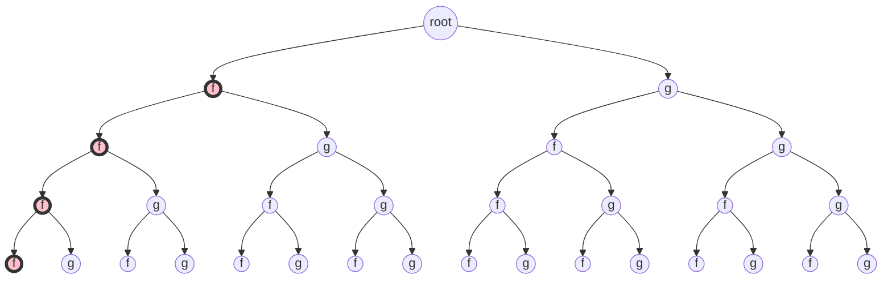
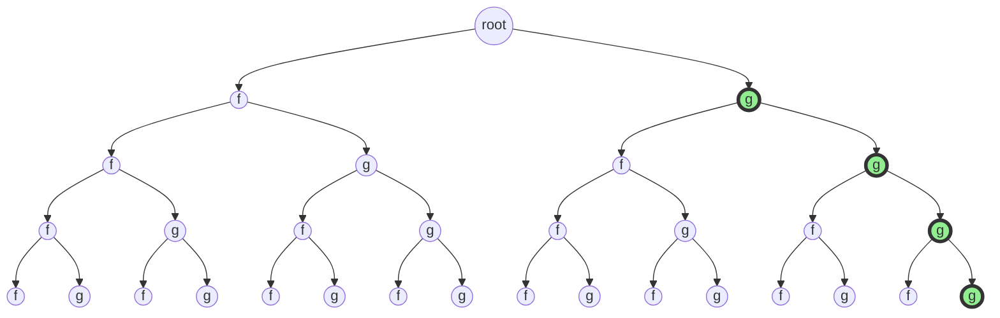
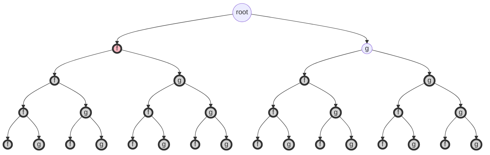
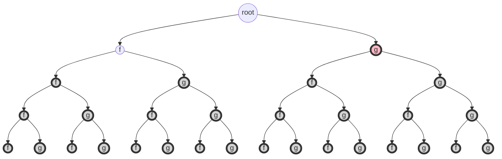
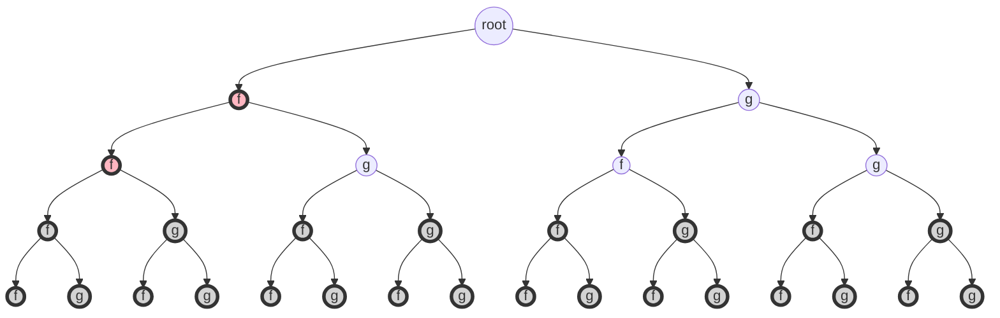
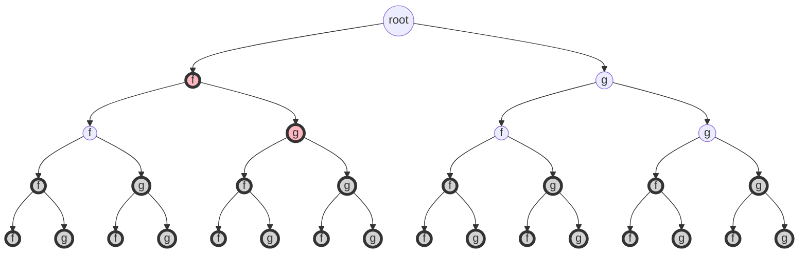

# Backtracking

## Integer Transformation Problem

### Description

整数变换问题。关于整数 i 的变换 f 和 g 定义如下：f(i)=3i；g(i)=i/2 (向下取整)。 试设计一个算法，对于给定的 2 个整数 n 和 m，用最少的 f 和 g 变换次数将 n 变换为 m。 例如，可以将整数 15 用 4 次变换将它变换为整数 4：4=gfgg(15)。当整数 n 不可能变换 为整数 m 时，算法应如何处理?

### Input

由文件 input.txt 给出输入数据。第一行有 2 个正整数 n 和 m。

### Output

将计算出的最少变换次数以及相应的变换序列输出到文件 output.txt。文件的第一行是 最少变换次数。文件的第 2 行是相应的变换序列。

### Sample

**输入文件示例**

input.txt

15 4

**输出文件示例**

output.txt 4 gfgg

### Analysis

#### DFS

定义 `转变函数 (Transformation Function)` f(x) 和 g(x)

由于需要求出，对于给定输入`整数n`，是否可以 `某种转变函数序列`来 `转变`到 `整数m`

我们不妨首先考虑使用 `Brute-Force Method`来处理该问题。

因为存在2种转变方式，所以我们定义的递归是 `2路递归`。

> 换句话说，这个 `递归方法`产生的 `解空间树`是一颗 `二叉树`

同时，我们通过题意可知，`递归次数的下界`为 `0`，但 `递归次数的上界`未知。

我们做一个 `猜测`：如果 `递归次数`超过 `整数n`，则 `不太可能` 存在解。

于是，对于该方法，我们会按照 `深度优先搜索`的顺序来访问 `解空间树`

> 假设我们已知拥有了 `整颗解空间树 (二叉树)`。则实际上，我们会直观地发现，
> 
> 我们会从 `树根`节点开始，沿着一条 `路径`做 `深度搜索`，直到抵达 `我们设定的最大层次 （也就是我们预测的递归次数的上界）`，再进行 `回溯`。（这个过程产生的方案是：我们设定的递归的最大深度f \\rightarrow ff \\rightarrow fff \\cdots \\rightarrow \\underbrace{f\\cdots f}\_{我们设定的递归的最大深度}
> 
> ```mermaid
> graph TD;
> root((root)) --> f((f));
> style f fill:pink,stroke:#333,stroke-width:4px
> root((root)) --> g((g));
> f --> ff((f));
> style ff fill:pink,stroke:#333,stroke-width:4px
> f --> fg((g));
> g --> gf((f));
> g --> gg((g));
> ff --> fff((f));
> style fff fill:pink,stroke:#333,stroke-width:4px
> ff --> ffg((g));
> fg --> fgf((f));
> fg --> fgg((g));
> gf --> gff((f));
> gf --> gfg((g));
> gg --> ggf((f));
> gg --> ggg((g));
> fff --> ffff((f));
> style ffff fill:pink,stroke:#333,stroke-width:4px
> fff --> fffg((g));
> ffg --> ffgf((f));
> ffg --> ffgg((g));
> fgf --> fgff((f));
> fgf --> fgfg((g));
> fgg --> fggf((f));
> fgg --> fggg((g));
> gff --> gfff((f));
> gff --> gffg((g));
> gfg --> gfgf((f));
> gfg --> gfgg((g));
> ggf --> ggff((f));
> ggf --> ggfg((g));
> ggg --> gggf((f));
> ggg --> gggg((g));
> 
> ```
> 
> > 当然，如果说，在 `沿着当前路径` `抵达人为设定的递归的最大深度`之前，我们 `幸运地`发现，已经找到了 `解`。
> > 
> > > 但是请注意：这个 `解`并不一定是 `最优解`，因为我们实际上进行的是 `深度优先搜索`。
> > > 
> > > `这个解`只不过是 `当前搜索路径`上的 `最优解`：因为在 `当前搜索路径`上，`该解`是 `第一个被发现的解`。
> > > 
> > > 根据题目的性质，我们可以知道，`在该条路径上的后续发现的解` 并不会 `优于` `在该条路径上被发现的第一个解`。
> 
> 如果，我们 `十分不幸运`，在 `沿着该条深度优先搜索路径` `抵达我们人为设定的最大递归深度`时，仍然 `未发现解`，
> 
> 则此时我们方法会见 `回溯1步`：f\\cdots fff \\rightarrow f \\cdots ffg
> 
> ```mermaid
> graph TD;
> root((root)) --> f((f));
> style f fill:pink,stroke:#333,stroke-width:4px
> root((root)) --> g((g));
> f --> ff((f));
> style ff fill:pink,stroke:#333,stroke-width:4px
> f --> fg((g));
> g --> gf((f));
> g --> gg((g));
> ff --> fff((f));
> style fff fill:pink,stroke:#333,stroke-width:4px
> ff --> ffg((g));
> fg --> fgf((f));
> fg --> fgg((g));
> gf --> gff((f));
> gf --> gfg((g));
> gg --> ggf((f));
> gg --> ggg((g));
> fff --> ffff((f));
> fff --> fffg((g));
> style fffg fill:pink,stroke:#333,stroke-width:4px
> ffg --> ffgf((f));
> ffg --> ffgg((g));
> fgf --> fgff((f));
> fgf --> fgfg((g));
> fgg --> fggf((f));
> fgg --> fggg((g));
> gff --> gfff((f));
> gff --> gffg((g));
> gfg --> gfgf((f));
> gfg --> gfgg((g));
> ggf --> ggff((f));
> ggf --> ggfg((g));
> ggg --> gggf((f));
> ggg --> gggg((g));
> 
> 
> ```
> 
> 如果此时还 `未发现解`，则 `再回溯1步`：f\\cdots ffg \\rightarrow f\\cdots fgf
> 
> ```mermaid
> graph TD;
> root((root)) --> f((f));
> style f fill:pink,stroke:#333,stroke-width:4px
> root((root)) --> g((g));
> f --> ff((f));
> style ff fill:pink,stroke:#333,stroke-width:4px
> f --> fg((g));
> g --> gf((f));
> g --> gg((g));
> ff --> fff((f));
> ff --> ffg((g));
> style ffg fill:pink,stroke:#333,stroke-width:4px
> fg --> fgf((f));
> fg --> fgg((g));
> gf --> gff((f));
> gf --> gfg((g));
> gg --> ggf((f));
> gg --> ggg((g));
> fff --> ffff((f));
> fff --> fffg((g));
> ffg --> ffgf((f));
> style ffgf fill:pink,stroke:#333,stroke-width:4px
> ffg --> ffgg((g));
> fgf --> fgff((f));
> fgf --> fgfg((g));
> fgg --> fggf((f));
> fgg --> fggg((g));
> gff --> gfff((f));
> gff --> gffg((g));
> gfg --> gfgf((f));
> gfg --> gfgg((g));
> ggf --> ggff((f));
> ggf --> ggfg((g));
> ggg --> gggf((f));
> ggg --> gggg((g));
> ```
> 
> 如果仍然 `未发现解`，则 `再回溯一步`： f\\cdots fgf \\rightarrow f\\cdots fgg
> 
> ```mermaid
> graph TD;
> root((root)) --> f((f));
> style f fill:pink,stroke:#333,stroke-width:4px
> root((root)) --> g((g));
> f --> ff((f));
> style ff fill:pink,stroke:#333,stroke-width:4px
> f --> fg((g));
> g --> gf((f));
> g --> gg((g));
> ff --> fff((f));
> ff --> ffg((g));
> style ffg fill:pink,stroke:#333,stroke-width:4px
> fg --> fgf((f));
> fg --> fgg((g));
> gf --> gff((f));
> gf --> gfg((g));
> gg --> ggf((f));
> gg --> ggg((g));
> fff --> ffff((f));
> fff --> fffg((g));
> ffg --> ffgf((f));
> ffg --> ffgg((g));
> style ffgg fill:pink,stroke:#333,stroke-width:4px
> fgf --> fgff((f));
> fgf --> fgfg((g));
> fgg --> fggf((f));
> fgg --> fggg((g));
> gff --> gfff((f));
> gff --> gffg((g));
> gfg --> gfgf((f));
> gfg --> gfgg((g));
> ggf --> ggff((f));
> ggf --> ggfg((g));
> ggg --> gggf((f));
> ggg --> gggg((g));
> ```

对此，我们发现一个 `比较严重的问题`。

我们观察到，该 `深度优先搜索`方法在 `每一个递归层次`都会 `按顺序执行`f(x)和g(x)，

所以，它会先 `沿着一条路径不断下降到` f \\cdots fff



如果，我们要寻找的 `最优解`它不是以f `作为前缀的`，

那么，我们对 `这整条深度优先搜索路径所做的搜索`的工作 `都是浪费的`！

更极端地，如果 `最优解`是 g \\cdots ggg，那么，我们 `所做的绝大部分搜索`都将是 `无用的`



不妨再考虑一个 `不幸运的情况`：`最优解` 如果是 `以g作为前缀`，但 `它的长度却比较小`。

那么我们也会做 `大部分没有意义的搜索`，因为该 `算法`不管 `最优解的长度有多么小`，都要按 `深度优先搜索`的方式，`不断下降（使转变函数序列的长度增长）`，不断 `下降`和 `回溯` 寻求解。(如果在 `下降过程`没有发现解，那么就只能通过 `回溯`后接着 `下降`，再继续寻找解)

#### Iterative-Deepening DFS

首先，我们解决一下 `这个不幸运的情况`：如果 `最优解`它足够短，我们希望 `搜索算法`不要 `下降到我们设定的最大深度`，然后通过 `逐步回溯`来发现这个 `长度较短的最优解`。而是说，我们希望让 `搜索算法`尽量找找看，有没有 `长度较短的解`，如果 `长度较短的解` `的确找不到`，那么我们再 `寻找长度较长的解`

> 实际上，根据这道题目的性质。我们也不应该采用 `深度优先搜索`。

因此，我们可以使用 `迭代加深搜索 (Iterative-Deepening DFS)`：

*   在 `深度为1的解空间树`中进行 `搜索`，若找到 `解`则立即返回。
*   在 `深度为2的解空间树`中进行 `搜索`，若找到 `解`则立即返回。
*   \\cdots
*   在 `深度为k的解空间树` 中进行 `搜索`，若找到 `解`则立即返回。
*   在 `深度为k以内的解空间树`中 `无解`！









\\cdots

> 注意两点：
> 
> *   我们可以 `立即返回`是因为：根据 `题目性质`，要求求解 `最短/最小的解`
>     
> *   算法最终 `报告无解`并不一定表示 `原问题无解`：这取决于 `我们设定的最大递归深度`k
>     
>     > 最大深度k的设定需要我们根据题目分析得到，它可以是 `静态的`，也可以是 `动态的`。
>     > 
>     > 它可以是 `不确切的上界`，但至少我们希望 `要保证k足够大，使得不会遗漏解`
>     

于是，我们需要做下面这些工作：

*   定义 `递归次数的上界估计函数 (价值函数)`\\implies \\text{estimate(args) -> int k }
    
    > 在 `DFS Method`中，我们并没有定义这个 `上界估计函数`，
    > 
    > 因为我们偷偷看了输入数据 如果 `k的上界`非常大的话，对于 `DFS Method`方法是 `没有意义的`，
    > 
    > 因为根据 `DFS`和 `该问题的特性`，`所产生的DFS树`会 `迅速膨胀`到 `我们无法在规定时间内求得解`，而这个 `非常大的k值`也 `根本不会被触碰到`
    
    > 对于 `IDDFS`，我们可以根据 `题目性质` 设置 `合适的上界估计函数`。
    > 
    > > 但要注意，如果 `最优解`的 `深度`确实很大，那么 `IDDFS`也会面临 `DFS树` `迅速膨胀` 的 `困境`
    > > 
    > > > 不过，`IDDFS`对于 `最优解的深度较小的情况`是非常适合的。
    
*   根据 `题目性质`为 `递归方法` 定义 `所需的全局变量`
    
    > 我们当然可以使用 `递归方法所属的方法栈的局部内存`来存储 `所需要的变量`
    > 
    > *   但是，这往往会导致 `重复拷贝和传递相同的参数`和 `产生大量结构高度相似的冗余信息`
    > 
    > 这不仅仅是 `空间`上的问题，还包括做这些工作所用的 `时间`
    > 
    > > 如果你使用的是 `C/C++`等提供 `指针/引用`的 `编程语言`，可能会有些 `奇怪的想法`。
    > > 
    > > 但请重新考虑一下：`一个4字节的指针`并不会比 `一个4字节的整数`更节约空间。
    > 
    > > 一般来说，`每个递归方法的一个帧栈`如果 `只做一个选择`，那么我们实际上只需要 `保存所做的选择`和 `当前深度`即可。
    > > 
    > > > 比如说，要求 `每一个递归方法的函数调用帧栈` 进行 `选择一个数字`，`选择一个转变函数`等等。
    > 
    > *   使用 `递归函数的函数调用帧栈`但 `仅保存必要信息`
    > 
    > 该方法可行，但 `回溯`时会稍微麻烦一些，仍然不如直接使用 `全局变量`
    
*   按k递增方式执行k次 `DFS` \\implies \\text{search(k) -> bool found}
    
    > 之所以能够在 `第一次发现解`后 `判定该解就是最优解`并 `终止算法`是取决于 `题目性质`
    > 
    > 如果 `题目所求的最优解` 与 `递归的深度`（也就是`最优解和长度无关`）无关，那么 `IDDFS`可能并不会更有效。
    
*   若`第一次发现任何解`则 `立即终止搜索`并 `返回该解` ， 否则报告 `无解`
    

### Solution

#### DFS

##### Source

```java
    public static int f(int i) {
        return 3 * i;
    }

    public static int g(int i) {
        return i / 2;
    }

    public static String ans_string;

    public static void solve(int n, int m, int limit, String ops) {

        // Base Case
        if ((n == m)  (n == 0)  (m == 0)  (ops.length() > ans_string.length())  limit >= 30) {
            if (n == m) {
                if (ops.length() < ans_string.length()) {
                    ans_string = ops;
                }
            }
            return;
        }

        // Recursion Case
        solve(f(n), m, limit + 1, "f" + ops);
        solve(g(n), m, limit + 1, "g" + ops);
    }
```

##### Benchmark

```yaml
-----------------------------------------------------
Current Case: FUNC0.in & FUNC0.out
Expected  Input: [15 4]
Expected Output: [4, gfgg]
Your     Output: [4, gfgg]
Time Cost: 157.343000 ms (157343000 ns)
Accepted.
-----------------------------------------------------
Current Case: FUNC1.in & FUNC1.out
Expected  Input: [115 8]
Expected Output: [9, gggggggff]
Your     Output: [9, gggggggff]
Time Cost: 3852.005300 ms (3852005300 ns)
Accepted.
-----------------------------------------------------
Current Case: FUNC10.in & FUNC10.out
Expected  Input: [11838 127878]
Expected Output: [25, ggffffggggfgggfffffgggggf]
Your     Output: [25, ggffffggggfgggfffffgggggf]
Time Cost: 15302.874100 ms (15302874100 ns)
Accepted.
-----------------------------------------------------
Current Case: FUNC2.in & FUNC2.out
Expected  Input: [82 54]
Expected Output: [8, fffggggg]
Your     Output: [8, fffggggg]
Time Cost: 295.231800 ms (295231800 ns)
Accepted.
-----------------------------------------------------
Current Case: FUNC3.in & FUNC3.out
Expected  Input: [56 125]
Expected Output: [22, ggggggffffffgggggggfff]
Your     Output: [22, ggggggffffffgggggggfff]
Time Cost: 3743.782100 ms (3743782100 ns)
Accepted.
-----------------------------------------------------
Current Case: FUNC4.in & FUNC4.out
Expected  Input: [115 111]
Expected Output: [18, fgfgfgggggfffggggf]
Your     Output: [18, fgfgfgggggfffggggf]
Time Cost: 13528.005700 ms (13528005700 ns)
Accepted.
-----------------------------------------------------
Current Case: FUNC5.in & FUNC5.out
Expected  Input: [210 24907]
Expected Output: [24, gffgggggfffffffffggggggf]
Your     Output: [24, gffgggggfffffffffggggggf]
Time Cost: 14796.151600 ms (14796151600 ns)
Accepted.
-----------------------------------------------------
Current Case: FUNC6.in & FUNC6.out
Expected  Input: [50961 91791]
Expected Output: [25, fggffffgggggggggggggfffff]
Your     Output: [25, fggffffgggggggggggggfffff]
Time Cost: 2660.372100 ms (2660372100 ns)
Accepted.
-----------------------------------------------------
Current Case: FUNC7.in & FUNC7.out
Expected  Input: [59338 486]
Expected Output: [22, fffffggggggggggggggggf]
Your     Output: [22, fffffggggggggggggggggf]
Time Cost: 2700.998700 ms (2700998700 ns)
Accepted.
-----------------------------------------------------
Current Case: FUNC8.in & FUNC8.out
Expected  Input: [53530 750062539]
Expected Output: [25, gfgfgfffffffffggfgggggfff]
Your     Output: [25, gfgfgfffffffffggfgggggfff]
Time Cost: 5185.903400 ms (5185903400 ns)
Accepted.
-----------------------------------------------------
Current Case: FUNC9.in & FUNC9.out
Expected  Input: [96418 37529284]
Expected Output: [25, gffffffgggggggggggfffffff]
Your     Output: [25, gffffffgggggggggggfffffff]
Time Cost: 2065.022700 ms (2065022700 ns)
Accepted.
-----------------------------------------------------
Result Statistics: √ √ √ √ √ √ √ √ √ √ √ 
```

#### Iterative Deepening DFS

##### Source

```java
    public static int f(int i) {
        return 3 * i;
    }

    public static int g(int i) {
        return i / 2;
    }

    /* Global Variable */
    private static int n;
    private static int m;
    private static int k;
    private static boolean[] performF;

    public static int estimate(int n, int m) {
        return n;
    }

    public static boolean found() {
        int value = n;
        for (int i = 0; i < k; i++) {
            if (performF[i]) {
                value = f(value);
            } else value = g(value);
        }
        return value == m;
    }

    public static void printCurrentPlan() {
        for (int i = k - 1; i >= 0; i--) {
            System.out.print(performF[i] ? "f" : "g");
        }

    }

    public static boolean search(int depth) {

        /* Base Case */
        if (depth >= k) {
            return found();
        }

        /* Recursion Case */
        // At any depth, we can have 2 choices:

        /* Perform f */
        performF[depth] = true;
        if (search(depth + 1)) {
            return true;
        }

        /* Perform g */
        performF[depth] = false;
        if (search(depth + 1)) {
            return true;
        }

        // If we can't perform either f or g, we backtrack
        return false;
    }

    public static void solve(Scanner scanner) {
        n = scanner.nextInt();
        m = scanner.nextInt();
        int estimate = estimate(n, m);
        performF = new boolean[estimate + 1];

        /* K-Search */
        // k means perform tiems
        for (k = 0; k <= estimate; k++) {
            if (search(0)) {
                System.out.println(k);
                printCurrentPlan();
                break;
            }
        }
    }
```

##### Benchmark

```yaml
-----------------------------------------------------
Current Case: FUNC0.in & FUNC0.out
Expected  Input: [15 4]
Expected Output: [4, gfgg]
Your     Output: [4, gfgg]
Time Cost: 3.844700 ms (3844700 ns)
Accepted.
-----------------------------------------------------
Current Case: FUNC1.in & FUNC1.out
Expected  Input: [115 8]
Expected Output: [9, gggggggff]
Your     Output: [9, gggggggff]
Time Cost: 1.549000 ms (1549000 ns)
Accepted.
-----------------------------------------------------
Current Case: FUNC10.in & FUNC10.out
Expected  Input: [11838 127878]
Expected Output: [25, ggffffggggfgggfffffgggggf]
Your     Output: [25, ggffffggggfgggfffffgggggf]
Time Cost: 2137.224700 ms (2137224700 ns)
Accepted.
-----------------------------------------------------
Current Case: FUNC2.in & FUNC2.out
Expected  Input: [82 54]
Expected Output: [8, fffggggg]
Your     Output: [8, fffggggg]
Time Cost: 0.945200 ms (945200 ns)
Accepted.
-----------------------------------------------------
Current Case: FUNC3.in & FUNC3.out
Expected  Input: [56 125]
Expected Output: [22, ggggggffffffgggggggfff]
Your     Output: [22, ggggggffffffgggggggfff]
Time Cost: 193.517300 ms (193517300 ns)
Accepted.
-----------------------------------------------------
Current Case: FUNC4.in & FUNC4.out
Expected  Input: [115 111]
Expected Output: [18, fgfgfgggggfffggggf]
Your     Output: [18, fgfgfgggggfffggggf]
Time Cost: 16.105000 ms (16105000 ns)
Accepted.
-----------------------------------------------------
Current Case: FUNC5.in & FUNC5.out
Expected  Input: [210 24907]
Expected Output: [24, gffgggggfffffffffggggggf]
Your     Output: [24, gffgggggfffffffffggggggf]
Time Cost: 1017.764000 ms (1017764000 ns)
Accepted.
-----------------------------------------------------
Current Case: FUNC6.in & FUNC6.out
Expected  Input: [50961 91791]
Expected Output: [25, fggffffgggggggggggggfffff]
Your     Output: [25, fggffffgggggggggggggfffff]
Time Cost: 1749.323400 ms (1749323400 ns)
Accepted.
-----------------------------------------------------
Current Case: FUNC7.in & FUNC7.out
Expected  Input: [59338 486]
Expected Output: [22, fffffggggggggggggggggf]
Your     Output: [22, fffffggggggggggggggggf]
Time Cost: 256.666400 ms (256666400 ns)
Accepted.
-----------------------------------------------------
Current Case: FUNC8.in & FUNC8.out
Expected  Input: [53530 750062539]
Expected Output: [25, gfgfgfffffffffggfgggggfff]
Your     Output: [25, gfgfgfffffffffggfgggggfff]
Time Cost: 1587.514600 ms (1587514600 ns)
Accepted.
-----------------------------------------------------
Current Case: FUNC9.in & FUNC9.out
Expected  Input: [96418 37529284]
Expected Output: [25, gffffffgggggggggggfffffff]
Your     Output: [25, gffffffgggggggggggfffffff]
Time Cost: 1395.128700 ms (1395128700 ns)
Accepted.
-----------------------------------------------------
Result Statistics: √ √ √ √ √ √ √ √ √ √ √ 
```

## Computation without Priority Problem

### Description

给定 n 个正整数和 4 个运算符＋、－、∗、/，且运算符无优先级，如 2+3∗5=25。对于 任意给定的整数 m，试设计一个算法，用以上给出的 n 个数和 4 个运算符，产生整数 m， 且用的运算次数最少。给出的 n 个数中每个数最多只能用 1 次，但每种运算符可以任意使用。

### Input

对于给定的 n 个正整数，设计一个算法，用最少的无优先级运算次数产生整数 m。

### Output

由文件 input.txt 给出输入数据。第一行有 2 个正整数 n 和 m。第 2 行是给定的用于运算 的 n 个正整数。

### Sample

**输入文件示例**

input.txt

5 25 5 2 3 6 7

**输出文件示例**

output.txt

2 2+3\*5

### Analysis

#### DFS

我们给出该问题的 `BFS Method`，该解法使用 `Token`存储 `已使用的数字`和 `参与运算的运算符`信息。

`递归过程`维护 `Token的链表`，通过 `遍历Token链表`来获得一个 `运算方案`。

#### IDDFS

不同于 `Integer Transformation Problem`的 `递归过程`：在 `DFS树`的 `每一层`只需要选择 `转变方法`

`Computation without Priority Problem`的 `递归过程`：在 `DFS树`的 `每一层` 不但要选择 `使用的数字`，还要选择 `使用的运算符`

> 不过，这并没有什么不同。因为，我们使用的是 `回溯法`。
> 
> 我们只管 `尝试所有可能的选法`，如果最终 `发现`确实 `DFS树的某层的选择`确实是错的，
> 
> 那么我们进行 `回溯`即可！然后继续寻找 `问题的解`

> 另外，这里我们不讨论 `剪枝`的问题，尽管使用 `剪枝`可以再进一步优化该方法。

### Solution

#### BFS

##### Source

```java
    enum Operators {
        ADDICTION("+"), SUBTRACTION("-"), MULTIPLICATION("*"), DIVISION("/"), NONE("");

        private final String operatorString;

        Operators(String operatorString) {
            this.operatorString = operatorString;
        }

        public String toString() {
            return this.operatorString;
        }
    }

    static class Token {
        public Token parent;
        public int value;
        public int operand;
        public String operator;
        public int length;

        public Token(Token parent, int value, int operand, String operator) {
            this.parent = parent;
            this.value = value;
            this.operand = operand;
            this.operator = operator;
            this.length = parent != null ? parent.length + 1 : 1;
        }

        public ArrayList<Integer> listUsedOperands() {
            ArrayList<Integer> operands = new ArrayList<>();
            Token current = this;
            while (current != null) {
                operands.add(current.operand);
                current = current.parent;
            }
            return operands;
        }

        public String getPath() {
            StringBuilder sb = new StringBuilder();
            getPath(sb, this);
            return sb.toString();
        }

        private void getPath(StringBuilder sb, Token currentToken) {
            if (currentToken != null) {
                getPath(sb, currentToken.parent);
                sb.append(currentToken.operator).append(currentToken.operand);
            }
        }

        @Override
        public String toString() {
            return this.getPath();
        }
    }


    /*
    Current Case: ARIT0.in & ARIT0.out
    Expected  Input: [5 25, 5 2 3 6 7]
    Expected Output: [2, 2+3*5]

    5 2 3 6 7
    0 0 0 0 0
    */
    public static Token solve(ArrayList<Integer> nums, int m) {

        /* Initialize the tokens */
        LinkedList<Token> tokens = new LinkedList<>();
        for (int num : nums) {
            // If we are lucky enough...
            if (num == m) return new Token(null, m, m, Operators.NONE.toString());
            tokens.add(new Token(null, num, num, Operators.NONE.toString()));
        }

        /* Brute-Force-Search */
        for (int level = 0; level < nums.size(); level++) {

            int SIZE = tokens.size();
            for (int amount = 0; amount < SIZE; amount++) {

                /* Get the first token */
                Token currentToken = tokens.poll();

                /* Generate tokens */
                // Get unused nums
                ArrayList<Integer> unusedNums = new ArrayList<>(nums);
                currentToken.listUsedOperands().forEach(unusedNums::remove);

                // Try all operators
                for (int num : unusedNums) {

                    for (Operators operator : Operators.values()) {
                        if (operator == Operators.NONE) continue;

                        int newValue;
                        switch (operator) {
                            case ADDICTION:
                                newValue = currentToken.value + num;
                                break;
                            case SUBTRACTION:
                                newValue = currentToken.value - num;
                                break;
                            case MULTIPLICATION:
                                newValue = currentToken.value * num;
                                break;
                            case DIVISION:
                                newValue = currentToken.value / num;
                                break;
                            default:
                                newValue = 0xdead;
                        }

                        /* Push */
                        Token newToken = new Token(currentToken, newValue, num, operator.toString());

                        /* Found ? */
                        if (newToken.value == m) {
                            return newToken;
                        } else tokens.add(newToken);
                    }
                }
            }
        }
        return null;
    }
```

##### Benchmark

```yaml
-----------------------------------------------------
Current Case: ARIT0.in & ARIT0.out
Expected  Input: [5 25, 5 2 3 6 7]
Expected Output: [2, 2+3*5]
Your     Output: [2, 2+3*5]
Time Cost: 7.099500 ms (7099500 ns)
Accepted.
-----------------------------------------------------
Current Case: ARIT1.in & ARIT1.out
Expected  Input: [30 2894, 2 40 2 50 48 23 39 26 23 42 36 29 35 17 39 16 48 12 45 20 35 19 20 3 15 42 1 49 45 10 ]
Expected Output: [3, 40+39*36+50]
Your     Output: [3, 40+39*36+50]
Time Cost: 477.980500 ms (477980500 ns)
Accepted.
-----------------------------------------------------
Current Case: ARIT10.in & ARIT10.out
Expected  Input: [6 721, 1 2 3 4 5 6]
Expected Output: [5, 2*3*4*5*6+1]
Your     Output: [5, 2*3*4*5*6+1]
Time Cost: 38.360500 ms (38360500 ns)
Accepted.
-----------------------------------------------------
Current Case: ARIT2.in & ARIT2.out
Expected  Input: [21 11573, 16 17 3 12 24 49 25 18 28 5 38 8 22 3 11 11 16 21 4 11 32 ]
Expected Output: [4, 16+3*38*16+21]
Your     Output: [4, 16*17+32*38+21]
Time Cost: 7109.397600 ms (7109397600 ns)
Wrong Answer.
-----------------------------------------------------
Current Case: ARIT3.in & ARIT3.out
Expected  Input: [8 1554, 32 23 1 1 26 33 28 5 ]
Expected Output: [3, 33+28*26-32]
Your     Output: [3, 33+28*26-32]
Time Cost: 3.193600 ms (3193600 ns)
Accepted.
-----------------------------------------------------
Current Case: ARIT4.in & ARIT4.out
Expected  Input: [41 48, 34 44 38 38 28 38 39 45 34 19 13 4 36 41 32 30 8 31 10 15 32 27 34 38 4 42 35 49 23 27 18 30 9 6 2 47 47 16 48 9 17 ]
Expected Output: [0, 48]
Your     Output: [0, 48]
Time Cost: 1.859300 ms (1859300 ns)
Accepted.
-----------------------------------------------------
Current Case: ARIT5.in & ARIT5.out
Expected  Input: [17 11787, 3 9 37 7 7 11 32 48 34 3 31 20 27 38 19 27 17 ]
Expected Output: [3, 31*20*19+7]
Your     Output: [3, 31*20*19+7]
Time Cost: 47.619500 ms (47619500 ns)
Accepted.
-----------------------------------------------------
Current Case: ARIT6.in & ARIT6.out
Expected  Input: [4 24, 1 1 10 7]
Expected Output: [3, 1+1*7+10]
Your     Output: [3, 1+1*7+10]
Time Cost: 1.087000 ms (1087000 ns)
Accepted.
-----------------------------------------------------
Current Case: ARIT7.in & ARIT7.out
Expected  Input: [18 2553, 32 48 3 42 7 34 12 29 3 50 30 35 22 13 35 9 11 20 ]
Expected Output: [3, 32+29*42-9]
Your     Output: [3, 32+29*42-9]
Time Cost: 3.876700 ms (3876700 ns)
Accepted.
-----------------------------------------------------
Current Case: ARIT8.in & ARIT8.out
Expected  Input: [6 1234, 1 2 3 4 5 6]
Expected Output: [No Solution!]
Your     Output: [No Solution!]
Time Cost: 1250.530200 ms (1250530200 ns)
Accepted.
-----------------------------------------------------
Current Case: ARIT9.in & ARIT9.out
Expected  Input: [27 9546, 10 5 30 1 14 49 8 19 44 21 23 35 26 7 35 3 27 18 5 15 49 23 8 44 48 49 47 ]
Expected Output: [4, 10+14*19*21-30]
Your     Output: [4, 10*30-26*35-44]
Time Cost: 33963.559100 ms (33963559100 ns)
Wrong Answer.
-----------------------------------------------------
Result Statistics: √ √ √ × √ √ √ √ √ √ × 
```

#### Iterative-Deeping DFS

##### Source

```java
    /* Global Variables */
    private enum Operators {
        ADDICTION("+"), SUBTRACTION("-"), MULTIPLICATION("*"), DIVISION("/");

        private final String operatorString;

        Operators(String operatorString) {
            this.operatorString = operatorString;
        }

        @Override
        public String toString() {
            return this.operatorString;
        }
    }

    private static int k;
    private static int n;
    private static int m;
    private static int[] nums;
    private static boolean[] used;
    private static int[] operands;
    private static int[] operators;

    public static void printCurrentPlan() {
        // for n numbers, we can use k \in {0, 1, 2, ..., n-1} operators
        // k = 0 means that we don't need to use any operators
        for (int i = 0; i <= k; i++) {
            if (i > 0) System.out.print(Operators.values()[operators[i - 1]]);
            System.out.print(operands[i]);
        }
    }

    public static boolean found() {

        int sum = 0xdead;
        // k means the number of operands
        for (int i = 0; i <= k; i++) {
            // Push the first operand
            if (i == 0) {
                sum = operands[0];
                continue;
            }

            // Actually, we won't use the last index of operator
            // And if we only have one operand, we won't need to calc any operators. (just ignore the only operator at index 0)
            int operator = operators[i - 1];
            int operand = operands[i];

            // Calculate
            switch (Operators.values()[operator]) {
                case ADDICTION:
                    sum += operand;
                    break;
                case SUBTRACTION:
                    sum -= operand;
                    break;
                case MULTIPLICATION:
                    sum *= operand;
                    break;
                case DIVISION:
                    sum /= operand;
                    break;
            }

        }

        return sum == m;
    }

    public static boolean search(int depth) {

        /* Base Case */
        if (depth > k) {
            return found();
        }

        /* Recursive Case */

        // We can choose any of the unused numbers !
        for (int i = 0; i < nums.length; i++) {
            // Skip the number if we have used it.
            if (used[i]) continue;
            else used[i] = true;

            // Use the number
            operands[depth] = nums[i];

            // Also, we can use any of the operators !
            for (int j = 0; j < Operators.values().length; j++) {
                // Use the operator
                operators[depth] = Operators.values()[j].ordinal();

                // Go !
                if (search(depth + 1)) {
                    // if not found, the recursion should go ahead
                    return true;
                }
            }

            // Free it !
            used[i] = false;
        }

        return false;
    }

    public static void solve(Scanner scanner) {

        /* Initialize */
        n = scanner.nextInt();
        nums = new int[n];
        used = new boolean[n];
        operands = new int[n];
        operators = new int[n];

        m = scanner.nextInt();
        for (int i = 0; i < n; i++) {
            nums[i] = scanner.nextInt();
        }

        /* k-search */
        // k is the number of operands
        // for n, k = 0, 1, 2, ..., n-1
        for (k = 0; k < nums.length; k++) {
            if (search(0)) {
                System.out.println(k);
                printCurrentPlan();
                return;
            }
        }
        System.out.println("No Solution!");
    }
```

##### Benchmark

```yaml
-----------------------------------------------------
Current Case: ARIT0.in & ARIT0.out
Expected  Input: [5 25, 5 2 3 6 7]
Expected Output: [2, 2+3*5]
Your     Output: [2, 2+3*5]
Time Cost: 6.820100 ms (6820100 ns)
Accepted.
-----------------------------------------------------
Current Case: ARIT1.in & ARIT1.out
Expected  Input: [30 2894, 2 40 2 50 48 23 39 26 23 42 36 29 35 17 39 16 48 12 45 20 35 19 20 3 15 42 1 49 45 10 ]
Expected Output: [3, 40+39*36+50]
Your     Output: [3, 40+39*36+50]
Time Cost: 473.039600 ms (473039600 ns)
Accepted.
-----------------------------------------------------
Current Case: ARIT10.in & ARIT10.out
Expected  Input: [6 721, 1 2 3 4 5 6]
Expected Output: [5, 2*3*4*5*6+1]
Your     Output: [5, 2*3*4*5*6+1]
Time Cost: 266.458500 ms (266458500 ns)
Accepted.
-----------------------------------------------------
Current Case: ARIT2.in & ARIT2.out
Expected  Input: [21 11573, 16 17 3 12 24 49 25 18 28 5 38 8 22 3 11 11 16 21 4 11 32 ]
Expected Output: [4, 16+3*38*16+21]
Your     Output: [4, 16+3*38*16+21]
Time Cost: 2210.722500 ms (2210722500 ns)
Accepted.
-----------------------------------------------------
Current Case: ARIT3.in & ARIT3.out
Expected  Input: [8 1554, 32 23 1 1 26 33 28 5 ]
Expected Output: [3, 33+28*26-32]
Your     Output: [3, 33+28*26-32]
Time Cost: 17.388700 ms (17388700 ns)
Accepted.
-----------------------------------------------------
Current Case: ARIT4.in & ARIT4.out
Expected  Input: [41 48, 34 44 38 38 28 38 39 45 34 19 13 4 36 41 32 30 8 31 10 15 32 27 34 38 4 42 35 49 23 27 18 30 9 6 2 47 47 16 48 9 17 ]
Expected Output: [0, 48]
Your     Output: [0, 48]
Time Cost: 1.912900 ms (1912900 ns)
Accepted.
-----------------------------------------------------
Current Case: ARIT5.in & ARIT5.out
Expected  Input: [17 11787, 3 9 37 7 7 11 32 48 34 3 31 20 27 38 19 27 17 ]
Expected Output: [3, 31*20*19+7]
Your     Output: [3, 31*20*19+7]
Time Cost: 510.196400 ms (510196400 ns)
Accepted.
-----------------------------------------------------
Current Case: ARIT6.in & ARIT6.out
Expected  Input: [4 24, 1 1 10 7]
Expected Output: [3, 1+1*7+10]
Your     Output: [3, 1+1*7+10]
Time Cost: 1.734900 ms (1734900 ns)
Accepted.
-----------------------------------------------------
Current Case: ARIT7.in & ARIT7.out
Expected  Input: [18 2553, 32 48 3 42 7 34 12 29 3 50 30 35 22 13 35 9 11 20 ]
Expected Output: [3, 32+29*42-9]
Your     Output: [3, 32+29*42-9]
Time Cost: 17.189900 ms (17189900 ns)
Accepted.
-----------------------------------------------------
Current Case: ARIT8.in & ARIT8.out
Expected  Input: [6 1234, 1 2 3 4 5 6]
Expected Output: [No Solution!]
Your     Output: [No Solution!]
Time Cost: 293.963800 ms (293963800 ns)
Accepted.
-----------------------------------------------------
Current Case: ARIT9.in & ARIT9.out
Expected  Input: [27 9546, 10 5 30 1 14 49 8 19 44 21 23 35 26 7 35 3 27 18 5 15 49 23 8 44 48 49 47 ]
Expected Output: [4, 10+14*19*21-30]
Your     Output: [4, 10+14*19*21-30]
Time Cost: 5940.226300 ms (5940226300 ns)
Accepted.
-----------------------------------------------------
Result Statistics: √ √ √ √ √ √ √ √ √ √ √ 
```